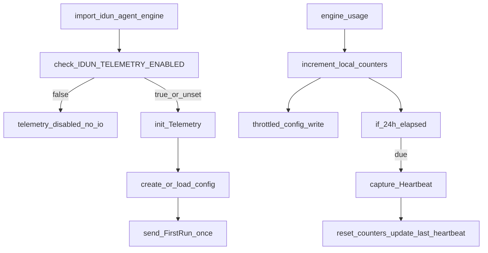

# Idun Agent Engine telemetry (default-on, privacy-aware)

## Goals

- **Measure adoption of the `idun-agent-engine` Python package** with minimal, anonymous telemetry.
- **Default ON**, but **global opt-out** via `IDUN_TELEMETRY_ENABLED=false` (and when disabled: **no file I/O** and no network).
- **Low-noise + low-overhead**: local counters + **daily heartbeat** (plus a one-time **First run**).
- **Strong guardrails**: strict sanitizer, whitelists/safe namespaces, payload caps, and no sensitive fields.
- **Silent and safe**: telemetry must never break user code or spam stderr.

## Architecture

Create a small isolated module set:

- [`libs/idun_agent_engine/src/idun_agent_engine/telemetry/__init__.py`](libs/idun_agent_engine/src/idun_agent_engine/telemetry/__init__.py): tiny public façade (`agent_running`, etc.)
- [`libs/idun_agent_engine/src/idun_agent_engine/telemetry/_environment.py`](libs/idun_agent_engine/src/idun_agent_engine/telemetry/_environment.py): cached process-level environment/system specs
- [`libs/idun_agent_engine/src/idun_agent_engine/telemetry/_telemetry.py`](libs/idun_agent_engine/src/idun_agent_engine/telemetry/_telemetry.py): enablement, config persistence (platformdirs), PostHog client, sanitizer, counters/heartbeat, safe wrappers

### Data flow (heartbeat-first)

## Implementation steps

### 1) Dependencies

- `platformdirs` and `posthog` are already present in engine deps.
- Add **explicit `PyYAML`** to engine deps (engine code already imports `yaml.safe_load`, but `PyYAML` isn’t currently declared).
  - File: [`libs/idun_agent_engine/pyproject.toml`](libs/idun_agent_engine/pyproject.toml)

### 2) Telemetry core (`_telemetry.py`)

Implement:

- **Enablement resolution** (order):

  1. `IDUN_TELEMETRY_ENABLED` env var (`true/1/yes` enable, `false/0/no/off` disable)
  2. config `telemetry_enabled`
  3. default **ON**

- **Config path**: `platformdirs.user_config_path("idun", appauthor=False) / "config.yaml"`
- **Config schema** (YAML):
  - `user_id: <uuid>`
  - `telemetry_enabled: true`
  - `created_at: <iso>`
  - `counters: { <key>: int }`
  - `last_heartbeat_at: <iso>|null`
- **When env var disables**: skip initialization entirely (no directory/file creation).
- **PostHog US**:
  - host: `https://us.i.posthog.com`
  - key: `FAKE-POSTHOF-API-KEY` (as requested)
  - wrap `posthog.capture(...)` in `try/except` and run in a **daemon background thread** to avoid blocking.
  - set PostHog/backoff loggers to **CRITICAL**, attach `NullHandler`, and disable propagation.
- **Rate limiting**:
  - Increment counters in-memory; persist to config with a small throttle (e.g. min 30–60s between writes).
  - `maybe_send_heartbeat()` checks if 24h elapsed; if due, send one `Heartbeat` containing aggregated counters, then reset counters and set `last_heartbeat_at`.
- **Strict sanitizer/guardrails** applied to every event properties dict:
  - allow only known system keys + safe namespaces (`feature.*`, `cli.*`, `workflow.*`)
  - drop keys containing risky tokens (`path`, `filepath`, `filename`, `prompt`, `query`, `text`, `document`, `content`, `url`, `email`, `token`, `secret`, `key`)
  - cap string length (200), list length (50), dict depth (2), total serialized payload size (16KB), and max keys

### 3) Environment specs (`_environment.py`)

Implement cached `collect_system_specs()` (computed once per process):

- `libraries.idun`: `idun_agent_engine.__version__`
- `os.containerized`: bool/None (cgroup + env heuristics; cached)
- `os.family`: Windows/Darwin/Linux
- `os.machine`: `platform.machine()`
- `python.version`: `platform.python_version()`
- context flags:
  - `libraries.pytest`: version or `False`
  - `libraries.ipython`: version or `False`
  - `libraries.colab`: version or `False`

### 4) Public API façade (`telemetry/__init__.py`) and top-level exports

- In [`libs/idun_agent_engine/src/idun_agent_engine/telemetry/__init__.py`](libs/idun_agent_engine/src/idun_agent_engine/telemetry/__init__.py) expose only:
  - `agent_running(agent_type: AgentFramework)` → increments `workflow.<type>.count` only
  - `feature_used(feature_name: str)` → increments `feature.<name>.count`
  - `cli_running(command: str)` → increments `cli.<command>.count`
  - `tutorial_running(tutorial_id: str)` → increments `tutorial.<id>.count` (or `feature.tutorial.<id>.count`)
  - re-export `AgentFramework` from `idun_agent_schema.engine.agent_framework` (already used by engine)
- In [`libs/idun_agent_engine/src/idun_agent_engine/__init__.py`](libs/idun_agent_engine/src/idun_agent_engine/__init__.py) re-export `agent_running` and `AgentFramework` and add to `__all__`.

### 5) Wire into real engine execution paths

- In [`libs/idun_agent_engine/src/idun_agent_engine/server/lifespan.py`](libs/idun_agent_engine/src/idun_agent_engine/server/lifespan.py), after successful agent initialization, call:
  - `agent_running(engine_config.agent.type)`
  - (optionally) `telemetry.maybe_send_heartbeat()` to attempt daily flush at startup (no spam).

- In CLI entrypoint [`libs/idun_agent_engine/src/idun_platform_cli/main.py`](libs/idun_agent_engine/src/idun_platform_cli/main.py), call `cli_running("idun")` (and/or include subcommand name if available) when the click group runs.

### 6) README documentation

Update [`libs/idun_agent_engine/README.md`](libs/idun_agent_engine/README.md) with a concise “Telemetry” section:

- default ON statement
- what is collected (explicit key list)
- how to disable: `IDUN_TELEMETRY_ENABLED=false`
- config file location examples per OS (platformdirs)
- how to inspect/reset config

### 7) Tests (no outbound calls)

Add `tests/test_telemetry.py` under [`libs/idun_agent_engine/tests`](libs/idun_agent_engine/tests):

- enabled-by-default creates config and `user_id` (patch `platformdirs.user_config_path` to `tmp_path`)
- env var disables and **prevents file creation** (reload module after setting env)
- sanitizer drops forbidden keys and enforces caps
- heartbeat sends at most once per 24h and resets counters (mock posthog capture)
- PostHog exceptions never bubble and do not write to stderr (capsys)

## Acceptance criteria

- Importing `idun_agent_engine` (with default settings) silently creates `config.yaml` in platformdirs and schedules `First run` once.
- Running a server triggers `agent_running` counter for the configured framework, but does not spam events (heartbeat is daily).
- `IDUN_TELEMETRY_ENABLED=false` guarantees no telemetry config file creation and no network.
- Telemetry never raises to callers and produces no default stderr logs.
