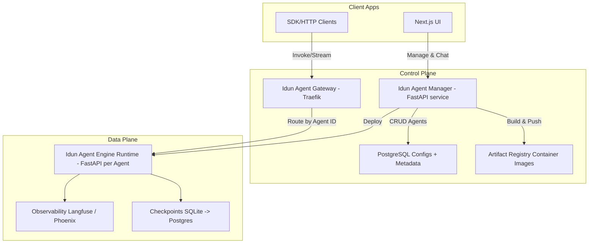

<div align="center">
  

  [](https://opensource.org/licenses/MIT) [](https://www.python.org/downloads/) [](https://pypi.org/project/idun-agent-engine/) [](https://idun-group.github.io/idun-agent-platform/) [](https://discord.gg/tcwH4z7R)

</div>

---

> [!WARNING]
> **Under Active Development** - This repository is currently under active development. APIs and features may change. Check the [Documentation](https://idun-group.github.io/idun-agent-platform/) for more info.


## Overview

Idun Agent Platform is an **open-source, production-ready platform** for building and operating AI agents. It provides a unified API layer over multiple agent frameworks (LangGraph, Haystack, CrewAI), built-in observability, and flexible deployment options.

The platform solves the fragmentation problem in the AI agent ecosystem—each framework has different APIs, deployment patterns, and monitoring solutions. With Idun, you configure once and deploy anywhere, while we handle the infrastructure, observability, and scaling.

<div align="center">
  <div style="overflow: hidden; padding: 1.5em 0; margin: 1.5em 0;">
    <div style="display: flex; justify-content: center; align-items: center; flex-wrap: wrap; gap: 2em; max-width: 800px; margin: 0 auto;">
      
      
      
      
      
      
      
      
      
    </div>
  </div>
</div>

## Key Features

- **Multi-Framework Support** – Work with LangGraph, Haystack, CrewAI, and more through a single unified API
- **Production-Ready** – Containerized runtime with health checks, checkpointing, and streaming responses
- **Built-in Observability** – Native integration with Langfuse and Arize Phoenix for monitoring and tracing
- **Guardrails** – Built-in safety and validation mechanisms to ensure agent behavior stays within defined boundaries
- **Flexible Deployment** – Deploy to local Docker, Google Cloud Run, or Kubernetes with the same configuration
- **Centralized Management** – Control all your agents via CLI or web dashboard from one place
- **Simple Configuration** – YAML-based configs that define agent setup and packaging requirements

## Quick Start

### Installation

```bash
pip install idun-agent-engine
```

### Configuration

Create a `config.yaml`:

```yaml
server:
  api:
    port: 8000

agent:
  type: "langgraph"
  config:
    name: "My Agent"
    graph_definition: ".path/to/my_agent.py:app"
    checkpointer:
      type: "sqlite"
      db_url: "sqlite:///example_checkpoint.db"
    observability:
      provider: langfuse
      enabled: true
      options:
        host: ${LANGFUSE_HOST}
        public_key: ${LANGFUSE_PUBLIC_KEY}
        secret_key: ${LANGFUSE_SECRET_KEY}
        run_name: "idun-langgraph-run"
```

### Running Your Agent

**Option 1: Local config**

```bash
idun serve .
```

**Option 2: Getting the config from the Manager (if already added)**

```bash
export IDUN_AGENT_API_KEY=<your-api-key-from-manager>
export IDUN_MANAGER_HOST=<manager-endpoint>
idun serve --source=manager
```

### Testing

```bash
curl -X POST "http://localhost:8000/agent/invoke" \
  -H "Content-Type: application/json" \
  -d '{"query": "Hello!", "session_id": "user-123"}'
```

> [!TIP]
> 📖 See the [full documentation](https://idun-group.github.io/idun-agent-platform/) for detailed guides and examples.

---

## Architecture



---

## Components

### Idun Agent Engine

Python library that encapsulates your agent into a production-grade FastAPI service. Configure via YAML or a fluent builder. Validates configuration and ships with observability, guardrails, streaming, structured responses, health endpoints, and simple persistence.

**Endpoints:**
- `POST /agent/invoke` – Single request/response
- `POST /agent/stream` – Server-Sent Events stream with AG-UI protocol
- `GET /health` – Engine health and version

**Features:**
- LangGraph and Haystack agent support
- SQLite checkpointing for LangGraph
- Observability via Langfuse or Arize Phoenix
- Unified API using the AG-UI protocol

> [!TIP]
> See `libs/idun_agent_engine/README.md` for full details

---

### Idun Agent Manager

Centralized control plane for managing deployed agents with authentication and RBAC. FastAPI service that provides agent lifecycle management, configuration storage, and access control.

**Features:**
- **Agent Management** – CRUD operations for agents
- **LLM Gateway** – Control access to models, track usage, and monitor LLM interactions
- **UI Chat** – Communicate with managed agents directly through the web interface
- **API Key Management** – Generate and manage API keys for agent access

---

### Idun Agent Gateway

API gateway powered by Traefik that routes traffic to specific agent instances by Agent ID. Supports TLS termination and rate limiting policies.

---

### Idun Agent UI

Next.js web interface to manage agents and interact with deployed agents via the unified API.

---

## Configuration

The Engine uses YAML-based configuration. Key fields:

| Field | Description | Example |
|-------|-------------|---------|
| `server.api.port` | HTTP port (default 8000) | `8000` |
| `agent.type` | Agent framework (`langgraph`, `haystack`) | `langgraph` |
| `agent.config.name` | Human-readable agent name | `"My Agent"` |
| `agent.config.graph_definition` | Path to agent code | `"./agent.py:app"` |
| `agent.config.checkpointer` | Checkpoint configuration | `{ type: "sqlite", db_url: "..." }` |
| `agent.config.observability` | Observability provider | `{ provider: "langfuse", enabled: true }` |

More adapters and stores are on the roadmap.

---

## Development

### Monorepo Structure

```
idun-agent-platform/
├── libs/idun_agent_engine/    # Engine library code and examples
├── services/
│   ├── idun_agent_manager/    # Manager service code
│   ├── idun_agent_gateway/    # Traefik configs
│   └── idun_agent_ui/         # Next.js UI
└── docs/                      # Documentation
```

### Local Setup

Run the Docker Compose setup at the root level:

```bash
docker compose up --build
```

Or use Make commands:

```bash
make dev              # Run all services
make dev-manager      # Run Manager only (port 8000)
```

Check the `Makefile` for more commands and options.

---

## Roadmap

- **Framework Adapters** – CrewAI, LangFlow, n8n, ADK support
- **Storage** – Postgres and external checkpoint stores
- **CLI & Templates** – First-class CLI with project templates
- **Multi-tenancy** – Enhanced Auth and RBAC features
- **Scaling** – Horizontal autoscaling and canary deployments
- **Security** – Built-in secrets management and vault integration
- **Monitoring** – Cost tracking and token accounting

---

## Contributing

We welcome contributions! Please see our [contributing guidelines](CONTRIBUTING.md) for details.

---

## Support

- **Documentation**: [https://idun-group.github.io/idun-agent-platform/](https://idun-group.github.io/idun-agent-platform/)
- **Issues**: [GitHub Issues](https://github.com/Idun-Group/idun-agent-platform/issues)
- **License**: MIT
