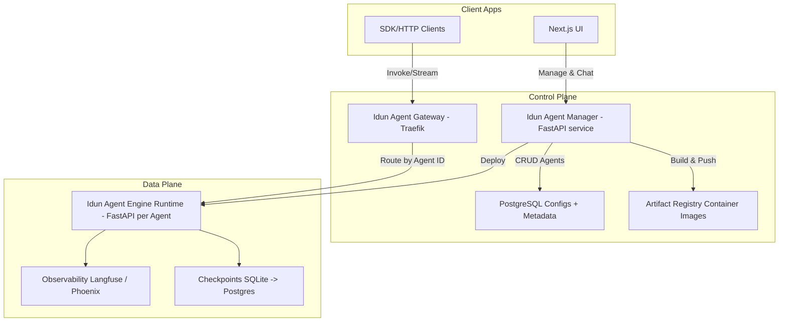

# Idun Agent Platform

The Idun Agent Platform is an open, modular platform for building, deploying, and operating AI agents with a unified API, observability, and multiple deployment targets. It is composed of:

- Idun Agent Engine: Python library that wraps agent frameworks (e.g., LangGraph) behind a FastAPI server with unified endpoints, streaming, and optional observability.
- Idun Agent Manager: Service that packages agent code, builds container images, and deploys them to local Docker, Cloud Run, or Kubernetes.
- Idun Agent Gateway: API gateway (Traefik) that routes requests to the correct agent instance by Agent ID.
- Idun Agent UI: Next.js web application to manage agents and interact with them.
- Idun Agent Auth (optional, future): Authentication and RBAC.

## Why Idun

- Unified API: Interact with any supported agent type via the same endpoints and event stream protocol (AG-UI).
- Framework flexibility: Start with LangGraph today; support for more frameworks is planned.
- Production-ready: Containerized runtime, health checks, observability hooks, and checkpointing.
- Choice of deployment: Local Docker, Google Cloud Run, or Kubernetes.

---

## Architecture



---

## Components

### Idun Agent Engine (Library)

Python library that encapsulates your agent into a production-grade FastAPI service. Configure via YAML or a fluent builder. Ships with streaming, structured responses, health endpoints, and simple persistence.

- Libraries: FastAPI, Uvicorn, LangGraph, AG-UI protocol bridge, optional Langfuse or Arize Phoenix, OpenTelemetry hooks
- Endpoints (default):
  - POST `/agent/invoke` – single request/response
  - POST `/agent/stream` – Server-Sent Events stream of AG-UI events
  - GET `/health` – engine health and version

Features (Ready):

- LangGraph agent support
- SQLite checkpointing for LangGraph
- Observability via Langfuse or Arize Phoenix
- Unified API using the AG-UI protocol

Coming soon:

- CrewAI, LangFlow, n8n, ADK, Haystack adapters
- Postgres checkpointers for LangGraph
- First-class CLI

See `libs/idun_agent_engine/README.md` for full details and examples.

### Idun Agent Manager (Service)

FastAPI service to package and deploy agent runtimes built with Idun Agent Engine. It stores configurations, builds images, and deploys them to your chosen environment. It supports retrieving agent code from local archives or GitHub.

Capabilities:

- CRUD agents: list, create, update, delete
- Build container images using the Engine
- Push to artifact registry
- Deploy to:
  - Local Docker
  - Google Cloud Run
  - Kubernetes
- Configure Traefik to route by Agent ID
- Persist configurations and deployment metadata in PostgreSQL

Agent creation/update workflow:

1. Receive configs: Engine config, Deployment config, Retriever config
1. Retrieve code: local zip or GitHub (branch, tag, or commit)
1. Generate Dockerfile using Idun Agent Engine
1. Build and push image to Artifact Registry
1. Deploy the image according to Deployment config
1. Configure Traefik to route traffic to the deployed agent
1. Persist configuration and state in PostgreSQL

### Idun Agent Gateway

API gateway powered by Traefik that routes traffic to specific agent instances by Agent ID. Supports TLS termination and rate limiting policies.

### Idun Agent UI

Next.js web interface to manage agents and interact with deployed agents via the unified API.

### Idun Agent Auth (optional, future)

Authentication and RBAC for enterprise environments.

---

## Quickstart

Prerequisites:

- Docker and Docker Compose
- Python 3.13 if running the Engine locally

### Run a local Engine example

1. Install the engine

```bash
pip install idun-agent-engine
```

1. Create a minimal `config.yaml`

```yaml
server:
  api:
    port: 8000

agent:
  type: "langgraph"
  config:
    name: "My Example LangGraph Agent"
    graph_definition: "./examples/01_basic_config_file/example_agent.py:app"
    checkpointer:
      type: "sqlite"
      db_url: "sqlite:///example_checkpoint.db"
    observability:
      provider: langfuse
      enabled: true
      options:
        host: ${LANGFUSE_HOST}
        public_key: ${LANGFUSE_PUBLIC_KEY}
        secret_key: ${LANGFUSE_SECRET_KEY}
        run_name: "idun-langgraph-run"
```

1. Run the server

```python
from idun_agent_engine.core.server_runner import run_server_from_config

run_server_from_config("config.yaml")
```

1. Try the API

```bash
curl -X POST "http://localhost:8000/agent/invoke" \
  -H "Content-Type: application/json" \
  -d '{"query": "Hello!", "session_id": "user-123"}'
```

### Docker Compose (dev preview)

Example `docker-compose.yml` to run the Gateway and a single Engine container. Replace image names and env values for your environment.

```yaml
version: "3.9"
services:
  gateway:
    image: traefik:v3.1
    command:
      - "--api.insecure=true"
      - "--providers.docker=true"
      - "--entrypoints.web.address=:80"
    ports:
      - "80:80"
      - "8080:8080" # Traefik dashboard
    volumes:
      - "/var/run/docker.sock:/var/run/docker.sock:ro"

  example-agent:
    image: ghcr.io/your-org/idun-agent-engine-example:latest
    environment:
      - LANGFUSE_HOST=${LANGFUSE_HOST}
      - LANGFUSE_PUBLIC_KEY=${LANGFUSE_PUBLIC_KEY}
      - LANGFUSE_SECRET_KEY=${LANGFUSE_SECRET_KEY}
    labels:
      - "traefik.enable=true"
      - "traefik.http.routers.example.rule=PathPrefix(`/agents/example`)"
      - "traefik.http.services.example.loadbalancer.server.port=8000"
```

### Deploy via Manager (conceptual)

The Manager exposes CRUD endpoints to register an agent config, retrieve code, build and push an image, and deploy.

High-level steps:

1. POST agent spec to the Manager (engine, retriever, deploy configs)
1. Manager clones or unpacks the agent source
1. Manager generates Dockerfile via the Engine
1. Manager builds and pushes image to registry
1. Manager deploys (Docker/Cloud Run/Kubernetes)
1. Gateway routes traffic based on Agent ID

---

## Configuration Model (Engine)

Key fields supported by the Engine today:

- `server.api.port`: HTTP port (default 8000)
- `agent.type`: currently `langgraph`
- `agent.config.name`: human-readable agent name
- `agent.config.graph_definition`: `path/to/file.py:variable` pointing to a LangGraph `StateGraph`
- `agent.config.checkpointer`: `{ type: "sqlite", db_url: "sqlite:///file.db" }`
- `agent.config.observability`: provider config for `langfuse` or `phoenix`

More adapters and stores are on the roadmap.

---

## Development

Monorepo layout (selected):

- `libs/idun_agent_engine`: Engine library code and examples
- `services/idun_agent_manager`: Manager service code (WIP)
- `services/idun_agent_gateway`: Traefik configs (WIP)
- `services/idun_agent_ui`: Next.js UI (WIP)
- `services/idun_agent_auth`: Auth service (future)

### Local setup (Engine library)

```bash
cd libs/idun_agent_engine
poetry install
poetry run pytest -q
```

---

## Roadmap

- More agent framework adapters: CrewAI, LangFlow, n8n, ADK, Haystack
- Postgres and external checkpoint stores
- First-class CLI and templates
- Multi-tenant Auth and RBAC
- Horizontal autoscaling and canary deploys
- Built-in secrets management and vault integration
- Cost tracking and token accounting

---

## Support & Community

- Documentation: `docs/` folder and `libs/idun_agent_engine/README.md`
- Issues: open on GitHub
- License: MIT (see `LICENSE`)
