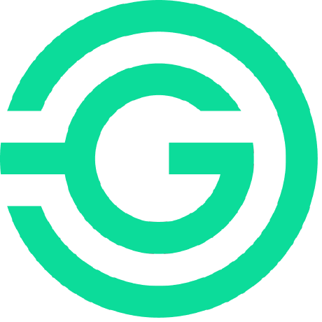
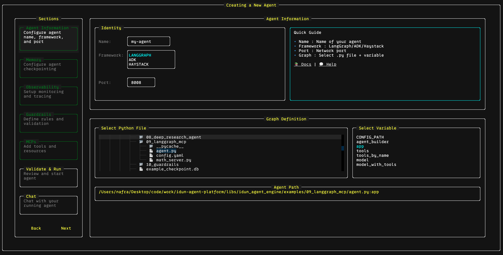
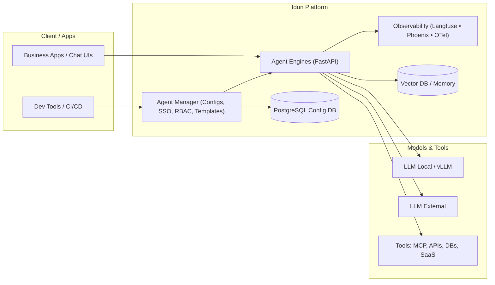
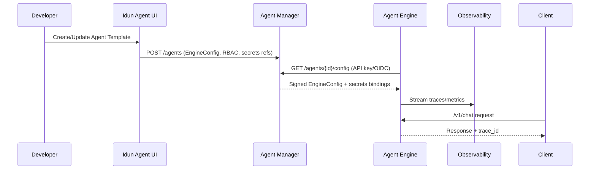

<div align="center">
  

  [](https://opensource.org/licenses/MIT) [](https://www.python.org/downloads/) [](https://pypi.org/project/idun-agent-engine/) [](https://idun-group.github.io/idun-agent-platform/) [](https://github.com/Idun-Group/idun-agent-platform) [](https://discord.gg/KCZ6nW2jQe)

</div>

# Idun Agent Platform

**Productionize and govern generative-AI agents on your own infrastructure.**

Idun Agent Platform is an open source control plane for generative AI agents.
It turns LangGraph, ADK or Haystack agents into **production-ready services** with

- Unified deployment across frameworks
- Observability and tracing
- Memory and session persistence
- Guardrails and MCP integration
- Multi-environment and access control

**Who is this for**

- **GenAI developers**, who want to ship agents without rebuilding infra each time
- **AI and data platform teams**, who need governance, auditability and sovereignty

```bash
pip install idun-agent-engine
```

**Links**

- **[Quickstart](https://idun-group.github.io/idun-agent-platform/getting-started/quickstart/)** (platform in Docker Compose)
- **[Documentation](https://idun-group.github.io/idun-agent-platform/)**
- **[Discord](https://discord.gg/KCZ6nW2jQe)**
- **[Contributing](./CONTRIBUTING.md)** and **[Code of Conduct](./CODE_OF_CONDUCT.md)**

<div align="center" style="margin: 2em 0;">
  <a href="https://www.youtube.com/watch?v=1QJbSrfz5tU">
    
  </a>
</div>


<p align="center">
  
  
  
  
  
  
  
  
  
  
  
  
  
  
</p>

<p align="center">
  If you find this project useful, please <b>star the repository</b> and join our <b>Discord community</b>.
</p>
<p align="center">
  Built by Idun Group (France).
</p>

---

## Table of contents

- [Should you use Idun Agent Platform](#should-you-use-idun-agent-platform)
- [Quickstart (CLI, 5 minutes)](#quickstart-cli-5-minutes)
- [Quickstart (Engine only, 10 minutes)](#quickstart-engine-only-10-minutes)
- [Quickstart (Platform, Docker Compose)](#quickstart)
- [Key capabilities at a glance](#key-capabilities-at-a-glance)
- [High level architecture](#high-level-architecture)
- [Enterprise and regulated environments](#enterprise-and-regulated-environments)
- [Community and support](#community-and-support)
- [Commercial support](#commercial-support)
- [Project status and roadmap](#project-status-and-roadmap)
- [Contributing](#contributing)

## Should you use Idun Agent Platform

You probably should if:

- You have or plan multiple agents built with LangGraph, ADK, Haystack or similar
- You care about observability, guardrails, security, and AI regulation
- You want to self host or run on your own cloud, not depend on a vendor black box

You probably should not if:

- You are just experimenting with a single toy chatbot
- You do not need observability, governance or multi environment setups yet

## For GenAI developers

You want to spend time on agent logic, not boilerplate infra.

With Idun you can:

- Wrap your LangGraph, ADK or Haystack agent as a FastAPI service in minutes
- Get tracing, feedback and metrics without rewriting your code
- Run the same agent locally, on staging and in production with the same config
- Plug tools and memory through configuration instead of hard coding everything

## For AI and data platform teams

You want to standardize how agents run in production and stay compliant.

With Idun you can:

- Maintain a catalog of approved agents with clear ownership and environments
- Enforce SSO, RBAC and per tenant isolation, integrated with your IdP
- Control which models, tools and data sources each agent can use with MCP
- Enforce guardrails for safety and compliance, with full audit and monitoring

## Why Idun exists

Today, each agent framework comes with its own way to deploy, observe and govern agents.
The result is a zoo of one off POCs, custom servers and ad hoc dashboards.

Idun Agent Platform gives you:

- **One configuration model**, define agents configurations in one central hub  that works across frameworks
- **Production features by default**, memory, observability, guardrails, MCP, SSO access
- **Flexible deployment**, run locally, self host on your own cloud or integrate in your platform
- **Centralized control**, manage agents, environments and access from one dashboard or CLI

👉 **[Read the technical whitepaper](#technical-whitepaper)** for a deeper architecture overview.

## Key capabilities at a glance

- **Observability**
  Plug Langfuse, Phoenix, LangSmith or GCP, get tracing and metrics for every call.

- **Guardrails**
  Add content safety, PII detection and prompt injection protection in front of any agent.

- **MCP integration**
  Extend agents with Model Context Protocol servers, Idun manages server lifecycle and tool registration.

- **Memory and session persistence**
  Persist conversations and state across calls with backends like SQLite or Postgres.

## Quickstart (CLI, 5 minutes)

The easiest way to configure and run an agent is with the interactive CLI:

1. Install:

```bash
pip install idun-agent-engine
```

2. Run the CLI:

```bash
idun init
```

<div align="center">
  <table>
    <tr>
      <td></td>
      <td></td>
    </tr>
    <tr>
      <td></td>
      <td></td>
    </tr>
  </table>
</div>

3. Configure your agent through the interactive TUI:
   - Agent framework (LangGraph/ADK)
   - Memory/checkpointing (In-Memory, SQLite, PostgreSQL)
   - Observability (Langfuse, Phoenix, LangSmith, GCP)
   - Guardrails and MCP servers

4. The CLI offers to:
   - Deploy the agent locally
   - Show live server logs
   - Open a chat interface to test your agent
   - View the Swagger docs at `http://localhost:8000/docs`

Or run the agent separately:

```bash
idun agent serve --source=file --path=.idun/agent_name.yaml
```

All from one terminal interface, no manual YAML editing required.

<div align="center">
  <table>
    <tr>
      <td></td>
      <td></td>
    </tr>
    <tr>
      <td></td>
      <td></td>
    </tr>
  </table>
</div>

## Quickstart (Engine only, 10 minutes)

If you just want to run an agent API (without the full platform UI/Manager), you can run the **Idun Agent Engine** standalone.

1. Install:

```bash
pip install idun-agent-engine
```

2. Create a minimal LangGraph agent (`example_agent.py`):

```python
import operator
from typing import Annotated, TypedDict

from langgraph.graph import END, StateGraph


class AgentState(TypedDict):
    messages: Annotated[list, operator.add]


def greet_node(state: AgentState):
    user_message = state["messages"][-1] if state.get("messages") else ""
    return {"messages": [("ai", f"Hello! You said: '{user_message}'")]}


graph = StateGraph(AgentState)
graph.add_node("greet", greet_node)
graph.set_entry_point("greet")
graph.add_edge("greet", END)

app = graph
```

3. Point the engine to it (`config.yaml`) and run:

```yaml
server:
  api:
    port: 8000

agent:
  type: "langgraph"
  config:
    name: "Hello World Agent"
    graph_definition: "./example_agent.py:app"
```

```bash
python -c "from idun_agent_engine.core.server_runner import run_server_from_config; run_server_from_config('config.yaml')"
```

Then open `http://localhost:8000/docs`.

## High level architecture

Idun Agent Platform is structured in four layers:

- **Web dashboard**
  UI to create, configure and monitor agents.

- **Manager API**
  Control plane that stores configurations, handles auth, observability and guardrails settings.

- **Engine runtime**
  Executes agents via adapters for LangGraph, ADK, Haystack and others, exposes AG-UI FastAPI endpoints.

- **Data layer**
  PostgreSQL for checkpointing and configuration, MCP servers for external tools and data.


## Quickstart

You need Python 3.12, Docker and Git.

1. Clone the repo

```bash
git clone https://github.com/Idun-Group/idun-agent-platform.git
cd idun-agent-platform
```

2. Start the platform locally

```bash
cp .env.example .env

docker compose -f docker-compose.dev.yml up --build
```

3. Open the dashboard at `http://localhost:3000` and create your first agent.

👉 For a complete step by step tutorial, including ADK example code, see the
**[Quickstart guide](https://idun-group.github.io/idun-agent-platform/getting-started/quickstart/)**.

---

## Enterprise and regulated environments

Idun is built for teams that need production governance and data control:

- **Data sovereignty**: run on-prem or in your own cloud (including EU-only deployments).
- **Security**: SSO/OIDC, multi-tenant RBAC, API keys, and guardrails.
- **Auditability**: end-to-end observability across prompts, tools, and model calls.
- **Platform standardization**: consistent runtime and policy enforcement across frameworks.

If you’re evaluating Idun for enterprise use, contact us at `contact@idun-group.com`.

## Technical whitepaper

### 1) System Overview

**Objective:** Provide a **unified, production-grade runtime** for heterogeneous agent frameworks with **centralized configuration, security, and observability**. Components:

- **Idun Agent Engine** — wraps LangGraph/ADK/Haystack agents into a **FastAPI** service with unified API using AG-UI protocol, memory, guardrails, and tracing. Works **standalone** (YAML) or **managed** (fetches config from Manager).
- **Idun Agent Manager** — **FastAPI + PostgreSQL** service for CRUD on engine configs; serves signed configs to Engines; enforces SSO/RBAC and tenancy.
- **Idun Agent UI** — **Next.js** admin for creating, deploying, observing, and governing agents.
- **Idun Agent Schema** — shared **Pydantic** models (EngineConfig, ManagedAgent, API contracts) ensuring type-safe interoperability across services.

**Non-functional pillars:** **Sovereignty (EU/on-prem), Security (guardrails, SSO/RBAC, air-gap), Observability (Langfuse/Phoenix/OpenTelemetry), Scalability (rate limiting, LB), Interoperability (multi-LLM, multi-framework).**

### 2) Reference Architecture



**Topologies:**

- **On-prem / EU cloud** with air-gapped LLMs and private data planes.
- **Hybrid** with local Engines and managed UI/Manager.

### 3) Managed Mode: Control-Plane Flow



**Benefits:** central policy enforcement, versioned configs, and uniform telemetry across heterogeneous frameworks.

### 4) Security & Compliance

- **Identity & Access:** **SSO/OIDC**, **RBAC**, per-tenant isolation; API keys for service-to-service.
- **Data Residency:** EU/on-prem deployment; optional **air-gap** with local LLMs.
- **Guardrails:** input/output filters, tool-use allowlists, prompt policy; **LLM-as-a-judge** evaluation paths.
- **Auditability:** full tracing of prompts, tools, and model calls (**OTel + Langfuse/Phoenix**).

### 5) Observability & Evaluation

- **Tracing:** spans across retrieval, function/tool calls, and model steps.
- **Feedback loops:** user scores + auto-eval ("LLM as a judge"); connect to regression dashboards.
- **Budgeting:** per-tenant usage/alerts; latency/error SLIs.

### 6) Interoperability

- **Frameworks:** LangGraph, CrewAI, ADK, Haystack (plug-in via adapters).
- **LLMs:** local (vLLM) and external (OpenAI/Anthropic/Mistral) behind a single gateway; **RAG & memory via Vector DB**.
- **Protocols:** **MCP**/**A2A** for tool and agent-to-agent collaboration.

### 7) Monorepo Layout

```text
libs/
  idun_agent_engine/     # runtime + adapters + FastAPI
  idun_agent_schema/     # Pydantic models (single source of truth)
services/
  idun_agent_manager/    # control plane (FastAPI + PostgreSQL)
  idun_agent_ui/         # Next.js admin
```

---

## Community and support

- Questions and help, [join the Discord](https://discord.gg/KCZ6nW2jQe)
- Proposals and ideas, [GitHub Discussions](https://github.com/Idun-Group/idun-agent-platform/discussions)
- Bugs and feature requests, [GitHub Issues](https://github.com/Idun-Group/idun-agent-platform/issues)

## Commercial support

Idun Agent Platform is maintained by Idun Group.
We can help with:

- Design and review of your agent platform architecture
- Secure deployment on your infrastructure
- Integration with your IdP, observability stack and compliance workflows

Contact us at contact@idun-group.com for enterprise support.

## Project status and roadmap

The platform is under active development and already used in production in real projects.

- ✅ Core runtime on PyPI as `idun-agent-engine`, with adapters for LangGraph and ADK
- ✅ Local and self-hosted deployment with Docker
- ✅ AG-UI compatible CopilotKit endpoint, MCP server support, Guardrails AI, observability (Langfuse, LangSmith, Phoenix, GCP Trace), SSO access to Manager UI
- 🚧 More agent frameworks and MCP integrations, environment management (DEV/STG/PRD), and expanded observability & evaluation
- 🚧 Deployment templates (Terraform, Helm/Kubernetes), ready-to-use agents & MCP tools, and Idun Cloud managed offering

See **[ROADMAP.md](./ROADMAP.md)** for details and planned features.

## Contributing

Contributions are welcome. Please see **[CONTRIBUTING.md](./CONTRIBUTING.md)** for guidelines.
