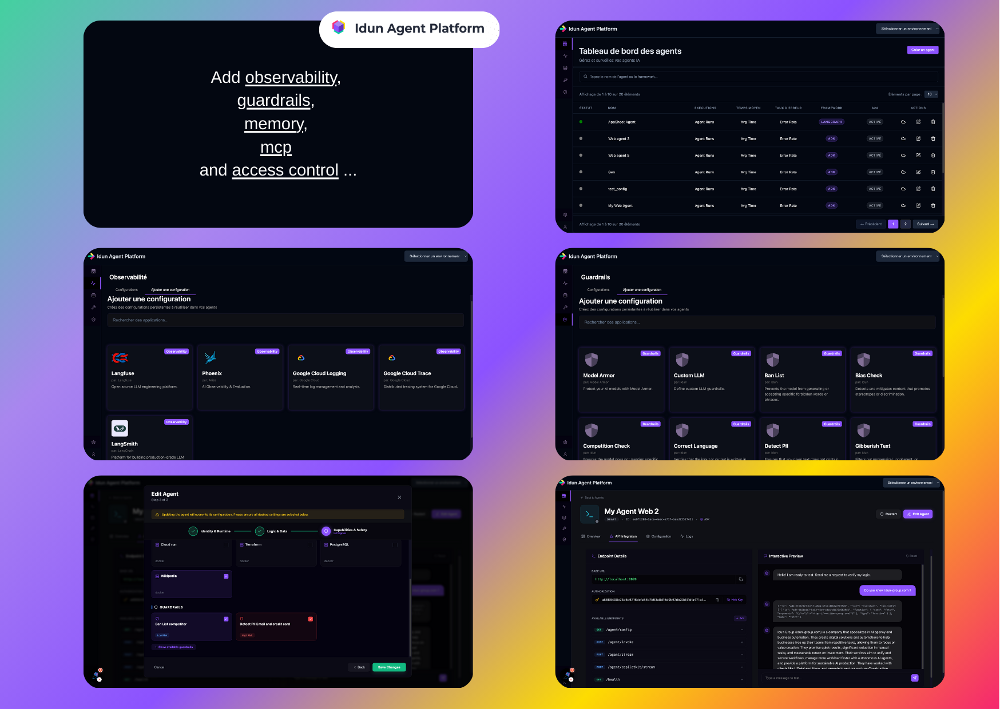
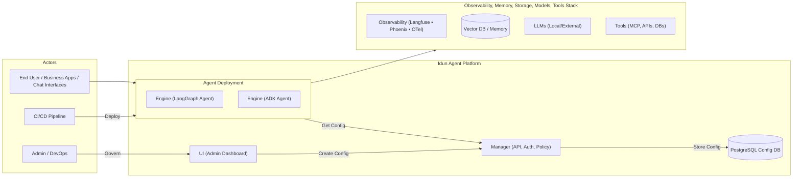

<div align="center">
  

  <div>
     <h3>
        <a href="https://idun-group.github.io/idun-agent-platform/getting-started/quickstart/">
           <strong>Quickstart</strong>
        </a> ·
        <a href="https://idun-group.github.io/idun-agent-platform/">
           <strong>Documentation</strong>
        </a> ·
        <a href="https://discord.gg/KCZ6nW2jQe">
           <strong>Discord</strong>
        </a>
     </h3>
  </div>

  <div>
     <a href="https://idun-group.github.io/idun-agent-platform/"><strong>Docs</strong></a> ·
     <a href="https://github.com/Idun-Group/idun-agent-platform/issues"><strong>Report Bug</strong></a> ·
     <a href="https://github.com/Idun-Group/idun-agent-platform/discussions"><strong>Feature Request</strong></a> ·
     <a href="./ROADMAP.md"><strong>Roadmap</strong></a> ·
     <a href="./CONTRIBUTING.md"><strong>Contributing</strong></a>
  </div>
  <br/>

  [](https://www.gnu.org/licenses/gpl-3.0.html) [](https://github.com/Idun-Group/idun-agent-platform/actions/workflows/ci.yml) [](https://www.python.org/downloads/) [](https://pypi.org/project/idun-agent-engine/) [](https://idun-group.github.io/idun-agent-platform/) [](https://github.com/Idun-Group/idun-agent-platform) [](https://discord.gg/KCZ6nW2jQe) [](https://www.linkedin.com/in/geoffrey-harrazi9/) [](https://github.com/Idun-Group/idun-agent-platform) [](https://deepwiki.com/Idun-Group/idun-agent-platform)

 </div>

## 🟪 **Own your agent stack**
**Open source, standards-based, lock-in-free, sovereign by design.**

The open-source platform that turns any **LangGraph** or **ADK** agent into a **production-ready service**.



## ✨ Core Features

- 🔌 **Standardized API**: AG-UI and CopilotKit-compatible endpoints
- 🔍 **Observability and tracing**: OpenTelemetry, Langfuse, Arize Phoenix, LangSmith, and Google Cloud Trace integrations
- 🧠 **Memory and session persistence**: Built-in memory backends: in-memory, SQLite, and PostgreSQL for production
- 🛡️ **Guardrails**: Apply input and output policies across agents, including PII detection, prompt-injection defenses, topic restrictions, and allowlists or blocklists (competitors, forbidden terms, etc.)
- 🧰 **MCP tool control**: Restrict agents to an approved set of MCP tools
- 🔐 **Access control**: SSO-based authentication and authorization to manage who can use each agent

## Who is this for?

- 🧑‍💻 **Solo developers**: Turn your LangGraph or ADK agent into a production service in minutes, without rebuilding the API, tracing, or memory layer.
- 🏢 **AI, data, and platform teams**: Standardize production agents with governance, auditability, and sovereignty on your own infrastructure.

<div align="center" style="margin: 2em 0;">
  <a href="https://www.youtube.com/watch?v=1QJbSrfz5tU">
    
  </a>
</div>

## 🔌 Integrations

<p align="center">
  
  
  
  
  
  
  
  
  
  
  
  
  
  
</p>

---

<p align="center">
  If you find this project useful, please <b>star ⭐ the repository</b> and join our <b>Discord community</b>.
</p>
<p align="center">
  Built by Idun Group with 💜
</p>

---

## Why Idun exists


Teams building an agent strategy are usually forced into a bad choice:
- **Build the whole platform yourself**, slow, expensive, hard to hire for, and hard to keep up with.
- **Adopt a ready-made SaaS or cloud platform**, faster at first, but you trade away sovereignty, resilience, and you accept vendor lock-in risk.

Meanwhile, **LLMs are becoming interchangeable**. Your real asset is the **agent workflow**: your business logic turned into execution. If that workflow lives in someone else’s black box, you lose control of the one thing that matters long term.

The ecosystem is also moving around **open source and open standards** (MCP, LangGraph, OpenTelemetry, Langfuse, etc.). This is where innovation happens first, proprietary stacks usually follow, and staying aligned with standards keeps your system portable and future-proof.

And in real companies, agents scale messily:
- **Shadow Agents** appear: multiple teams ship agents without governance, ownership, or security consistency—the same failure mode as Shadow IT.
- Access control, data/tool permissions, auditability, and compliance become painful to manage without a central control plane.

**Idun is the third path**: a **self-hosted, open source control plane** that lets you focus on **agent logic**, while Idun provides the **production and governance layer** described in the Core Features above.

# Getting Started

You can start using Idun Agent Platform in 3 ways:
- [Manager](#manager): **10 minutes, full experience** Use a Web UI to manage and govern multiple configs and agents.
- [CLI](#cli): **5 minutes, easiest** Lets you design your config with an interactive CLI
- [Manual config](#manual-config): **2 minutes, manual** Fewer dependencies, but you need to follow strict schema constraints

## Manager

Full Idun Agent Platform with an admin UI to manage and govern multiple configs and agents.

<div align="center">
  
</div>

You need Python 3.12, Docker, and Git.

1. Clone the repo.

```bash
git clone https://github.com/Idun-Group/idun-agent-platform.git
cd idun-agent-platform
```

2. Start the platform locally.

```bash
cp .env.example .env

docker compose -f docker-compose.dev.yml up --build
```

3. Open the dashboard at `http://localhost:3000` and create your first agent.

👉 For a complete step-by-step tutorial, including ADK example code, see the
**[Quickstart guide](https://idun-group.github.io/idun-agent-platform/getting-started/quickstart/)**.

## CLI

Easy, interactive CLI to configure your agent:

<div align="center">
  
</div>

1. Install in your agent environment:

```bash
pip install idun-agent-engine
```

2. Run the CLI:

```bash
idun init
```

3. Configure your agent through the interactive CLI:
   - Agent framework (LangGraph/ADK)
   - Memory/checkpointing (In-Memory, SQLite, PostgreSQL)
   - Observability (Langfuse, Phoenix, LangSmith, GCP)
   - Guardrails
   - MCP servers

> [!TIP]
  > You can press **Next** to save a section, or skip it. Each time you press **Next**, the state of your config is saved to **.idun/agent_name.yaml**. You can then run your agent directly without having to launch it via the CLI.


4. The CLI lets you:
   - Deploy the agent locally
   - Show live server logs
   - Open a chat interface to test your agent

You can view the Swagger docs at `http://localhost:YOUR_AGENT_PORT/docs`

👉 For a complete step-by-step tutorial with the CLI, see the
**[CLI guide](https://idun-group.github.io/idun-agent-platform/cli/overview/)**

## Manual config

If you just want to run an agent API (without the full platform UI/Manager), you can run the **Idun Agent Engine** standalone.

1. Install:

```bash
pip install idun-agent-engine
```

2. Create a minimal LangGraph agent (`example_agent.py`):

```python
import operator
from typing import Annotated, TypedDict

from langgraph.graph import END, StateGraph


class AgentState(TypedDict):
    messages: Annotated[list, operator.add]


def greet_node(state: AgentState):
    user_message = state["messages"][-1] if state.get("messages") else ""
    return {"messages": [("ai", f"Hello! You said: '{user_message}'")]}


graph = StateGraph(AgentState)
graph.add_node("greet", greet_node)
graph.set_entry_point("greet")
graph.add_edge("greet", END)

app = graph
```

3. Point the engine to it (`config.yaml`) and run:

```yaml
server:
  api:
    port: 8000

agent:
  type: "langgraph"
  config:
    name: "Hello World Agent"
    graph_definition: "./example_agent.py:app"
```

```bash
python -c "from idun_agent_engine.core.server_runner import run_server_from_config; run_server_from_config('config.yaml')"
```

Then open `http://localhost:8000/docs`

---

# Technical architecture


- **Idun Agent Engine** — wraps LangGraph/ADK agents into a **FastAPI** service with a unified API using the AG-UI protocol, memory, guardrails, and tracing. Use a local YAML config or fetch it from Manager.
- **Idun Agent CLI** - easy CLI to create a YAML config for the Engine.
- **Idun Agent Manager** — **FastAPI + PostgreSQL** service for CRUD on engine configs; serves signed configs to Engines; enforces SSO/RBAC and tenancy.
- **Idun Agent UI** — **Next.js** admin UI to govern agents by creating and modifying agent configs.
- **Idun Agent Schema** — shared **Pydantic** models ensuring type-safe interoperability across services.




---

# Community and support

- Questions and help: [join the Discord](https://discord.gg/KCZ6nW2jQe)
- Proposals and ideas: [GitHub Discussions](https://github.com/Idun-Group/idun-agent-platform/discussions)
- Bugs and feature requests: [GitHub Issues](https://github.com/Idun-Group/idun-agent-platform/issues)

# Commercial support

Idun Agent Platform is maintained by Idun Group.
We can help with:

- Design and review of your agent platform architecture
- Secure deployment on your infrastructure
- Integration with your IdP, observability stack, and compliance workflows

Contact us at contact@idun-group.com for enterprise support.

# Telemetry

By default, Idun Agent Platform gathers minimal, anonymized usage metrics from self-hosted deployments to PostHog.

This enables us to:
- Better understand how people use the platform and prioritize enhancements.
- Track adoption for both internal improvement and, when required, external reporting.

No private or sensitive information is collected, and no usage data is shared with third parties. We aim for full transparency—**[view the telemetry source code](libs/idun_agent_engine/src/idun_agent_engine/telemetry/telemetry.py)** to see exactly what data is collected.

If you prefer not to send usage data, you can disable telemetry by setting `IDUN_TELEMETRY_ENABLED=false`.

# Project status and roadmap

See **[ROADMAP.md](./ROADMAP.md)** for the latest status, priorities, and what’s coming next.

Have an idea or want to influence priorities? Please start a thread in **[GitHub Discussions](https://github.com/Idun-Group/idun-agent-platform/discussions)** — we use it to collect proposals and shape the roadmap with the community.

# Contributing

Contributions are welcome. Please see **[CONTRIBUTING.md](./CONTRIBUTING.md)** for guidelines.

# ⭐️ Star Us
<div align="center">
  
</div>
