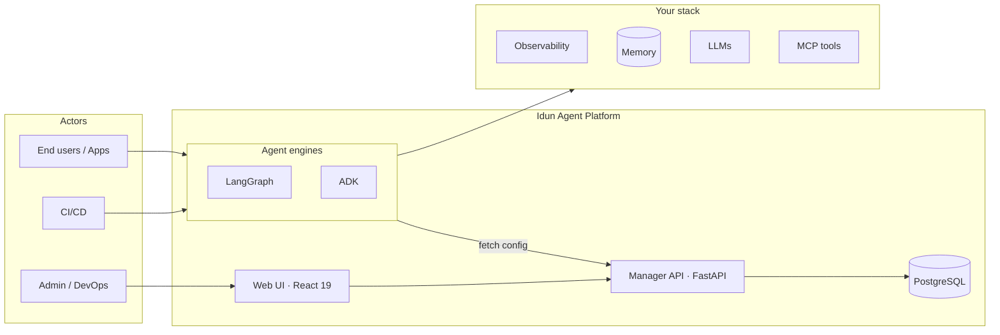

<div align="center">

<picture>
  <source media="(prefers-color-scheme: dark)" srcset="docs/logo/light.svg">
  <source media="(prefers-color-scheme: light)" srcset="docs/logo/dark.svg">
  
</picture>

### Deploy AI agents to production

Idun Agent Platform is an open-source, self-hosted control plane for LangGraph and ADK agents.
You bring the agent. Idun adds observability, guardrails, memory, MCP tool governance, and SSO, then serves it as a production API.

No vendor lock-in. No infrastructure to build. [Get started in 5 minutes.](#quick-start)

<br/>

<a href="https://cloud.idunplatform.com">Cloud</a> &middot;
<a href="https://docs.idunplatform.com/quickstart">Quickstart</a> &middot;
<a href="https://docs.idunplatform.com">Documentation</a> &middot;
<a href="https://discord.gg/KCZ6nW2jQe">Discord</a> &middot;
<a href="https://calendar.app.google/RSzm7EM5VZY8xVnN9">Book a demo</a>

<br/>

[](https://www.gnu.org/licenses/gpl-3.0.html) [](https://github.com/Idun-Group/idun-agent-platform/actions/workflows/ci.yml) [](https://pypi.org/project/idun-agent-engine/) [](https://discord.gg/KCZ6nW2jQe) [](https://github.com/Idun-Group/idun-agent-platform)

</div>

<br/>

<p align="center">
  
</p>

## Quick start

You need Docker and Git.

```bash
git clone https://github.com/Idun-Group/idun-agent-platform.git
cd idun-agent-platform
cp .env.example .env
docker compose -f docker-compose.dev.yml up --build
```

Open [localhost:3000](http://localhost:3000). Create an account. Deploy your first agent.

That's it. For the full walkthrough, see the [quickstart guide](https://docs.idunplatform.com/quickstart).

> **Don't need the full platform?** Install the engine standalone:
> ```bash
> pip install idun-agent-engine
> idun init
> ```
> The TUI wizard configures framework, memory, observability, guardrails, and MCP in one pass. [CLI docs](https://docs.idunplatform.com/cli/overview).

## Features

### Observability

Connect Langfuse, Arize Phoenix, LangSmith, Google Cloud Trace, or Google Cloud Logging. Enable tracing and metrics through config, not code. Multiple providers can run simultaneously.


### Guardrails

15 built-in guards: PII detection, toxic language, ban lists, topic restriction, bias checks, NSFW filtering, competition checks, language validation, and more. Apply them per-agent on input, output, or both. Powered by [Guardrails AI](https://www.guardrailsai.com/).


### MCP tool governance

Register MCP servers (stdio, SSE, streamable HTTP, WebSocket) and assign them to agents. Each agent only sees the tools you allow.


### Memory and persistence

In-memory, SQLite, or PostgreSQL for LangGraph. In-memory, Vertex AI, or database sessions for ADK. Conversations persist across restarts.


### SSO and multi-tenancy

OIDC authentication with Google and Okta (or username/password). Workspaces with role-based access control: owner, admin, member, viewer. Every resource is scoped to a workspace.

### Messaging integrations

Bridge agents to WhatsApp, Discord, and Slack. Idun handles webhook verification, message routing, and bidirectional communication.


### Prompt management

Versioned prompt templates with Jinja2 variables. Create, tag, and assign prompts to agents from the UI or API. Content is immutable after creation (append-only versioning).

### Agent detail and chat playground

Every agent gets an overview page with config, resources, graph visualization, and a built-in chat interface for testing. AG-UI streaming protocol, compatible with CopilotKit clients.


## Architecture


```mermaid
flowchart LR
  subgraph Actors
    Users["End users / Apps"]
    Admin["Admin / DevOps"]
    CICD["CI/CD"]
  end

  subgraph Platform["Idun Agent Platform"]
    direction TB
    UI["Web UI · React 19"]
    MGR["Manager API · FastAPI"]
    subgraph Engines["Agent engines"]
      ENG1["LangGraph"]
      ENG2["ADK"]
    end
    DB[(PostgreSQL)]
  end

  subgraph Infra["Your stack"]
    OBS["Observability"]
    MEM[(Memory)]
    LLM["LLMs"]
    TOOLS["MCP tools"]
  end

  Admin --> UI --> MGR --> DB
  Engines -- "fetch config" --> MGR
  CICD --> Engines
  Users --> Engines --> Infra
```

| Layer | What it does |
|---|---|
| **Engine** | Wraps your LangGraph or ADK agent into a FastAPI service. Handles AG-UI streaming, checkpointing, guardrails, observability, MCP tools, and SSO. Config from YAML or Manager API. |
| **Manager** | Control plane. CRUD for agents, guardrails, MCP servers, observability, memory, SSO, prompts, integrations. Multi-tenant workspaces. Materialized config served to engines at zero latency. |
| **Web UI** | Admin dashboard. Create agents, configure resources, test with built-in chat, manage users and workspaces. |

## Integrations

<p align="center">
  
  
  
  
  
  
  
  
  
  
  
  
  
</p>

## Trusted by

> *"Idun Platform brings together all the tools needed to orchestrate our AI agents. It lets us significantly accelerate the deployment of our generative AI ambitions."*
>
> **Cyriac Azefack**, Generative AI Lead, Richemont

> *"Idun Platform brings together what's essential for industrialising AI agents, from governance to observability. It gives you the confidence to move from POC to production."*
>
> **Atilla Topo**, Head of Cloud, AXA Partners

## Manual setup

<details>
<summary>Run a standalone agent from a config file (no Manager, no database)</summary>

<br/>

```bash
pip install idun-agent-engine
```

Create your agent (`agent.py`):

```python
import operator
from typing import Annotated, TypedDict
from langgraph.graph import END, StateGraph

class AgentState(TypedDict):
    messages: Annotated[list, operator.add]

def greet(state: AgentState):
    user_msg = state["messages"][-1] if state.get("messages") else ""
    return {"messages": [("ai", f"Hello! You said: '{user_msg}'")]}

graph = StateGraph(AgentState)
graph.add_node("greet", greet)
graph.set_entry_point("greet")
graph.add_edge("greet", END)
app = graph
```

Create `config.yaml`:

```yaml
server:
  api:
    port: 8000

agent:
  type: "LANGGRAPH"
  config:
    name: "Hello World Agent"
    graph_definition: "./agent.py:app"
```

```bash
idun agent serve --source file --path config.yaml
# Open http://localhost:8000/docs
```

For more examples, see the [agent templates](https://github.com/Idun-Group/idun-agent-template) repository.

</details>

## Community

- **Help and questions** — [Discord](https://discord.gg/KCZ6nW2jQe)
- **Feature requests** — [GitHub Discussions](https://github.com/Idun-Group/idun-agent-platform/discussions)
- **Bug reports** — [GitHub Issues](https://github.com/Idun-Group/idun-agent-platform/issues)

## Contributing

See [CONTRIBUTING.md](./CONTRIBUTING.md) for setup and guidelines, [ROADMAP.md](./ROADMAP.md) for what's next.

## Commercial support

Idun Agent Platform is maintained by [Idun Group](https://idunplatform.com). We help with agent platform architecture, deployment on your infrastructure, and integration with your identity provider and compliance stack. [Book a call](https://calendar.app.google/RSzm7EM5VZY8xVnN9) or email contact@idun-group.com.

## Telemetry

Minimal, anonymous usage metrics via PostHog. No PII. No third-party sharing. [View the source](libs/idun_agent_engine/src/idun_agent_engine/telemetry/telemetry.py). Opt out: `IDUN_TELEMETRY_ENABLED=false`

## License

[GPLv3](./LICENSE)
