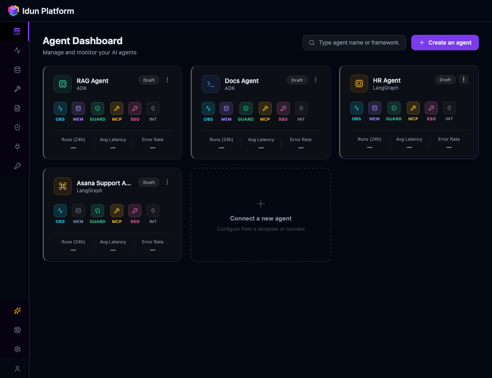
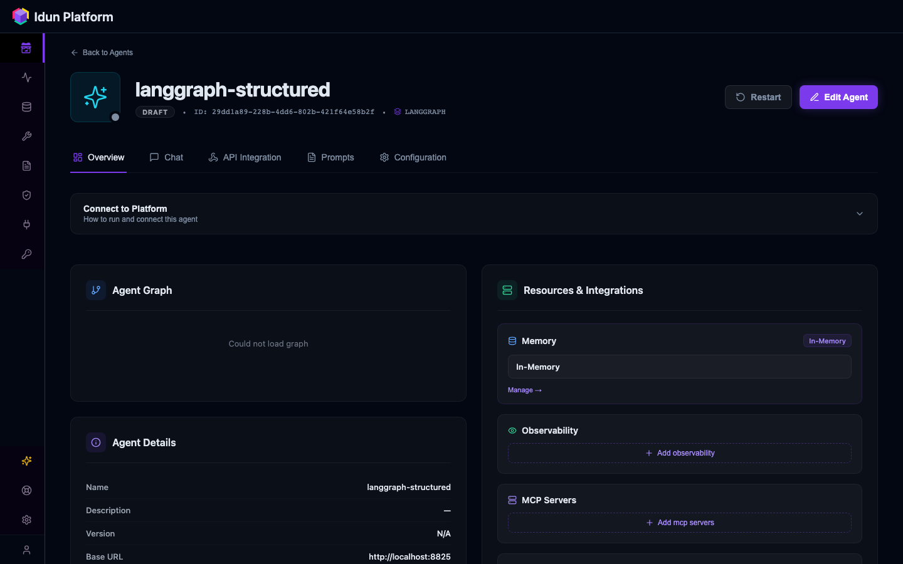
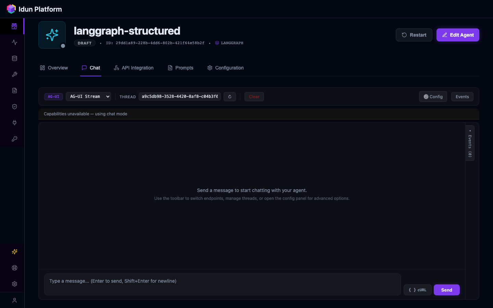
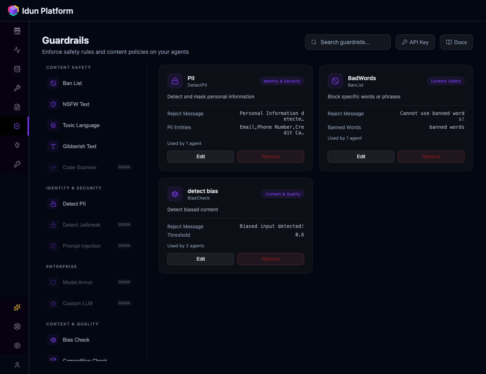
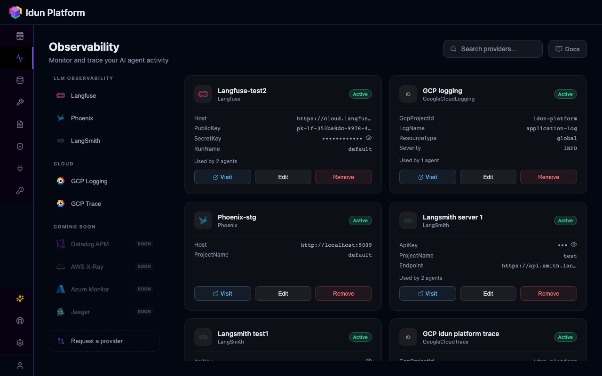
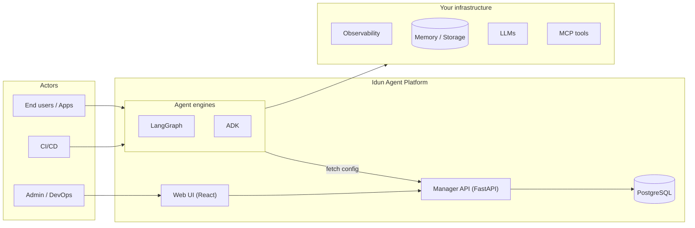

<div align="center">

<picture>
  <source media="(prefers-color-scheme: dark)" srcset="docs/logo/light.svg">
  <source media="(prefers-color-scheme: light)" srcset="docs/logo/dark.svg">
  
</picture>

<h3>Open-source AI agent deployment platform</h3>

<p>Deploy any LangGraph or ADK agent to production with built-in observability,<br/> guardrails, memory, MCP tool governance, and SSO. Self-hosted. No lock-in.</p>

<p>
  <a href="https://cloud.idunplatform.com">Cloud</a> &middot;
  <a href="https://docs.idunplatform.com/quickstart">Quickstart</a> &middot;
  <a href="https://docs.idunplatform.com">Docs</a> &middot;
  <a href="https://discord.gg/KCZ6nW2jQe">Discord</a> &middot;
  <a href="https://calendar.app.google/RSzm7EM5VZY8xVnN9">Book a demo</a>
</p>

<p>
  <a href="https://www.gnu.org/licenses/gpl-3.0.html"></a>
  <a href="https://github.com/Idun-Group/idun-agent-platform/actions/workflows/ci.yml"></a>
  <a href="https://pypi.org/project/idun-agent-engine/"></a>
  <a href="https://discord.gg/KCZ6nW2jQe"></a>
  <a href="https://github.com/Idun-Group/idun-agent-platform"></a>
  <a href="https://github.com/Idun-Group/idun-agent-platform"></a>
</p>

</div>

<br/>

<p align="center">
  
</p>

## Quick start

The fastest way to get running. You need Docker and Git.

```bash
git clone https://github.com/Idun-Group/idun-agent-platform.git
cd idun-agent-platform
cp .env.example .env
docker compose -f docker-compose.dev.yml up --build
```

Open [http://localhost:3000](http://localhost:3000), create an account, and deploy your first agent.

> **Standalone mode:** If you don't need the full platform, install the engine directly:
> ```bash
> pip install idun-agent-engine
> idun init
> ```
> The interactive TUI walks you through framework, memory, observability, and guardrails setup. See the [CLI docs](https://docs.idunplatform.com/cli/overview).

For the full walkthrough, see the **[quickstart guide](https://docs.idunplatform.com/quickstart)**.

## What you get

<table>
<tr>
<td width="50%" valign="top">

**1. Agent to production in minutes**

Enroll any LangGraph or ADK agent and get a production-grade API with AG-UI streaming, CopilotKit compatibility, and OpenAPI docs. No boilerplate.

**2. Observability**

Full visibility into every agent run. Connect Langfuse, Arize Phoenix, LangSmith, or Google Cloud Trace with a few lines of config.

**3. Memory and persistence**

Conversation state with in-memory, SQLite, or PostgreSQL backends. ADK agents get VertexAI and database session services.

**4. Guardrails**

Enforce policies on input and output: PII detection, toxic language, ban lists, topic restriction, bias checks, NSFW filtering, and more. Powered by Guardrails AI.

</td>
<td width="50%" valign="top">

**5. MCP tool governance**

Control which MCP tools each agent can access. Supports stdio, SSE, streamable HTTP, and WebSocket transports.

**6. SSO and multi-tenancy**

OIDC authentication (Google, Okta) or username/password. Role-based workspaces (owner, admin, member, viewer) to isolate teams.

**7. Messaging integrations**

Connect agents to WhatsApp, Discord, and Slack through built-in webhook adapters. Bidirectional: receive messages, invoke agents, send replies.

**8. Prompt management**

Versioned prompt templates with Jinja2 variables. Create, tag, and assign prompts to agents from the UI or API.

</td>
</tr>
</table>

## See it in action

<table>
<tr>
<td width="50%">

<p align="center"><em>Agent overview — config, resources, graph visualization</em></p>
</td>
<td width="50%">

<p align="center"><em>Built-in chat playground for testing</em></p>
</td>
</tr>
<tr>
<td width="50%">

<p align="center"><em>Guardrail policies with per-agent assignment</em></p>
</td>
<td width="50%">

<p align="center"><em>Observability providers — Langfuse, Phoenix, LangSmith, GCP</em></p>
</td>
</tr>
</table>

## Architecture


```mermaid
flowchart LR
  subgraph Actors
    ChatUI["End users / Apps"]
    Admin["Admin / DevOps"]
    CICD["CI/CD"]
  end

  subgraph Platform["Idun Agent Platform"]
    direction TB
    UI["Web UI (React)"]
    MGR["Manager API (FastAPI)"]
    subgraph Engines["Agent engines"]
      ENG1["LangGraph"]
      ENG2["ADK"]
    end
    DB[(PostgreSQL)]
  end

  subgraph Infra["Your infrastructure"]
    OBS["Observability"]
    MEM[(Memory / Storage)]
    LLM["LLMs"]
    TOOLS["MCP tools"]
  end

  Admin --> UI --> MGR --> DB
  Engines -- "fetch config" --> MGR
  CICD --> Engines
  ChatUI --> Engines --> Infra
```

**Engine** wraps your agent framework into a FastAPI service. Reads config from YAML or the Manager API. Handles streaming (AG-UI), checkpointing, guardrails, observability, and MCP tools.

**Manager** is the control plane. CRUD for agents, guardrails, MCP servers, observability, memory, SSO, prompts, and integrations. Multi-tenant workspaces. Materialized config served to engines with zero JOINs.

**Web UI** is the admin dashboard. Create agents, configure resources, test with the built-in chat, manage users and workspaces.

## Integrations

<p align="center">
  
  
  
  
  
  
  
  
  
  
  
  
  
</p>

## Manual config

<details>
<summary>Run a single agent from a YAML file (no Manager, no database)</summary>

<br/>

```bash
pip install idun-agent-engine
```

Create your agent (`agent.py`):

```python
import operator
from typing import Annotated, TypedDict
from langgraph.graph import END, StateGraph

class AgentState(TypedDict):
    messages: Annotated[list, operator.add]

def greet(state: AgentState):
    user_msg = state["messages"][-1] if state.get("messages") else ""
    return {"messages": [("ai", f"Hello! You said: '{user_msg}'")]}

graph = StateGraph(AgentState)
graph.add_node("greet", greet)
graph.set_entry_point("greet")
graph.add_edge("greet", END)
app = graph
```

Point the engine to it (`config.yaml`):

```yaml
server:
  api:
    port: 8000

agent:
  type: "LANGGRAPH"
  config:
    name: "Hello World Agent"
    graph_definition: "./agent.py:app"
```

```bash
idun agent serve --source file --path config.yaml
# API docs at http://localhost:8000/docs
```

For more examples, see the **[agent templates](https://github.com/Idun-Group/idun-agent-template)** repo (9 runnable examples).

</details>

## Community and support

- **Questions and help** — [Discord](https://discord.gg/KCZ6nW2jQe)
- **Feature requests** — [GitHub Discussions](https://github.com/Idun-Group/idun-agent-platform/discussions)
- **Bug reports** — [GitHub Issues](https://github.com/Idun-Group/idun-agent-platform/issues)

## Contributing

See **[CONTRIBUTING.md](./CONTRIBUTING.md)** for setup and guidelines, **[ROADMAP.md](./ROADMAP.md)** for priorities.

## Commercial support

Idun Agent Platform is maintained by [Idun Group](https://idunplatform.com). We help with platform architecture, deployment on your infrastructure, and integration with your IdP and compliance stack. [Book a call](https://calendar.app.google/RSzm7EM5VZY8xVnN9) or email contact@idun-group.com.

## Telemetry

Minimal, anonymized usage metrics via PostHog. No PII. No third-party sharing. **[View the source](libs/idun_agent_engine/src/idun_agent_engine/telemetry/telemetry.py)**. Opt out: `IDUN_TELEMETRY_ENABLED=false`

## License

[GPLv3](./LICENSE)
