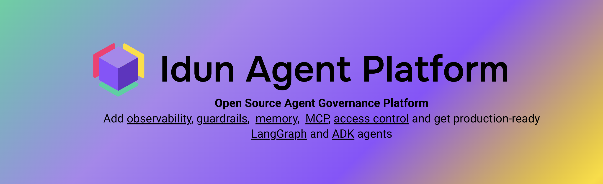
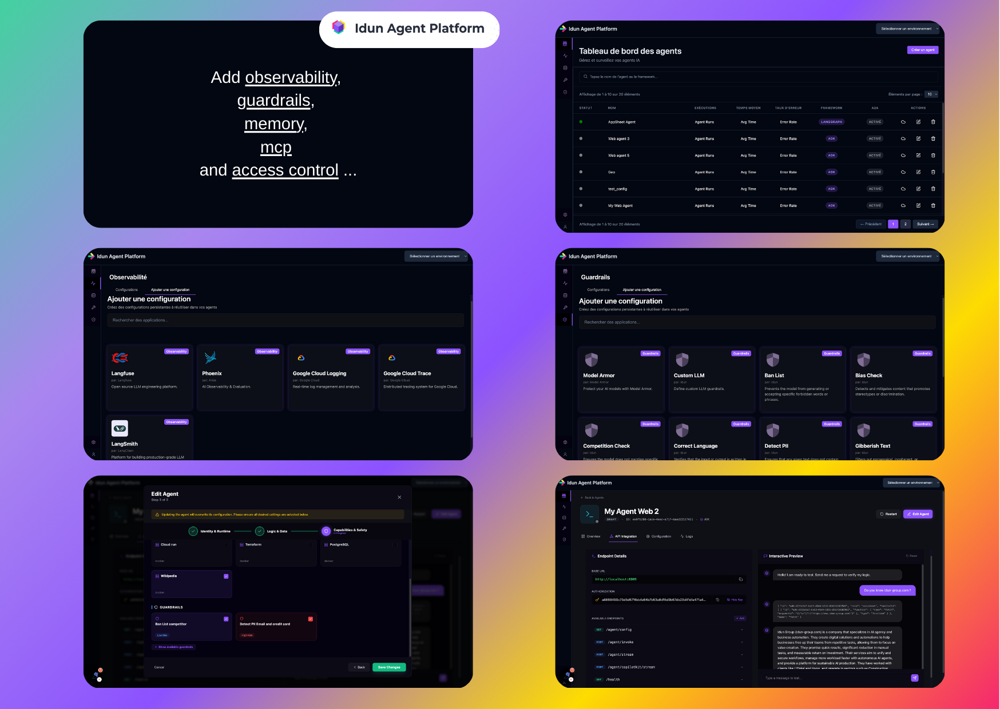
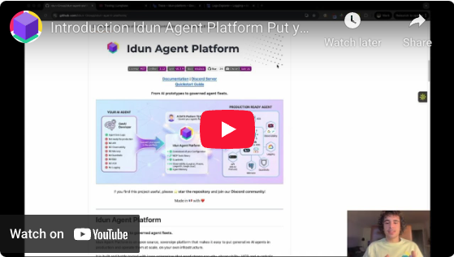
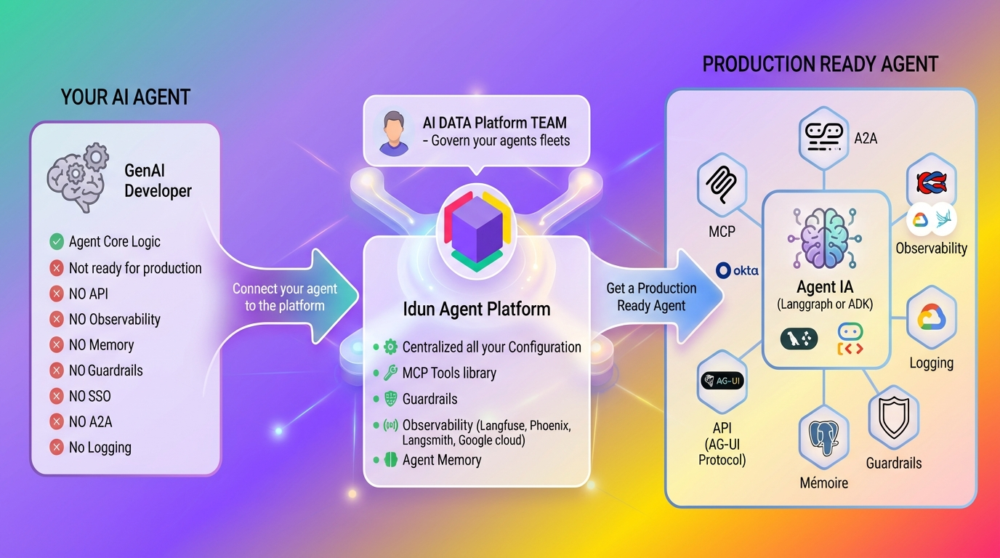
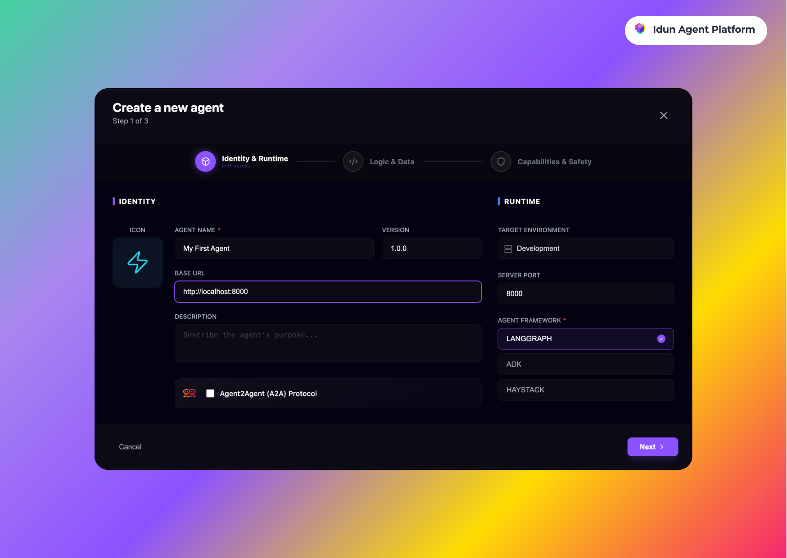
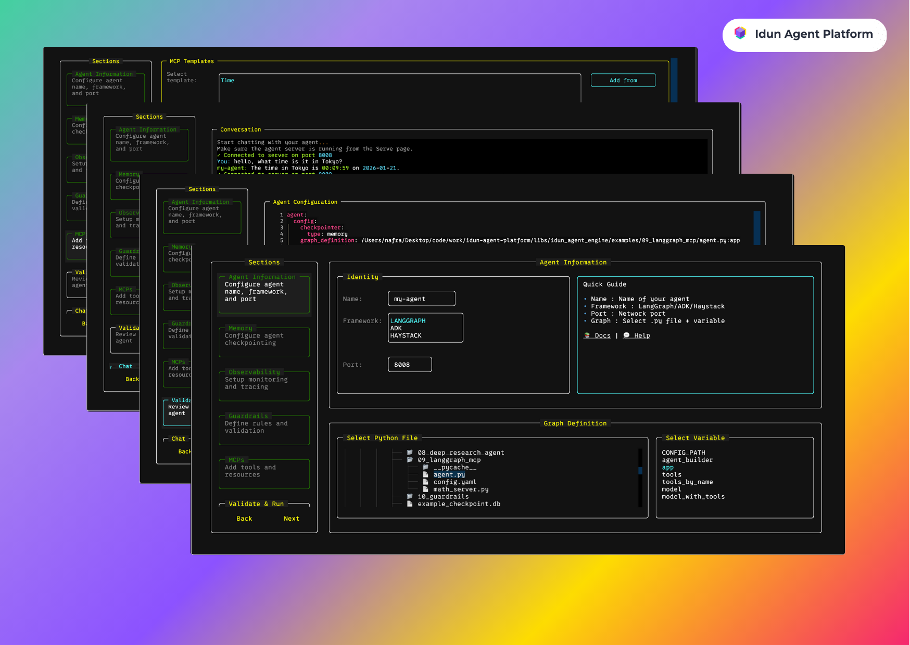
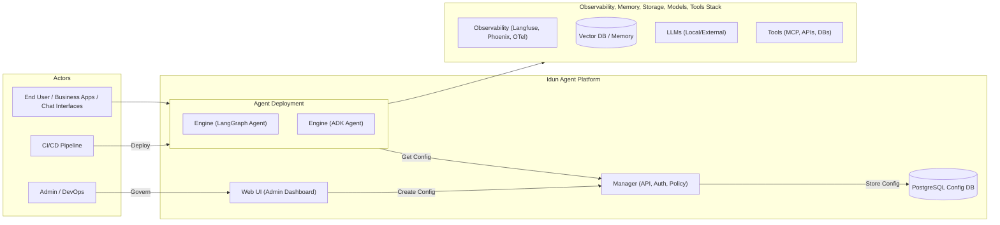

<div align="center">
  

  <div>
     <h3>
        <a href="https://docs.idunplatform.com/quickstart">
           <strong>Quickstart</strong>
        </a> ·
        <a href="https://docs.idunplatform.com">
           <strong>Documentation</strong>
        </a> ·
        <a href="https://discord.gg/KCZ6nW2jQe">
           <strong>Discord</strong>
        </a>
     </h3>
  </div>

  <div>
     <a href="https://docs.idunplatform.com"><strong>Docs</strong></a> ·
     <a href="https://github.com/Idun-Group/idun-agent-platform/issues"><strong>Report Bug</strong></a> ·
     <a href="https://github.com/Idun-Group/idun-agent-platform/discussions"><strong>Feature Request</strong></a> ·
     <a href="./ROADMAP.md"><strong>Roadmap</strong></a> ·
     <a href="./CONTRIBUTING.md"><strong>Contributing</strong></a>
  </div>
  <br/>

  [](https://www.gnu.org/licenses/gpl-3.0.html) [](https://github.com/Idun-Group/idun-agent-platform/actions/workflows/ci.yml) [](https://www.python.org/downloads/) [](https://pypi.org/project/idun-agent-engine/) [](https://docs.idunplatform.com) [](https://github.com/Idun-Group/idun-agent-platform) [](https://discord.gg/KCZ6nW2jQe) [](https://www.linkedin.com/in/geoffrey-harrazi9/) [](https://github.com/Idun-Group/idun-agent-platform) [](https://deepwiki.com/Idun-Group/idun-agent-platform)

 </div>

## Own your agent stack

**Open source. Standards-based. No lock-in. Sovereign by design.**

The open-source platform that turns any **LangGraph** or **ADK** agent into a **production-ready service**.



## Core features

- **Standardized API**: AG-UI and CopilotKit-compatible endpoints out of the box
- **Observability and tracing**: Langfuse, Arize Phoenix, LangSmith, and Google Cloud Trace integrations via OpenTelemetry
- **Memory and session persistence**: In-memory, SQLite, and PostgreSQL backends with zero-config defaults
- **Guardrails**: Input and output policies including PII detection, prompt injection defense, topic restriction, and custom allowlists/blocklists
- **MCP tool control**: Per-agent allowlists that restrict which MCP tools each agent can access
- **SSO and access control**: OIDC authentication with role-based workspace isolation

## Who is this for?

**Solo developers**: You have a LangGraph or ADK agent. You want it running behind a production API with tracing, memory, and guardrails. You don't want to build that infrastructure yourself.

**Platform teams**: You have multiple teams shipping agents. You need centralized governance, auditability, and the ability to enforce policies without touching agent code.

<div align="center" style="margin: 2em 0;">
  <a href="https://www.youtube.com/watch?v=1QJbSrfz5tU">
    
  </a>
</div>

## Integrations

<p align="center">
  
  
  
  
  
  
  
  
  
  
  
</p>

---

<p align="center">
  If you find this project useful, please <b>star the repository</b> and join our <b>Discord community</b>.
</p>

---

## Why Idun exists



Teams building an agent strategy usually face a bad tradeoff:

- **Build the platform yourself.** Slow, expensive, and hard to keep up with a stack that changes monthly.
- **Adopt a SaaS platform.** Faster to start, but you hand over sovereignty and accept lock-in on the one asset that matters: your agent workflows.

Meanwhile, the ecosystem is converging on **open standards** (MCP, LangGraph, OpenTelemetry, Langfuse). This is where innovation happens first. Proprietary stacks follow. Staying aligned with standards keeps your system portable.

And in real companies, agents scale messily. Multiple teams ship agents without shared governance, access control, or observability. The same failure mode as Shadow IT, except with LLM-powered services that have access to your tools and data.

**Idun is the third path**: a self-hosted, open source control plane. You focus on agent logic. The platform handles the production and governance layer.

# Getting started

Three ways to start, depending on how much platform you want.

## Manager (recommended)

The full platform: web UI, Manager API, PostgreSQL, and centralized governance for multiple agents.

<div align="center">
  
</div>

You need Python 3.12, Docker, and Git.

1. Clone the repo:

```bash
git clone https://github.com/Idun-Group/idun-agent-platform.git
cd idun-agent-platform
```

2. Start the platform:

```bash
cp .env.example .env
docker compose -f docker-compose.dev.yml up --build
```

3. Open `http://localhost:3000`, create an agent through the 3-step wizard, then enroll it from your code.

For the complete walkthrough, see the **[Manager tutorial](https://docs.idunplatform.com/manager/tutorial)**.

## CLI

Interactive TUI to configure and run a standalone agent without the Manager:

<div align="center">
  
</div>

```bash
pip install idun-agent-engine
idun init
```

The TUI walks you through framework selection, memory, observability, guardrails, and MCP. Your config is saved to `.idun/agent_name.yaml`.

See the **[CLI docs](https://docs.idunplatform.com/cli/overview)** for details.

## Manual config

Run a single agent from a YAML config file. No Manager, no database.

```bash
pip install idun-agent-engine
```

Create `example_agent.py`:

```python
import operator
from typing import Annotated, TypedDict

from langgraph.graph import END, StateGraph


class AgentState(TypedDict):
    messages: Annotated[list, operator.add]


def greet_node(state: AgentState):
    user_message = state["messages"][-1] if state.get("messages") else ""
    return {"messages": [("ai", f"Hello! You said: '{user_message}'")]}


graph = StateGraph(AgentState)
graph.add_node("greet", greet_node)
graph.set_entry_point("greet")
graph.add_edge("greet", END)

app = graph
```

Point the engine to it (`config.yaml`):

```yaml
server:
  api:
    port: 8000

agent:
  type: "langgraph"
  config:
    name: "Hello World Agent"
    graph_definition: "./example_agent.py:app"
```

```bash
idun agent serve --source file --path config.yaml
```

Then open `http://localhost:8000/docs`

## Agent templates

Want to start from working code? The [idun-agent-template](https://github.com/Idun-Group/idun-agent-template) repository has 9 runnable examples covering tool calling, structured I/O, multi-step workflows, and more. Clone the one closest to what you're building and go from there.

---

# Technical architecture

- **Engine**: wraps LangGraph/ADK agents into a FastAPI service with AG-UI protocol, memory, guardrails, and tracing. Reads config from a local YAML file or fetches it from the Manager.
  - **CLI**: interactive TUI to create YAML configs.
  - **Schema**: shared Pydantic models for type-safe interoperability across services.
- **Manager**: FastAPI + PostgreSQL control plane. CRUD for agent configs, SSO/RBAC, multi-tenancy. Serves materialized configs to running engines.
- **Web UI**: React 19 + Vite admin dashboard for governing agents, resources, users, and workspaces.


```mermaid
flowchart LR
  subgraph Actors["Actors"]
    ChatUI["End User / Business Apps / Chat Interfaces"]
    Admin["Admin / DevOps"]
    CICD["CI/CD Pipeline"]
  end

  subgraph Idun_Platform["Idun Agent Platform"]
    direction TB
    UI["Web UI (Admin Dashboard)"]
    MGR["Manager (API, Auth, Policy)"]

    subgraph Agents["Agent Deployment"]
      ENG1["Engine (LangGraph Agent)"]
      ENG2["Engine (ADK Agent)"]
    end

    CFGDB[(PostgreSQL Config DB)]
  end

  subgraph Stack["Observability, Memory, Storage, Models, Tools Stack"]
    OBS["Observability (Langfuse, Phoenix, OTel)"]
    VDB[(Vector DB / Memory)]
    LLM["LLMs (Local/External)"]
    TOOLS["Tools (MCP, APIs, DBs)"]
  end

  Admin -- "Govern" --> UI
  UI -- "Create Config" --> MGR
  MGR -- "Store Config" --> CFGDB

  Agents -- "Get Config" --> MGR

  CICD -- "Deploy" --> Agents

  ChatUI --> Agents

  Agents --> Stack
```

---

# Community and support

- Questions and help: [join the Discord](https://discord.gg/KCZ6nW2jQe)
- Proposals and ideas: [GitHub Discussions](https://github.com/Idun-Group/idun-agent-platform/discussions)
- Bugs and feature requests: [GitHub Issues](https://github.com/Idun-Group/idun-agent-platform/issues)

# Commercial support

Idun Agent Platform is maintained by Idun Group. We can help with:

- Design and review of your agent platform architecture
- Secure deployment on your infrastructure
- Integration with your IdP, observability stack, and compliance workflows

[Book a call](https://calendar.app.google/RSzm7EM5VZY8xVnN9) or email contact@idun-group.com.

# Telemetry

Idun Agent Platform collects minimal, anonymized usage metrics via PostHog by default. No private or sensitive data is collected. No usage data is shared with third parties.

**[View the telemetry source code](libs/idun_agent_engine/src/idun_agent_engine/telemetry/telemetry.py)** to see exactly what's collected.

To opt out: `IDUN_TELEMETRY_ENABLED=false`

# Project status and roadmap

See **[ROADMAP.md](./ROADMAP.md)** for priorities and what's coming next.

Have an idea? Start a thread in **[GitHub Discussions](https://github.com/Idun-Group/idun-agent-platform/discussions)**.

# Contributing

Contributions are welcome. See **[CONTRIBUTING.md](./CONTRIBUTING.md)** for guidelines.

# Star us

<div align="center">
  
</div>
