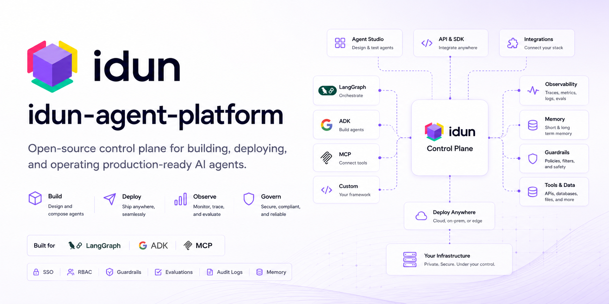
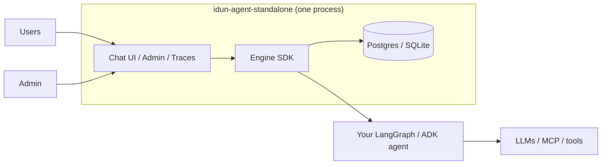

<div align="center">



<p>
  <strong>English</strong> | <a href="docs/readme/README.fr.md">Français</a> | <a href="docs/readme/README.es.md">Español</a> | <a href="docs/readme/README.zh.md">中文</a> | <a href="docs/readme/README.ar.md">العربية</a>
</p>

<br/>

### Productionize LangGraph & ADK agents.

Self-hosted. Open source. No vendor lock-in.

<br/>

[](https://www.gnu.org/licenses/gpl-3.0.html)
[](https://github.com/Idun-Group/idun-agent-platform/actions/workflows/ci.yml)
[](https://pypi.org/project/idun-agent-engine/)
[](https://discord.gg/KCZ6nW2jQe)
[](https://github.com/Idun-Group/idun-agent-platform)
[](https://github.com/Idun-Group/idun-agent-platform)

<br/>

[Cloud](https://cloud.idunplatform.com) · [Quickstart](https://docs.idunplatform.com/quickstart) · [Docs](https://docs.idunplatform.com) · [Discord](https://discord.gg/KCZ6nW2jQe) · [Book a demo](https://calendar.app.google/RSzm7EM5VZY8xVnN9)

⭐ If you find this useful, please star the repo. It helps others discover the project.

</div>

<br/>

<p align="center">Idun Agent Platform is an open-source, self-hosted production wrapper for <b>LangGraph</b> and <b>Google ADK</b> agents. <code>pip install idun-agent-engine</code> and your agent runs as a FastAPI process with built-in chat UI, admin panel, traces, observability, guardrails, memory persistence, MCP tool governance, and prompt management.</p>

> **Why Idun?** Teams building agents face a tradeoff: build the production wrapper yourself (FastAPI + traces + guardrails + admin UI — slow), or adopt a SaaS like LangGraph Cloud or LangSmith (sovereignty trade-off). Idun is the third path: pip install a self-sufficient FastAPI process that bundles your agent with chat UI, admin, traces, and guardrails — all open source, all on your infrastructure.

<p align="center">
  
</p>

---

## Quick start

> **Prerequisites**: Python 3.12+ and pip.

```bash
pip install idun-agent-engine
idun init my-agent
cd my-agent && idun serve
```

Open [http://localhost:8000](http://localhost:8000). Chat with your agent, then explore the admin at [/admin](http://localhost:8000/admin) and traces at [/admin/traces](http://localhost:8000/admin/traces).

> Installing a TestPyPI dev snapshot? Its JSON metadata can come back with `entry_points: null` and a partial `requires_dist`. The wheel still bundles `idun_agent_standalone` and `idun_agent_schema`, so trust the wheel. Public PyPI releases (0.6.0+) are not affected. To check what you got:
>
> ```bash
> python -c "import idun_agent_engine, idun_agent_standalone, idun_agent_schema"
> idun --help
> ```

## What's inside

<table>
<tr>
<td width="50%" valign="top">

### Observability

Langfuse · Arize Phoenix · LangSmith · GCP Trace · GCP Logging

Trace every agent run. Connect multiple providers at the same time through config.


</td>
<td width="50%" valign="top">

### Guardrails

PII detection · Toxic language · Ban lists · Topic restriction · Bias checks · NSFW · 9 more

Apply policies per agent on input, output, or both. Powered by Guardrails AI.


</td>
</tr>
<tr>
<td width="50%" valign="top">

### MCP tool governance

Register MCP servers and control which tools each agent can access. Supports stdio, SSE, streamable HTTP, and WebSocket.


</td>
<td width="50%" valign="top">

### Memory and persistence

PostgreSQL · SQLite · In-memory · Vertex AI · ADK Database

Conversations persist across restarts. Pick a backend per agent.


</td>
</tr>
<tr>
<td colspan="2" valign="top" align="center">

### Prompt management

Versioned templates with Jinja2 variables. Assign prompts to agents from the UI or API.


</td>
</tr>
</table>

> [!NOTE]
> **AG-UI streaming** — Every agent gets a standards-based streaming API, compatible with CopilotKit clients. Built-in chat playground for testing.

<p align="center">
  
</p>

---

## Architecture

Idun ships as one process: **`idun-agent-standalone`**. It bundles the engine SDK, a Next.js chat UI, an admin panel, and a traces viewer — your agent runs inside this process, configured from a YAML file and re-loaded live from the admin REST.


```mermaid
flowchart LR
  subgraph Idun["idun-agent-standalone (one process)"]
    direction TB
    UI["Chat UI / Admin / Traces"] --> ENG["Engine SDK"]
    ENG --> DB[(Postgres / SQLite)]
  end
  Users --> UI
  Admin --> UI
  ENG --> Agent["Your LangGraph / ADK agent"]
  Agent --> LLM["LLMs / MCP / tools"]
```

---

## Integrations

<p align="center">
  
  
  
  
  
  
  
  
  
  
  
  
</p>

> [!NOTE]
> **Framework support** — LangGraph and Google ADK are first-class today, with full adapters in the engine. LangChain is supported via the LangGraph adapter; broader native LangChain compatibility is on the [roadmap](https://docs.idunplatform.com/roadmap).

---

## Idun vs alternatives

| | **Idun Platform** | **LangGraph Cloud** | **LangSmith** | **DIY (FastAPI + glue)** |
|---|:---:|:---:|:---:|:---:|
| Self-hosted / on-prem | ✅ | ❌ | ❌ | ✅ |
| Multi-framework (LangGraph + ADK) | ✅ | LangGraph only | ❌ obs only | Manual |
| Guardrails (15+ built-in) | ✅ | ❌ | ❌ | Build yourself |
| MCP tool governance | ✅ per-agent | ❌ | ❌ | Build yourself |
| Observability (multi-provider) | ✅ Langfuse, Phoenix, LangSmith, GCP | ❌ LangSmith only | ✅ LangSmith only | Manual |
| Memory / checkpointing | ✅ Postgres, SQLite, in-memory | ✅ | ❌ | Build yourself |
| AG-UI / CopilotKit streaming | ✅ | ✅ | ❌ | Manual |
| Open source (GPLv3) | ✅ | ❌ | ❌ | — |

> [!NOTE]
> Idun is not a replacement for LangSmith (observability) or LangGraph Cloud (hosting). It is the layer between your agent code and production that handles governance, security, and operations, regardless of which observability or hosting you choose.

---

## Configuration

Every agent is configured through a single YAML file. Here is a complete example with all features enabled:

```yaml
server:
  api:
    port: 8001

agent:
  type: "LANGGRAPH"
  config:
    name: "Support Agent"
    graph_definition: "./agent.py:graph"
    checkpointer:
      type: "sqlite"
      db_url: "sqlite:///checkpoints.db"

observability:
  - provider: "LANGFUSE"
    enabled: true
    config:
      host: "https://cloud.langfuse.com"
      public_key: "${LANGFUSE_PUBLIC_KEY}"
      secret_key: "${LANGFUSE_SECRET_KEY}"

guardrails:
  input:
    - config_id: "DETECT_PII"
      on_fail: "reject"
      reject_message: "Request contains personal information."
  output:
    - config_id: "TOXIC_LANGUAGE"
      on_fail: "reject"

mcp_servers:
  - name: "time"
    transport: "stdio"
    command: "docker"
    args: ["run", "-i", "--rm", "mcp/time"]

prompts:
  - prompt_id: "system-prompt"
    version: 1
    content: "You are a support agent for {{ company_name }}."
    tags: ["latest"]
```

> [!TIP]
> Environment variables like `${LANGFUSE_SECRET_KEY}` are resolved at startup. You can use `.env` files or inject them through Docker/Kubernetes.

Serve the engine directly from a YAML file (no admin UI, just the agent endpoints):

```bash
idun agent serve --source file --path config.yaml
```

> [!IMPORTANT]
> Full config reference: [docs.idunplatform.com/configuration](https://docs.idunplatform.com/configuration)
>
> 9 runnable agent examples: [idun-agent-template](https://github.com/Idun-Group/idun-agent-template)

---

## Community

| | |
|---|---|
| **Questions and help** | [Discord](https://discord.gg/KCZ6nW2jQe) |
| **Feature requests** | [GitHub Discussions](https://github.com/Idun-Group/idun-agent-platform/discussions) |
| **Bug reports** | [GitHub Issues](https://github.com/Idun-Group/idun-agent-platform/issues) |
| **Contributing** | [CONTRIBUTING.md](./CONTRIBUTING.md) |
| **Roadmap** | [ROADMAP.md](./ROADMAP.md) |

## Commercial support

Maintained by [Idun Group](https://idunplatform.com). We help with platform architecture, deployment, and IdP/compliance integration. [Book a call](https://calendar.app.google/RSzm7EM5VZY8xVnN9) · contact@idun-group.com

## Telemetry

Minimal, anonymous usage metrics via PostHog. No PII. [View source](libs/idun_agent_engine/src/idun_agent_engine/telemetry/telemetry.py). Opt out: `IDUN_TELEMETRY_ENABLED=false`

## License

[GPLv3](./LICENSE)
