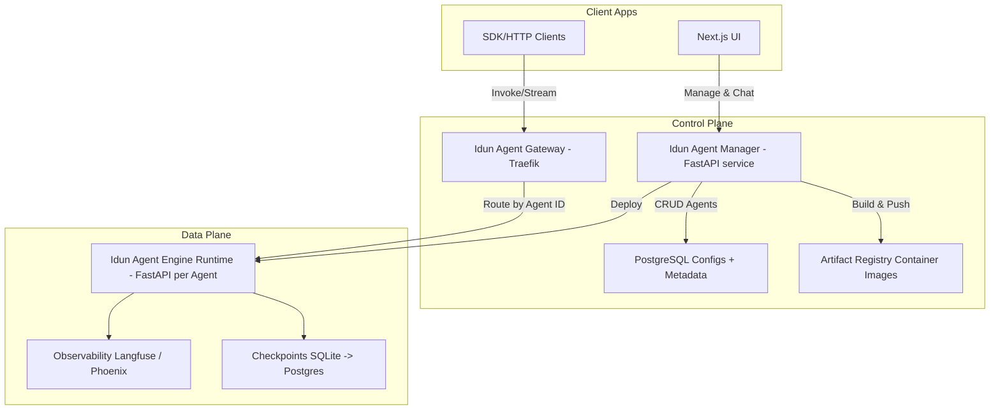

# Architecture

```mermaid
graph TD
  subgraph Client Apps
    U[Next.js UI]
    S[SDK/HTTP Clients]
  end

  subgraph Control Plane
    M[Idun Agent Manager - FastAPI service]
    G[Idun Agent Gateway - Traefik]
    A[PostgreSQL Configs + Metadata]
    R[Artifact Registry Container Images]
  end

  subgraph Data Plane
    E[Idun Agent Engine Runtime - FastAPI per Agent]
    O[Observability Langfuse / Phoenix]
    C[Checkpoints SQLite -> Postgres]
  end

  U -->|Manage & Chat| M
  S -->|Invoke/Stream| G
  M -->|CRUD Agents| A
  M -->|Build & Push| R
  M -->|Deploy| E
  G -->|Route by Agent ID| E
  E --> O
  E --> C
```

The Engine exposes a unified API, enabling interchangeable agent frameworks while preserving operational concerns like health checks and observability.
