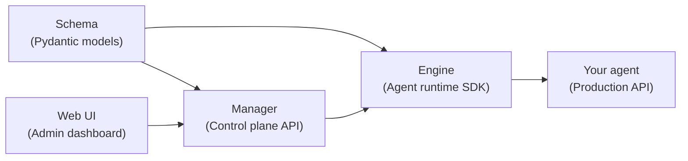
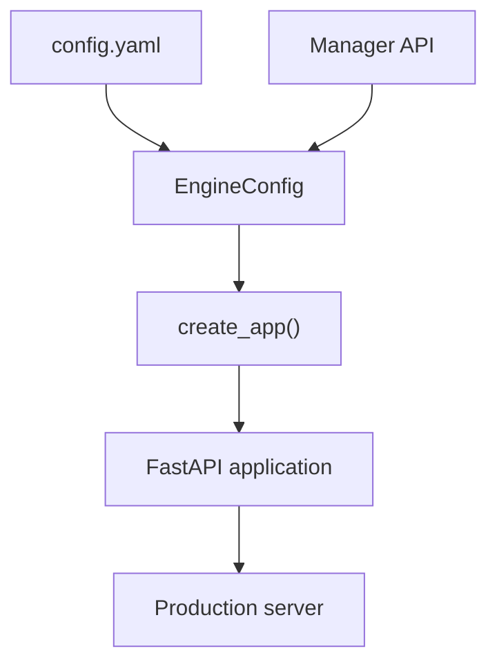

## System overview

Idun Agent Platform has four components that work together: a shared schema library defines data contracts, a control plane stores configuration, an engine SDK wraps your agent into a production API, and a web dashboard provides a management interface.



## Components

### Idun Agent Schema

The shared Pydantic model library published to PyPI as `idun-agent-schema`. It defines every config structure, API payload, and resource schema used across the platform. Three namespaces: `engine` (YAML config models), `manager` (API request/response models), and `shared` (cross-cutting base classes).

Schema changes start here and propagate to the engine and manager.

### Idun Agent Manager

A FastAPI + PostgreSQL control plane that provides CRUD operations for agents, guardrails, MCP servers, observability configs, memory configs, SSO, integrations, and prompts. It supports multi-tenant workspaces with role-based access and authenticates users via username/password or Google OIDC.

When you create or update an agent through the manager, it materializes a full `EngineConfig` as a pre-computed JSON snapshot. The engine fetches this config at startup with zero database joins.

[Learn more about the manager](/manager/overview)

### Idun Agent Engine

A Python SDK that wraps agent frameworks (LangGraph and Google ADK) into production-ready FastAPI services. You provide your agent code and a configuration, and the engine adds streaming (AG-UI protocol), memory/checkpointing, observability, guardrails, MCP tool management, SSO, and messaging integrations.

The engine exposes these endpoints:

| Endpoint | Method | Purpose |
|---|---|---|
| `/` | GET | Service info |
| `/health` | GET | Health check |
| `/agent/run` | POST | AG-UI interaction (SSE streaming) |
| `/agent/config` | GET | Current agent configuration |
| `/agent/capabilities` | GET | Agent capability discovery |

[Learn more about supported frameworks](/frameworks/overview)

### Idun Agent Web

A React 19 + Vite admin dashboard for managing agents, configuring resources, and organizing workspaces. It communicates with the manager API and provides a tabbed agent detail view with Overview, Gateway, Config, Prompts, and Logs sections.

## Config flow

Configuration drives everything in the engine. A single `EngineConfig` object determines your server settings, agent framework, observability providers, guardrails, memory, MCP servers, SSO, and integrations.



The engine resolves configuration in this priority order:

1. Pre-validated `EngineConfig` object (programmatic use)
2. Raw Python dictionary
3. YAML file path
4. Default `config.yaml` in the working directory

## Operating modes

### Standalone mode

You define a `config.yaml` file alongside your agent code and run the engine directly. No manager or database required.

```bash
idun agent serve --source file --path config.yaml
```

This mode suits local development, single-agent deployments, and CI/CD pipelines where you version your config in Git.

### Managed mode

The engine fetches its configuration from the manager API at startup. You configure agents through the web UI or the manager API, and the engine pulls the materialized config using an API key.

```bash
export IDUN_AGENT_API_KEY=your-agent-api-key
export IDUN_MANAGER_HOST=https://manager.example.com
idun agent serve --source manager
```

This mode suits multi-agent deployments where you want centralized configuration, workspace isolation, and a UI for non-technical team members.

The config structure is identical in both modes. Moving from standalone to managed requires no changes to your agent code.

## Next steps

<CardGroup cols={3}>
  <Card title="Supported frameworks" icon="layer-group" href="/frameworks/overview">
    LangGraph and Google ADK adapters.
  </Card>
  <Card title="Configuration reference" icon="gear" href="/configuration">
    Full config.yaml structure and environment variables.
  </Card>
  <Card title="Deployment" icon="cloud" href="/deployment/overview">
    Deploy to production with Docker and cloud providers.
  </Card>
</CardGroup>
