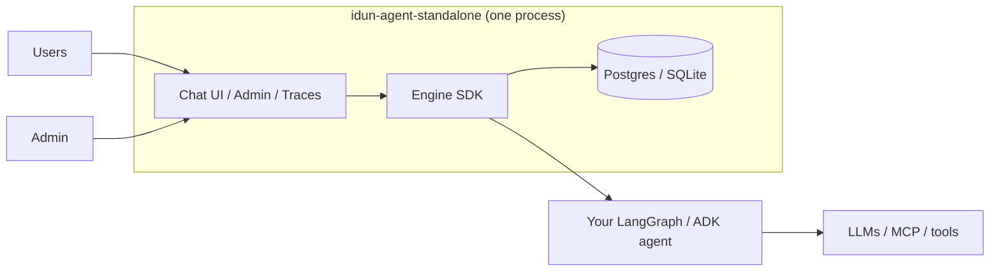
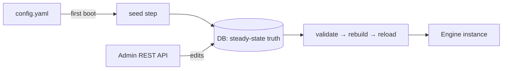

## System overview

Idun ships as two packages. **`idun-agent-engine`** is the SDK that wraps your agent into a FastAPI service. **`idun-agent-standalone`** is a self-sufficient process that bundles the engine, a Next.js chat UI, an admin panel, and a traces viewer.

```mermaid
flowchart LR
  subgraph Idun["idun-agent-standalone (one process)"]
    direction TB
    UI["Chat UI / Admin / Traces"] --> ENG["Engine SDK"]
    ENG --> DB[(Postgres / SQLite)]
  end
  Users --> UI
  Admin --> UI
  ENG --> Agent["Your LangGraph / ADK agent"]
  Agent --> LLM["LLMs / MCP / tools"]
```

## Components

### Idun Agent Schema

The shared Pydantic model library published to PyPI as `idun-agent-schema`. It defines the config structures, API payloads, and resource schemas the other packages consume. Schema changes start here and propagate to the engine and standalone.

### Idun Agent Engine

The Python SDK that wraps agent frameworks (LangGraph and Google ADK) into production-ready FastAPI services. You provide your agent code and a configuration; the engine adds AG-UI streaming, memory and checkpointing, observability, guardrails, and MCP tool management.

The engine exposes these endpoints:

| Endpoint | Method | Purpose |
|---|---|---|
| `/health` | GET | Health check |
| `/_engine/info` | GET | Engine introspection (version, capabilities, mounted endpoints) |
| `/agent/run` | POST | AG-UI interaction (SSE streaming) |
| `/agent/config` | GET | Current agent configuration |
| `/agent/capabilities` | GET | Agent capability discovery |

[Learn more about supported frameworks](/frameworks/overview)

### Idun Agent Standalone

The self-sufficient app that bundles the engine, a Next.js UI (chat + admin + traces), an admin REST API, password or unauthenticated admin auth, DB seeding, and a validate-rebuild reload pipeline, all in one process.

Standalone adds two things on top of the engine:

- **Embedded UI.** Chat at `/`, admin at `/admin/`, traces at `/admin/traces`. The UI is built as a static Next.js export and bundled into the standalone wheel, so there is no separate frontend to deploy.
- **Reload-over-restart.** Edits made through the admin UI route through a validate-rebuild-reload pipeline; engine init failures roll back the DB write so the running agent stays serving the previous config.

[Learn more about Idun Agent Standalone](/standalone/overview)

## Config flow

Configuration drives everything. A single `EngineConfig` object determines server settings, agent framework, observability providers, guardrails, memory, and MCP servers.

```mermaid
flowchart LR
  YAML["config.yaml"] -->|first boot| Seed["seed step"]
  Seed --> DB[(DB: steady-state truth)]
  AdminAPI["Admin REST API"] -->|edits| DB
  DB --> Reload["validate → rebuild → reload"]
  Reload --> Engine["Engine instance"]
```

YAML is the seed shape; the database is the runtime source of truth. After first boot, mutations flow through the admin REST and trigger a validated reload of the engine instance. Init failures roll back to the previous config, so the running agent never crashes mid-flight on a bad edit.

## Next steps

<Card title="Pick a framework" icon="layers" horizontal href="/frameworks/overview">
  LangGraph or Google ADK
</Card>

<Card title="Idun Agent Standalone" icon="server" horizontal href="/standalone/overview">
  The single-process app that bundles the engine, UI, admin, and traces
</Card>

<Card title="Quickstart" icon="rocket" horizontal href="/quickstart">
  Deploy your first agent in under 30 minutes
</Card>
