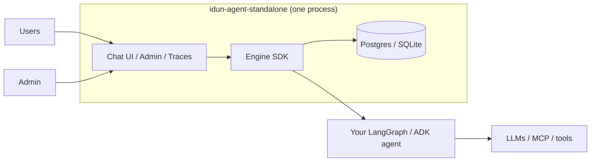
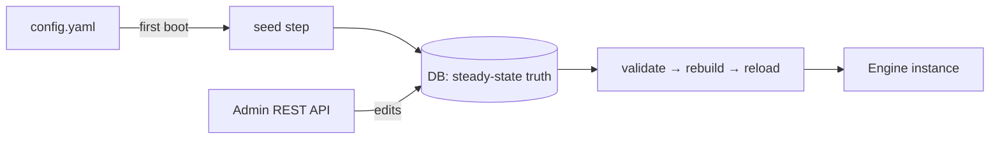

## System overview

Idun ships as two packages. **`idun-agent-engine`** is the SDK that wraps your agent into a FastAPI service. **`idun-agent-standalone`** is a self-sufficient process that bundles the engine, a Next.js chat UI, an admin panel, and a traces viewer.


```mermaid
flowchart LR
  subgraph Idun["idun-agent-standalone (one process)"]
    direction TB
    UI["Chat UI / Admin / Traces"] --> ENG["Engine SDK"]
    ENG --> DB[(Postgres / SQLite)]
  end
  Users --> UI
  Admin --> UI
  ENG --> Agent["Your LangGraph / ADK agent"]
  Agent --> LLM["LLMs / MCP / tools"]
```

## Components

### Idun Agent Schema

The shared Pydantic model library published to PyPI as `idun-agent-schema`. It defines the config structures, API payloads, and resource schemas the other packages consume. Schema changes start here and propagate to the engine and standalone.

### Idun Agent Engine

The Python SDK that wraps agent frameworks (LangGraph and Google ADK) into production-ready FastAPI services. You provide your agent code and a configuration; the engine adds AG-UI streaming, memory and checkpointing, observability, guardrails, and MCP tool management.

The engine exposes these endpoints:

| Endpoint | Method | Purpose |
|---|---|---|
| `/health` | GET | Health check; see contract below |
| `/_engine/info` | GET | Engine introspection (version, capabilities, mounted endpoints) |
| `/reload` | POST | Engine-only hot-reload entry point. See [Hot reload (engine-only)](#hot-reload-engine-only) below. **Disabled in standalone**: returns HTTP 403; reloads go through `/admin/api/v1/*` instead. |
| `/agent/run` | POST | AG-UI interaction (SSE streaming) |
| `/agent/sessions` | GET | List sessions for the live agent |
| `/agent/sessions/{session_id}` | GET | Inspect a single session |
| `/agent/graph` | GET | Agent graph in framework-agnostic IR form |
| `/agent/graph/mermaid` | GET | Same graph rendered as Mermaid source |
| `/agent/graph/ascii` | GET | Same graph rendered as ASCII art |
| `/agent/config` | GET | Current agent configuration |
| `/agent/capabilities` | GET | Agent capability discovery |

`POST /agent/stream` and `POST /agent/copilotkit/stream` are also exposed but deprecated; new clients should use `POST /agent/run`.

#### `/health` response contract

`/health` is meant for load balancers and Kubernetes liveness/readiness probes. The response shape is fixed (`libs/idun_agent_engine/src/idun_agent_engine/server/routers/base.py`):

```json
{
  "status": "ok",
  "service": "idun-agent-engine",
  "version": "0.6.2",
  "agent_ready": true,
  "agent_name": "my-adk-agent"
}
```

| Field | Type | Notes |
|---|---|---|
| `status` | `"ok"` or `"degraded"` | `degraded` whenever no agent is registered: pre-onboarding state, standalone admin-only mode after an assembly error, or engine boot that bailed on a bad config. |
| `service` | string | Always `idun-agent-engine`. |
| `version` | string | Engine semver, useful for catching stale rollouts behind a load balancer. |
| `agent_ready` | bool | `true` only when `/agent/*` will accept requests. |
| `agent_name` | string or null | Pulled from the loaded agent's config; null when none is loaded. |
| `reason` | string (optional) | Only present on `degraded` when the standalone's assembly handler captured a boot error; carries the short diagnostic. Field is absent (not `null`) on the happy path. |

For probes, gate readiness on `status == "ok"` (or equivalently `agent_ready == true`). The endpoint is unauthenticated by design so external probes can reach it; this is intentional and called out in [Authentication](/auth/overview).

#### Hot reload (engine-only)

`POST /reload` rebuilds the agent in place from a YAML file the process can read:

```bash
curl -sX POST http://localhost:8000/reload \
  -H 'Content-Type: application/json' \
  -d '{"path": "/etc/idun/config.yaml"}'
```

Sequence (`server/routers/base.py`): parse the new config, then `cleanup_agent(app)`, then `configure_app(app, new_config)`. If config parsing fails the old agent is still alive (cleanup never ran), so the engine returns HTTP 500 with the upstream error and keeps serving. If `configure_app` fails after cleanup, the engine is left without an agent and `/agent/*` returns 503 `agent_not_ready` until a successful reload or process restart. There is no automatic rollback.

`POST /reload` is **unauthenticated by default**. `create_app(reload_auth=...)` accepts a FastAPI-dependency callable that runs before the handler; raise `HTTPException` from it to reject a request. In the **standalone**, this hook is set to a built-in `reload_disabled` that returns HTTP 403, so `POST /reload` is unusable on the standalone surface. The standalone owns reloads through the validated `/admin/api/v1/*` pipeline (see [Reload pipeline outcomes](/troubleshooting#reload-pipeline-outcomes)). The endpoint is therefore a knob for engine-only deployments (`idun agent serve --source file`).

[Learn more about supported frameworks](/frameworks/overview)

### Idun Agent Standalone

The self-sufficient app that bundles the engine, a Next.js UI (chat + admin + traces), an admin REST API, password or unauthenticated admin auth, DB seeding, and a validate-rebuild reload pipeline, all in one process.

Standalone adds two things on top of the engine:

- **Embedded UI.** Chat at `/`, admin at `/admin/`, traces at `/admin/traces`. The UI is built as a static Next.js export and bundled into the standalone wheel, so there is no separate frontend to deploy.
- **Reload-over-restart.** Edits made through the admin UI route through a validate-rebuild-reload pipeline; engine init failures roll back the DB write so the running agent stays serving the previous config.

[Learn more about Idun Agent Standalone](/standalone/overview)

## Config flow

Configuration drives everything. A single `EngineConfig` object determines server settings, agent framework, observability providers, guardrails, memory, and MCP servers.


```mermaid
flowchart LR
  YAML["config.yaml"] -->|first boot| Seed["seed step"]
  Seed --> DB[(DB: steady-state truth)]
  AdminAPI["Admin REST API"] -->|edits| DB
  DB --> Reload["validate → rebuild → reload"]
  Reload --> Engine["Engine instance"]
```

YAML is the seed shape; the database is the runtime source of truth. After first boot, mutations flow through the admin REST and trigger a validated reload of the engine instance. Init failures roll back to the previous config, so the running agent never crashes mid-flight on a bad edit.

## Next steps

<Card title="Pick a framework" icon="layers" horizontal href="/frameworks/overview">
  LangGraph or Google ADK
</Card>

<Card title="Idun Agent Standalone" icon="server" horizontal href="/standalone/overview">
  The single-process app that bundles the engine, UI, admin, and traces
</Card>

<Card title="Quickstart" icon="rocket" horizontal href="/quickstart">
  Deploy your first agent in under 30 minutes
</Card>
