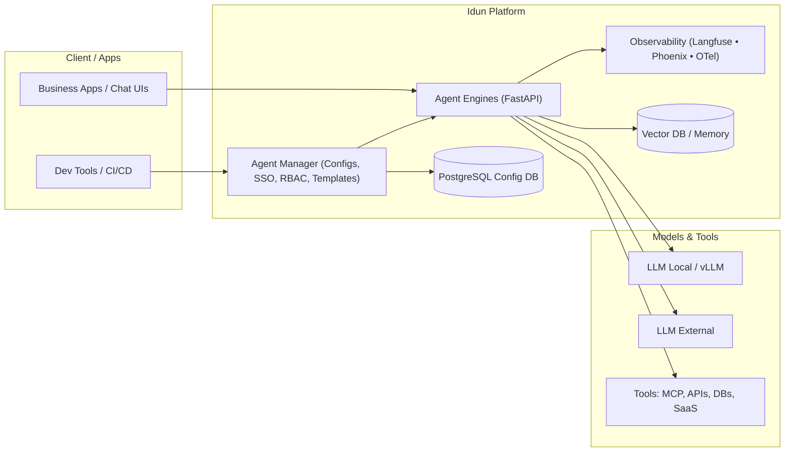
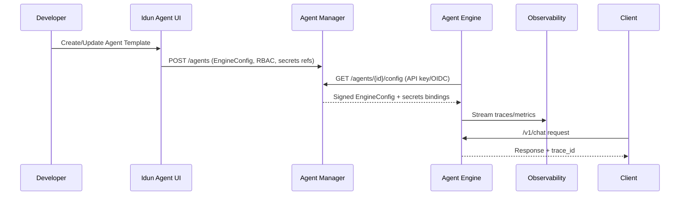

# Architecture Overview

This page provides a high-level view of the Idun Agent Platform architecture. It complements the conceptual guides under [Concepts](../concepts/overview.md) and focuses on how the main services fit together in production.

**Time to read:** ~7 minutes.

Idun Agent Platform is designed as a **unified, production-grade runtime** for heterogeneous agent frameworks (LangGraph, ADK, Haystack, and others) with **centralized configuration, security, and observability**.

## Core Components

Idun is built from four main components that can be deployed together or individually:

- **Idun Agent Engine (Runtime)**
  Wraps LangGraph/ADK/Haystack agents into a **FastAPI** service that exposes a unified REST API (AG-UI compatible), with memory, guardrails, observability, and MCP integration. Can run:
  - **Standalone**: fully configured from a local YAML file or Python dict.
  - **Managed**: fetches configuration and secrets from the Manager.

- **Idun Agent Manager (Control Plane)**
  **FastAPI + PostgreSQL** service that acts as a control plane:
  - Stores and versions **EngineConfig** documents for all agents.
  - Exposes CRUD APIs and a UI for agents, guardrails, observability, and MCP servers.
  - Enforces **SSO/OIDC, RBAC, multi-tenancy, and API keys**.

- **Idun Agent UI (Admin Dashboard)**
  A **Next.js** web application used by developers and platform teams to:
  - Create and configure agents and templates.
  - Attach observability, guardrails, and MCP servers.
  - Manage environments (DEV/ STG/ PRD) and access control.

- **Idun Agent Schema (Shared Models)**
  A shared library of **Pydantic models** (e.g. `EngineConfig`, `ManagedAgent`, API contracts) that acts as a single source of truth across Engine, Manager, and UI.

## High-Level Logical Architecture

At a high level, the platform sits between **client applications** and **models/tools**, with the **Manager** and **UI** providing central governance and the **Engine** providing the runtime.



**Typical topologies:**

- **Self-hosted / on-prem / EU cloud**: Manager, UI, and Engines run in your own environment next to your data and LLMs.
- **Hybrid**: Engines run close to data (on-prem/VPC), while Manager/UI may be centralised or managed.

## Managed vs Standalone Engine Modes

The Engine can operate in two modes:

- **Standalone mode**
  - You provide a local `config.yaml` or a Python `EngineConfig` object.
  - No Manager or PostgreSQL is required (you can still use SQLite or in-memory checkpointing).
  - Ideal for local development, PoCs, and simple deployments.

- **Managed mode**
  - The Engine is given an API key and **pulls its configuration from the Manager**.
  - Enables centralised policy enforcement, config versioning, and standardised observability and guardrails.

### Control-Plane Flow (Managed Mode)



**Key benefits:**

- Centralised, versioned configuration per agent and per environment.
- Uniform authentication and RBAC using your IdP (SSO/OIDC).
- Consistent observability and guardrails across heterogeneous frameworks.

## Security and Compliance

Security and compliance are first-class concerns in the architecture:

- **Identity & Access**
  - SSO/OIDC integration with enterprise IdPs.
  - Role-based access control (RBAC) and tenant isolation in the Manager and UI.
  - API keys for Engine-to-Manager and client-to-Engine traffic.

- **Data Residency & Sovereignty**
  - Deploy fully on-prem or in EU cloud, including local LLMs and private networks.
  - Option to keep data plane and model calls inside your perimeter.

- **Guardrails**
  - Input and output guardrails configured centrally (content safety, PII detection, prompt injection protection, policy checks).
  - Guardrails can reject requests or responses with clear `reject_message`s and full audit logging.

- **Auditability**
  - Full tracing of prompts, tool calls, and model invocations via OpenTelemetry and integrations like Langfuse, Phoenix, or LangSmith.
  - Per-tenant logging and metrics to support regulatory audits.

## Observability and Evaluation

Observability is built into the Engine and wired via configuration:

- **Tracing** of the full request lifecycle: HTTP request, agent invocation, LLM calls, tool calls, and guardrail checks.
- **Feedback loops**: user feedback and automatic evaluations ("LLM as a judge") can be sent to observability providers.
- **Usage and cost tracking**: latency, error rates, and token/usage metrics per agent, tenant, and environment.

For provider-specific setup, see [Observability Overview](../observability/overview.md).

## Interoperability and Extensibility

The architecture is explicitly **framework- and model-agnostic**:

- **Agent frameworks**: LangGraph, ADK, Haystack, and others integrate via adapters that implement a common `BaseAgent` protocol.
- **LLMs**: local (e.g. vLLM) and external LLMs (OpenAI, Anthropic, Mistral, etc.) can be accessed behind a single gateway.
- **Tools and agents**: Model Context Protocol (MCP) and A2A enable tool integration and agent-to-agent collaboration.

New frameworks, tools, or observability providers can be added by implementing the corresponding adapter interfaces in the Engine.

## Monorepo Layout

The repository is organised so that runtime, control plane, and UI share common schemas while remaining independently deployable:

```text
libs/
  idun_agent_engine/     # Runtime + framework adapters + FastAPI
  idun_agent_schema/     # Shared Pydantic models (configs, API contracts)
services/
  idun_agent_manager/    # Control plane (FastAPI + PostgreSQL)
  idun_agent_ui/         # Next.js admin dashboard
```

For a deeper conceptual breakdown of each component, see:

- [Architecture Concepts](../concepts/architecture.md)
- [Engine Concepts](../concepts/engine.md)
- [Manager Concepts](../concepts/manager.md)
