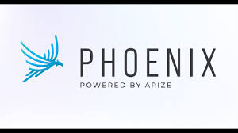

<div align="center">
  
  <h1 style="font-size: 2em; margin: 0.3em 0;">Idun Agent Platform</h1>
  <p style="font-size: 1.05em; color: #666; max-width: 650px; margin: 0.4em auto 1em auto; line-height: 1.5;">
    Build, deploy, and manage AI agents across multiple frameworks
  </p>

  <div style="display: inline-block; max-width: 400px;">

```bash
pip install idun-agent-engine
```

  </div>
</div>

<style>
@keyframes scroll {
  0% { transform: translateX(0); }
  100% { transform: translateX(-50%); }
}
.logo-slider {
  overflow: hidden;
  padding: 0.6em 0;
  background: linear-gradient(to bottom, #fafafa, #ffffff);
  margin: 1em 0;
  max-width: 100%;
}
.logo-track {
  display: flex;
  width: max-content;
  animation: scroll 20s linear infinite;
  align-items: center;
}
.logo-item {
  height: 45px;
  width: auto;
  max-width: 120px;
  max-height: 45px;
  object-fit: contain;
  margin: 0 1.8em;
  opacity: 0.6;
  transition: all 0.3s;
  filter: grayscale(80%);
}
.logo-item:hover {
  opacity: 1;
  filter: grayscale(0%);
  transform: scale(1.1);
}
</style>

<div class="logo-slider">
  <div class="logo-track">
    
    
    
    
    
    
    
    
    
    
    
    
    
    
    
    
  </div>
</div>

---

<style>
.feature-grid {
  display: grid;
  grid-template-columns: repeat(2, 1fr);
  gap: 1.2em;
  margin: 1.5em 0 2em 0;
}
.feature-card {
  background: #ffffff;
  border: 1px solid #e9d5ff;
  border-radius: 8px;
  padding: 1.3em;
  transition: all 0.3s ease;
}
.feature-card:hover {
  transform: translateY(-4px);
  box-shadow: 0 8px 24px rgba(147, 51, 234, 0.15);
  border-color: #d8b4fe;
}
.feature-title {
  color: #7c3aed;
  font-size: 1em;
  font-weight: 600;
  margin: 0 0 0.5em 0;
}
.feature-desc {
  color: #666;
  font-size: 0.88em;
  line-height: 1.5;
  margin: 0;
}
</style>

<h2 style="color: #7c3aed;">Why Idun?</h2>

The AI agent ecosystem is fragmented. Each framework has its own deployment patterns and monitoring solutions. Idun provides a consistent layer over different agent frameworks—configure once, deploy anywhere. We handle deployment, observability, and scaling so you can focus on building better agents.

<div class="feature-grid">
  <div class="feature-card">
    <div class="feature-title">Multi-Framework Support</div>
    <p class="feature-desc">Work with Haystack, LangGraph, CrewAI, and more through a single unified interface</p>
  </div>

  <div class="feature-card">
    <div class="feature-title">Centralized Management</div>
    <p class="feature-desc">Control all your agents via CLI or web dashboard from one place</p>
  </div>

  <div class="feature-card">
    <div class="feature-title">Built-in Observability</div>
    <p class="feature-desc">Monitor performance with Phoenix and Langfuse integration out of the box</p>
  </div>

  <div class="feature-card">
    <div class="feature-title">Simple Configuration</div>
    <p class="feature-desc">Define agents using straightforward YAML files with no complexity</p>
  </div>
</div>

