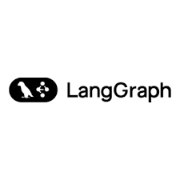

<div align="center">
  
  <h1 style="font-size: 2em; margin: 0.3em 0;">Idun Agent Platform</h1>
  <p style="font-size: 1.05em; color: #666; max-width: 650px; margin: 0.4em auto 1em auto; line-height: 1.5;">
    Build, deploy, and manage AI agents across multiple frameworks
  </p>

  <div style="display: inline-block; max-width: 400px;">

```bash
pip install idun-agent-engine
```

  </div>
</div>

<style>
@keyframes scroll {
  0% { transform: translateX(0); }
  100% { transform: translateX(-50%); }
}
.logo-slider {
  overflow: hidden;
  padding: 0.6em 0;
  background: linear-gradient(to bottom, #fafafa, #ffffff);
  margin: 1em 0;
  max-width: 100%;
}
.logo-track {
  display: flex;
  width: max-content;
  animation: scroll 20s linear infinite;
  align-items: center;
}
.logo-item {
  height: 45px;
  width: auto;
  max-width: 120px;
  max-height: 45px;
  object-fit: contain;
  margin: 0 1.8em;
  opacity: 0.6;
  transition: all 0.3s;
  filter: grayscale(80%);
}
.logo-item:hover {
  opacity: 1;
  filter: grayscale(0%);
  transform: scale(1.1);
}
</style>

<div class="logo-slider">
  <div class="logo-track">
    
    
    
    
    
    
    
    
    
    
    
    
    
    
    
  </div>
</div>

---

<style>
.feature-grid {
  display: grid;
  grid-template-columns: repeat(2, 1fr);
  gap: 1.2em;
  margin: 1.5em 0 2em 0;
}
.feature-card {
  background: #ffffff;
  border: 1px solid #e9d5ff;
  border-radius: 8px;
  padding: 1.3em;
  transition: all 0.3s ease;
}
.feature-card:hover {
  transform: translateY(-4px);
  box-shadow: 0 8px 24px rgba(147, 51, 234, 0.15);
  border-color: #d8b4fe;
}
.feature-title {
  color: #7c3aed;
  font-size: 1em;
  font-weight: 600;
  margin: 0 0 0.5em 0;
}
.feature-desc {
  color: #666;
  font-size: 0.88em;
  line-height: 1.5;
  margin: 0;
}
</style>

<h2 style="color: #7c3aed;">Why Idun?</h2>

The AI agent ecosystem is fragmented. Each framework has its own deployment patterns and monitoring solutions. Idun provides a consistent layer over different agent frameworks—configure once, deploy anywhere. We handle deployment, observability, and scaling so you can focus on building better agents.

<div class="feature-grid">
  <div class="feature-card">
    <div class="feature-title">Multi-Framework Support</div>
    <p class="feature-desc">Work with Haystack, LangGraph, CrewAI, and more through a single unified interface</p>
  </div>

  <div class="feature-card">
    <div class="feature-title">Centralized Management</div>
    <p class="feature-desc">Control all your agents via CLI or web dashboard from one place</p>
  </div>

  <div class="feature-card">
    <div class="feature-title">Built-in Observability</div>
    <p class="feature-desc">Monitor performance with Phoenix and Langfuse integration out of the box</p>
  </div>

  <div class="feature-card">
    <div class="feature-title">Simple Configuration</div>
    <p class="feature-desc">Define agents using straightforward YAML files with no complexity</p>
  </div>
</div>

---

## What is Idun?

Idun Agent Platform solves the fragmentation problem in AI agent development. Each framework (LangGraph, Haystack, ADK) has its own deployment patterns, observability solutions, and operational requirements. Idun provides:

**A unified configuration interface** - Define agents using YAML files that work across all supported frameworks

**Production-ready infrastructure** - Built-in checkpointing, observability, guardrails, and MCP server integration

**Flexible deployment** - Run locally for development, deploy to self-hosted infrastructure, or use managed cloud

**Framework-agnostic tooling** - CLI and web dashboard work consistently across all agent types

## Why Choose Idun?

!!! success "Multi-Framework Support"
    Deploy LangGraph graphs, Haystack pipelines, and ADK agents through a single unified interface. Switch frameworks without changing your deployment pipeline or tooling.

!!! success "Production-Ready Features"
    Checkpointing for conversation persistence, observability with Langfuse/Phoenix/GCP, guardrails for content safety, and MCP servers for tool integration—all configured through YAML.

!!! success "Simple Configuration"
    Define your agent, observability, guardrails, and tools in a single YAML file. No complex setup scripts or framework-specific deployment code required.

!!! success "Centralized Management"
    Control multiple agents through a web dashboard or CLI. Create, configure, deploy, and monitor agents from one place.

## Quick Start

### 1. Install

```bash
pip install idun-agent-engine
```

### 2. Create Your Agent

Create a LangGraph agent in `agent.py`:

```python
from langgraph.graph import StateGraph, END
from typing import TypedDict

class State(TypedDict):
    query: str
    response: str

def process(state: State):
    return {"response": f"Processed: {state['query']}"}

workflow = StateGraph(State)
workflow.add_node("process", process)
workflow.set_entry_point("process")
workflow.add_edge("process", END)

graph = workflow.compile()
```

### 3. Configure in YAML

Create `config.yaml`:

```yaml
server:
  api:
    port: 8000

agent:
  type: "LANGGRAPH"
  config:
    name: "My Agent"
    graph_definition: "./agent.py:graph"
    checkpointer:
      type: "sqlite"
      db_url: "checkpoints.db"
```

### 4. Run

```bash
idun agent serve --source=file --path=./config.yaml
```

Your agent is now running at `http://localhost:8000` with checkpointing, REST API, and streaming support.

[Full Quickstart Guide →](quickstart.md)

## Core Concepts

### Engine

The runtime execution layer that loads and runs your agents. Handles configuration resolution, agent initialization, request processing, and lifecycle management.

Key features:
- Framework adapters for LangGraph, Haystack, and ADK
- Automatic observability handler attachment
- Guardrails validation for inputs and outputs
- MCP server registry and lifecycle management

[Learn about the Engine →](concepts/engine.md)

### Manager

Web-based control plane for creating and managing agents. Provides CRUD APIs, authentication, and a dashboard for agent operations.

Key features:
- Agent configuration management
- API key generation and authentication
- Observability provider configuration
- Guardrails and MCP server setup

[Learn about the Manager →](concepts/manager.md)

### Configuration

YAML-based declarative configuration for all agent aspects. Define agent type, framework settings, observability, guardrails, and MCP servers in one file.

Supports:
- Environment variable substitution for secrets
- Multiple observability providers simultaneously
- Input and output guardrails
- Framework-specific settings (checkpointers, session services, etc.)

[Configuration Documentation →](concepts/configuration.md)

## Supported Frameworks

### LangGraph

Stateful multi-actor agents with cycles and persistence. Idun provides:
- SQLite, PostgreSQL, and in-memory checkpointing
- Event streaming for real-time UI updates
- Thread management for concurrent conversations

```yaml
agent:
  type: "LANGGRAPH"
  config:
    graph_definition: "./agent.py:graph"
    checkpointer:
      type: "postgres"
      db_url: "${DATABASE_URL}"
```

[LangGraph Configuration →](concepts/agent-frameworks.md#langgraph)

### Haystack

Document search and question-answering systems. Idun provides:
- Pipeline and agent component support
- Document store integration
- Native observability hooks

```yaml
agent:
  type: "HAYSTACK"
  config:
    component_type: "pipeline"
    component_definition: "./pipeline.py:search_pipeline"
```

[Haystack Configuration →](concepts/agent-frameworks.md#haystack)

### ADK (Agent Development Kit)

Google Cloud-native agents with built-in session and memory services. Idun provides:
- In-memory and Firestore storage backends
- Vertex AI integration
- Cloud Logging and Trace support

```yaml
agent:
  type: "ADK"
  config:
    agent: "./agent.py:agent"
    session_service:
      type: "firestore"
```

[ADK Configuration →](concepts/agent-frameworks.md#adk)

## Key Features

### Observability

Integrate with multiple observability providers simultaneously. Track LLM calls, measure costs, monitor performance, and debug agent behavior.

Supported providers:
- **Langfuse** - LLM-specific tracing with cost tracking
- **Phoenix** - OpenTelemetry-based ML observability
- **GCP Logging/Trace** - Cloud-native logging and distributed tracing
- **LangSmith** - LangChain ecosystem monitoring

[Observability Guide →](guides/02-observability-checkpointing.md)

### Guardrails

Add safety constraints to filter harmful content and enforce compliance. Powered by Guardrails AI Hub.

Available validators:
- **Ban List** - Block specific words or phrases
- **PII Detector** - Detect and handle personally identifiable information

Configure input validation (before processing) and output validation (before returning responses).

[Guardrails Guide →](guides/04-guardrails.md)

### MCP Servers

Extend agent capabilities with Model Context Protocol servers. Idun manages server lifecycle, connection management, and tool registration automatically.

Common integrations:
- Filesystem access
- Web search (Brave, Google)
- Database connections
- API integrations
- Git repositories

[MCP Configuration →](concepts/configuration.md#mcp-servers)

### Checkpointing

Persist conversation state across requests. Resume conversations after failures or restarts. Support multiple concurrent conversations with thread isolation.

Supported backends:
- SQLite (local development)
- PostgreSQL (production)
- In-memory (stateless testing)

[Checkpointing Guide →](guides/02-observability-checkpointing.md)

## Deployment Options

### Local Development

```bash
idun agent serve --source=file --path=./config.yaml
```

Run agents locally with hot reload, SQLite checkpointing, and local observability.

### Self-Hosted

Deploy with Docker Compose or Kubernetes to your own infrastructure. Includes PostgreSQL database, Manager API, and web dashboard.

```bash
docker-compose up -d
```

[Self-Hosted Deployment →](deployment/self-hosted.md)

### Idun Cloud

Managed hosting with zero infrastructure management. Automatic scaling, built-in high availability, and integrated observability.

[Learn about Idun Cloud →](deployment/idun-cloud.md)

## Use Cases

### Conversational AI

Build chatbots and virtual assistants with:
- Persistent conversation history through checkpointing
- Multi-turn context management
- Tool calling for external integrations (via MCP servers)
- Content safety through guardrails

### Research & Analysis

Deploy research agents that:
- Search and analyze information from multiple sources
- Process documents with Haystack pipelines
- Synthesize findings into structured reports
- Track research provenance through observability

### Workflow Automation

Create automation agents that:
- Handle complex multi-step workflows
- Integrate with external tools via MCP servers
- Make autonomous decisions based on business logic
- Provide audit trails through observability

## Architecture

The platform consists of three main layers:

**Web Dashboard** - User interface for creating and managing agents

**Manager (Control Plane)** - REST API for agent CRUD operations, configuration management, and authentication. Handles observability and guardrails configuration.

**Engine (Runtime)** - Loads and executes agents through framework-specific adapters (LangGraph, Haystack, ADK). Manages observability, guardrails, MCP servers, and provides REST API access.

**Data Layer** - PostgreSQL for checkpointing and configuration storage. MCP servers for tool integrations.

[Architecture Details →](concepts/architecture.md)

## Getting Help

!!! question "Questions & Support"
    **Documentation** - [Guides](quickstart.md), [Concepts](concepts/overview.md), [Reference](reference/configuration.md)

    **Community** - [GitHub Discussions](https://github.com/Idun-Group/idun-agent-platform/discussions)

    **Issues** - [Report bugs and request features](https://github.com/Idun-Group/idun-agent-platform/issues)

## Next Steps

Ready to build your first agent?

[Quickstart Guide →](quickstart.md){ .md-button .md-button--primary }

Want to understand the platform better?

[Concepts Overview →](concepts/overview.md){ .md-button }

Need detailed reference documentation?

[Configuration Reference →](reference/configuration.md){ .md-button }
