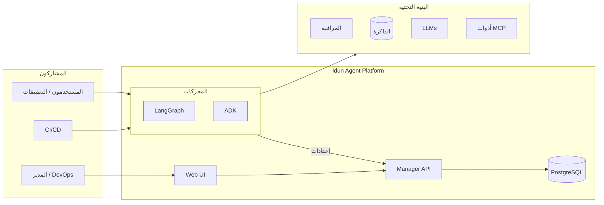

<p align="center">
  <a href="../../README.md">English</a> | <a href="README.fr.md">Français</a> | <a href="README.es.md">Español</a> | <a href="README.zh.md">中文</a> | <strong>العربية</strong>
</p>

<div align="center">

<picture>
  <source media="(prefers-color-scheme: dark)" srcset="../logo/light.svg">
  <source media="(prefers-color-scheme: light)" srcset="../logo/dark.svg">
  
</picture>

<br/>

### كل ما تحتاجه لنشر وكلاء الذكاء الاصطناعي في بيئة الإنتاج

<br/>

[](https://www.gnu.org/licenses/gpl-3.0.html)
[](https://github.com/Idun-Group/idun-agent-platform/actions/workflows/ci.yml)
[](https://pypi.org/project/idun-agent-engine/)
[](https://discord.gg/KCZ6nW2jQe)
[](https://github.com/Idun-Group/idun-agent-platform)
[](https://github.com/Idun-Group/idun-agent-platform)

<br/>

[السحابة](https://cloud.idunplatform.com) · [البدء السريع](https://docs.idunplatform.com/quickstart) · [التوثيق](https://docs.idunplatform.com) · [Discord](https://discord.gg/KCZ6nW2jQe) · [حجز عرض توضيحي](https://calendar.app.google/RSzm7EM5VZY8xVnN9)

⭐ إذا وجدت هذا مفيداً، يرجى إضافة نجمة للمستودع. هذا يساعد الآخرين على اكتشاف المشروع.

</div>

<br/>

<p align="center">Idun Agent Platform هي منصة تحكم مفتوحة المصدر ذاتية الاستضافة لوكلاء <b>LangGraph</b> و <b>Google ADK</b>. سجّل وكيلك واحصل على خدمة جاهزة للإنتاج مع إمكانية المراقبة، حواجز الحماية، استمرار الذاكرة، حوكمة أدوات MCP، إدارة الموجّهات، وتسجيل الدخول الموحد مع عزل مساحات العمل.</p>

> **لماذا Idun؟** تواجه الفرق التي تبني وكلاء ذكاء اصطناعي مفاضلة صعبة: بناء المنصة بنفسك (بطيء، مكلف) أو اعتماد خدمة سحابية (تقييد، بدون سيادة). Idun هو الطريق الثالث: تحتفظ بكود الوكيل الخاص بك، بياناتك، وبنيتك التحتية. المنصة تتولى طبقة الإنتاج.

<p align="center">
  
</p>

---

## البدء السريع

> **المتطلبات الأساسية**: Docker و Git.

```bash
git clone https://github.com/Idun-Group/idun-agent-platform.git && cd idun-agent-platform
cp .env.example .env
docker compose -f docker-compose.dev.yml up --build
```

افتح [localhost:3000](http://localhost:3000). أنشئ حساباً. انشر وكيلك الأول بثلاث نقرات.

> [!TIP]
> **لا تحتاج المنصة الكاملة؟** شغّل وكيلاً مستقلاً بدون Manager وبدون قاعدة بيانات:
> ```bash
> pip install idun-agent-engine && idun init
> ```
> واجهة TUI التفاعلية تضبط إعدادات الإطار، الذاكرة، المراقبة، حواجز الحماية و MCP دفعة واحدة. راجع [توثيق CLI](https://docs.idunplatform.com/cli/overview).

---

## المحتويات

<table>
<tr>
<td width="50%" valign="top">

### المراقبة

Langfuse · Arize Phoenix · LangSmith · GCP Trace · GCP Logging

تتبع كل تشغيل للوكيل. اربط عدة مزودين في نفس الوقت عبر الإعدادات.


</td>
<td width="50%" valign="top">

### حواجز الحماية

كشف PII · لغة سامة · قوائم حظر · تقييد الموضوع · فحص التحيز · NSFW · و9 أنواع أخرى

طبّق سياسات لكل وكيل على المدخلات أو المخرجات أو كليهما. مدعوم من Guardrails AI.


</td>
</tr>
<tr>
<td width="50%" valign="top">

### حوكمة أدوات MCP

سجّل خوادم MCP وتحكم في الأدوات التي يمكن لكل وكيل الوصول إليها. يدعم stdio و SSE و HTTP القابل للتدفق و WebSocket.


</td>
<td width="50%" valign="top">

### الذاكرة والاستمرارية

PostgreSQL · SQLite · في الذاكرة · Vertex AI · ADK Database

المحادثات تستمر بعد إعادة التشغيل. اختر خلفية لكل وكيل.


</td>
</tr>
<tr>
<td width="50%" valign="top">

### إدارة الموجّهات

قوالب مُنسّخة مع متغيرات Jinja2. عيّن الموجّهات للوكلاء من واجهة المستخدم أو API.


</td>
<td width="50%" valign="top">

### تكامل المراسلة

WhatsApp · Discord · Slack

ثنائي الاتجاه: استقبل الرسائل، استدعِ الوكلاء، أرسل الردود. التحقق من Webhook مُدمج.


</td>
</tr>
</table>

> [!NOTE]
> **SSO والتعدد** — OIDC مع Google و Okta، أو اسم مستخدم/كلمة مرور. مساحات عمل بأدوار (مالك، مدير، عضو، مشاهد). كل مورد محدد بمساحة عمل.

> [!NOTE]
> **بث AG-UI** — كل وكيل يحصل على API بث قائم على المعايير، متوافق مع عملاء CopilotKit. ساحة اختبار دردشة مدمجة.

<p align="center">
  
</p>

---

## الهندسة المعمارية

| | |
|---|---|
| **Engine** | يغلف وكلاء LangGraph/ADK في خدمة FastAPI مع بث AG-UI، نقاط التفتيش، حواجز الحماية، المراقبة، MCP و SSO. الإعداد عبر YAML أو Manager API. |
| **Manager** | مستوى التحكم. عمليات CRUD للوكلاء، إدارة الموارد، مساحات عمل متعددة المستأجرين. يقدم إعدادات مُجسّدة للمحركات. |
| **Web UI** | لوحة تحكم React 19. معالج إنشاء الوكلاء، إعداد الموارد، دردشة مدمجة، إدارة المستخدمين. |



---

## التكاملات

<p align="center">
  
  
  
  
  
  
  
  
  
  
  
  
  
</p>

---

## Idun مقابل البدائل

| | **Idun Platform** | **LangGraph Cloud** | **LangSmith** | **DIY (FastAPI + glue)** |
|---|:---:|:---:|:---:|:---:|
| استضافة ذاتية / محلية | ✅ | ❌ | ❌ | ✅ |
| متعدد الأطر (LangGraph + ADK) | ✅ | LangGraph فقط | ❌ (مراقبة فقط) | يدوي |
| حواجز الحماية (PII، السمية، الموضوع) | ✅ 15+ مدمجة | ❌ | ❌ | ابنِها بنفسك |
| حوكمة أدوات MCP | ✅ لكل وكيل | ❌ | ❌ | ابنِها بنفسك |
| مساحات عمل متعددة المستأجرين + RBAC | ✅ | ❌ | ✅ | ابنِها بنفسك |
| SSO (OIDC، Okta، Google) | ✅ | ❌ | ✅ | ابنِها بنفسك |
| المراقبة (Langfuse، Phoenix، LangSmith، GCP) | ✅ متعدد المزودين | ❌ LangSmith فقط | ✅ LangSmith فقط | يدوي |
| الذاكرة / نقاط التفتيش | ✅ Postgres، SQLite، في الذاكرة | ✅ | ❌ | ابنِها بنفسك |
| إدارة الموجّهات (مُنسّخة، Jinja2) | ✅ | ❌ | ✅ Hub | ابنِها بنفسك |
| المراسلة (WhatsApp، Discord، Slack) | ✅ | ❌ | ❌ | ابنِها بنفسك |
| بث AG-UI / CopilotKit | ✅ | ✅ | ❌ | يدوي |
| واجهة إدارة | ✅ | ✅ | ✅ | ❌ |
| تقييد المزود | **لا يوجد** | عالي | عالي | لا يوجد |
| مفتوح المصدر | ✅ GPLv3 | ❌ | ❌ | — |
| عبء الصيانة | منخفض | منخفض | منخفض | **عالي** |

> [!NOTE]
> Idun ليست بديلاً عن LangSmith (المراقبة) أو LangGraph Cloud (الاستضافة). إنها الطبقة بين كود الوكيل والإنتاج التي تتعامل مع الحوكمة والأمان والعمليات، بغض النظر عن المراقبة أو الاستضافة التي تختارها.

---

## الإعدادات

يتم إعداد كل وكيل من خلال ملف YAML واحد. إليك مثال كامل مع تفعيل جميع الميزات:

```yaml
server:
  api:
    port: 8001

agent:
  type: "LANGGRAPH"
  config:
    name: "Support Agent"
    graph_definition: "./agent.py:graph"
    checkpointer:
      type: "sqlite"
      db_url: "sqlite:///checkpoints.db"

observability:
  - provider: "LANGFUSE"
    enabled: true
    config:
      host: "https://cloud.langfuse.com"
      public_key: "${LANGFUSE_PUBLIC_KEY}"
      secret_key: "${LANGFUSE_SECRET_KEY}"

guardrails:
  input:
    - config_id: "DETECT_PII"
      on_fail: "reject"
      reject_message: "الطلب يحتوي على معلومات شخصية."
  output:
    - config_id: "TOXIC_LANGUAGE"
      on_fail: "reject"

mcp_servers:
  - name: "time"
    transport: "stdio"
    command: "docker"
    args: ["run", "-i", "--rm", "mcp/time"]

prompts:
  - prompt_id: "system-prompt"
    version: 1
    content: "أنت وكيل دعم لـ {{ company_name }}."
    tags: ["latest"]

sso:
  enabled: true
  issuer: "https://accounts.google.com"
  client_id: "123456789.apps.googleusercontent.com"
  allowed_domains: ["yourcompany.com"]

integrations:
  - provider: "WHATSAPP"
    enabled: true
    config:
      access_token: "${WHATSAPP_ACCESS_TOKEN}"
      phone_number_id: "${WHATSAPP_PHONE_ID}"
      verify_token: "${WHATSAPP_VERIFY_TOKEN}"
```

> [!TIP]
> متغيرات البيئة مثل `${LANGFUSE_SECRET_KEY}` يتم حلها عند بدء التشغيل. يمكنك استخدام ملفات `.env` أو حقنها عبر Docker/Kubernetes.

التشغيل من ملف:

```bash
pip install idun-agent-engine
idun agent serve --source file --path config.yaml
```

أو جلب الإعدادات من Manager:

```bash
export IDUN_AGENT_API_KEY=your-agent-api-key
export IDUN_MANAGER_HOST=https://manager.example.com
idun agent serve --source manager
```

> [!IMPORTANT]
> مرجع الإعدادات الكامل: [docs.idunplatform.com/configuration](https://docs.idunplatform.com/configuration)
>
> 9 أمثلة وكلاء قابلة للتشغيل: [idun-agent-template](https://github.com/Idun-Group/idun-agent-template)

---

## المجتمع

| | |
|---|---|
| **أسئلة ومساعدة** | [Discord](https://discord.gg/KCZ6nW2jQe) |
| **طلبات الميزات** | [GitHub Discussions](https://github.com/Idun-Group/idun-agent-platform/discussions) |
| **تقارير الأخطاء** | [GitHub Issues](https://github.com/Idun-Group/idun-agent-platform/issues) |
| **المساهمة** | [CONTRIBUTING.md](../../CONTRIBUTING.md) |
| **خارطة الطريق** | [ROADMAP.md](../../ROADMAP.md) |

## الدعم التجاري

تتم الصيانة بواسطة [Idun Group](https://idunplatform.com). نساعد في هندسة المنصة، النشر، وتكامل IdP/الامتثال. [احجز مكالمة](https://calendar.app.google/RSzm7EM5VZY8xVnN9) · contact@idun-group.com

## القياس عن بُعد

مقاييس استخدام مجهولة وبسيطة عبر PostHog. بدون PII. [عرض الكود المصدري](../../libs/idun_agent_engine/src/idun_agent_engine/telemetry/telemetry.py). إلغاء الاشتراك: `IDUN_TELEMETRY_ENABLED=false`

## الرخصة

[GPLv3](../../LICENSE)
