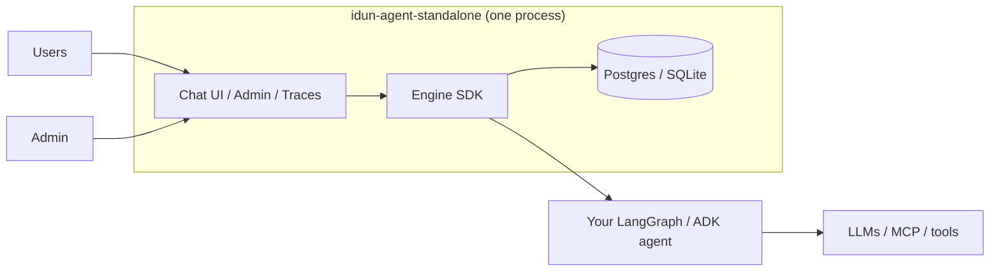

<p align="center">
  <a href="../../README.md">English</a> | <a href="README.fr.md">Français</a> | <a href="README.es.md">Español</a> | <a href="README.zh.md">中文</a> | <strong>العربية</strong>
</p>

> تم التحديث لـ v0.6 من النسخة الإنجليزية. يُرجى الإبلاغ عن مشاكل الترجمة على [GitHub Issues](https://github.com/Idun-Group/idun-agent-platform/issues/new?labels=docs%2Ci18n).

<div align="center">

<picture>
  <source media="(prefers-color-scheme: dark)" srcset="../logo/light.svg">
  <source media="(prefers-color-scheme: light)" srcset="../logo/dark.svg">
  
</picture>

<br/>

### قم بإطلاق عملاء LangGraph و ADK في الإنتاج.

استضافة ذاتية. مفتوح المصدر. بدون قيود الموردين.

<br/>

[](https://www.gnu.org/licenses/gpl-3.0.html)
[](https://github.com/Idun-Group/idun-agent-platform/actions/workflows/ci.yml)
[](https://pypi.org/project/idun-agent-engine/)
[](https://discord.gg/KCZ6nW2jQe)
[](https://github.com/Idun-Group/idun-agent-platform)
[](https://github.com/Idun-Group/idun-agent-platform)

<br/>

[السحابة](https://cloud.idunplatform.com) · [البدء السريع](https://docs.idunplatform.com/quickstart) · [التوثيق](https://docs.idunplatform.com) · [Discord](https://discord.gg/KCZ6nW2jQe) · [حجز عرض توضيحي](https://calendar.app.google/RSzm7EM5VZY8xVnN9)

⭐ إذا وجدت هذا مفيداً، يرجى إضافة نجمة للمستودع. هذا يساعد الآخرين على اكتشاف المشروع.

</div>

<br/>

<p align="center">Idun هو غلاف الإنتاج مفتوح المصدر لعملاء <b>LangGraph</b> و <b>Google ADK</b> — واجهة دردشة، تتبعات، حواجز، ذاكرة، و MCP، على البنية التحتية الخاصة بك. <code>pip install idun-agent-engine</code> ويعمل عميلك كعملية FastAPI مع واجهة دردشة مدمجة، لوحة إدارة، تتبعات، مراقبة، حواجز حماية، استمرار للذاكرة، حوكمة لأدوات MCP، وإدارة للموجّهات.</p>

> **لماذا Idun؟** تواجه الفرق التي تبني العملاء مفاضلة: بناء غلاف الإنتاج بنفسك (FastAPI + تتبعات + حواجز + لوحة إدارة — بطيء)، أو اعتماد خدمة SaaS مثل LangGraph Cloud أو LangSmith (التضحية بالسيادة). Idun هو الطريق الثالث: `pip install` لعملية FastAPI مكتفية ذاتياً تجمع عميلك مع واجهة دردشة، لوحة إدارة، تتبعات، وحواجز — كلها مفتوحة المصدر، وكلها على بنيتك التحتية.

<p align="center">
  
</p>

---

## البدء السريع

> **المتطلبات الأساسية**: Python 3.12+ و pip.

```bash
pip install idun-agent-engine
idun init my-agent
cd my-agent && idun serve
```

افتح [http://localhost:8000](http://localhost:8000). تحدّث مع عميلك، ثم استكشف الإدارة على [/admin](http://localhost:8000/admin) والتتبعات على [/admin/traces](http://localhost:8000/admin/traces).

## ما الذي يتضمنه Idun

<table>
<tr>
<td width="50%" valign="top">

### المراقبة

Langfuse · Arize Phoenix · LangSmith · GCP Trace · GCP Logging

تتبّع كل تشغيل للعميل. اربط عدة موفرين في نفس الوقت من خلال الإعدادات.


</td>
<td width="50%" valign="top">

### الحواجز

كشف PII · لغة سامة · قوائم حظر · تقييد المواضيع · فحص التحيز · NSFW · 9 أخرى

طبّق سياسات لكل عميل على المدخلات أو المخرجات أو كليهما. مدعوم بـ Guardrails AI.


</td>
</tr>
<tr>
<td width="50%" valign="top">

### حوكمة أدوات MCP

سجّل خوادم MCP وتحكّم في الأدوات التي يمكن لكل عميل الوصول إليها. يدعم stdio و SSE و HTTP المتدفق و WebSocket.


</td>
<td width="50%" valign="top">

### الذاكرة والاستمرار

PostgreSQL · SQLite · في الذاكرة · Vertex AI · ADK Database

تستمر المحادثات عبر إعادة التشغيل. اختر الواجهة الخلفية لكل عميل.


</td>
</tr>
<tr>
<td colspan="2" valign="top" align="center">

### إدارة الموجّهات

قوالب ذات إصدارات بمتغيرات Jinja2. اربط الموجّهات بالعملاء من الواجهة أو الـ API.


</td>
</tr>
</table>

> [!NOTE]
> **بث AG-UI** — يحصل كل عميل على واجهة بث برمجية قائمة على المعايير، متوافقة مع عملاء CopilotKit. ساحة دردشة مدمجة للاختبار.

<p align="center">
  
</p>

---

## البنية المعمارية

يُشحن Idun كعملية واحدة: **`idun-agent-standalone`**. يجمع SDK المحرك، وواجهة دردشة Next.js، ولوحة إدارة، وعارض تتبعات — يعمل عميلك داخل هذه العملية، يُهيَّأ من ملف YAML ويُعاد تحميله مباشرة من REST الإدارة.


```mermaid
flowchart LR
  subgraph Idun["idun-agent-standalone (one process)"]
    direction TB
    UI["Chat UI / Admin / Traces"] --> ENG["Engine SDK"]
    ENG --> DB[(Postgres / SQLite)]
  end
  Users --> UI
  Admin --> UI
  ENG --> Agent["Your LangGraph / ADK agent"]
  Agent --> LLM["LLMs / MCP / tools"]
```

---

## التكاملات

<p align="center">
  
  
  
  
  
  
  
  
  
  
  
  
</p>

> [!NOTE]
> **دعم أُطر العمل** — LangGraph و Google ADK مدعومان بشكل أساسي اليوم، مع محولات كاملة في المحرك. LangChain مدعوم عبر محول LangGraph؛ التوافق الأصلي الأوسع مع LangChain موجود في [خارطة الطريق](https://docs.idunplatform.com/roadmap).

---

## Idun مقابل البدائل

| | **Idun Platform** | **LangGraph Cloud** | **LangSmith** | **DIY (FastAPI + glue)** |
|---|:---:|:---:|:---:|:---:|
| استضافة ذاتية / on-prem | ✅ | ❌ | ❌ | ✅ |
| متعدد الأطر (LangGraph + ADK) | ✅ | LangGraph only | ❌ obs only | Manual |
| الحواجز (15+ مدمجة) | ✅ | ❌ | ❌ | Build yourself |
| حوكمة أدوات MCP | ✅ per-agent | ❌ | ❌ | Build yourself |
| المراقبة (متعددة الموفرين) | ✅ Langfuse, Phoenix, LangSmith, GCP | ❌ LangSmith only | ✅ LangSmith only | Manual |
| الذاكرة / نقاط التحقق | ✅ Postgres, SQLite, in-memory | ✅ | ❌ | Build yourself |
| بث AG-UI / CopilotKit | ✅ | ✅ | ❌ | Manual |
| مفتوح المصدر (GPLv3) | ✅ | ❌ | ❌ | — |

> [!NOTE]
> Idun ليس بديلاً عن LangSmith (المراقبة) أو LangGraph Cloud (الاستضافة). إنه الطبقة بين كود عميلك والإنتاج، التي تتولى الحوكمة والأمان والعمليات، بغض النظر عن المراقبة أو الاستضافة التي تختارها.

---

## التهيئة

يتم تهيئة كل عميل من خلال ملف YAML واحد. فيما يلي مثال كامل مع تمكين جميع الميزات:

```yaml
server:
  api:
    port: 8001

agent:
  type: "LANGGRAPH"
  config:
    name: "Support Agent"
    graph_definition: "./agent.py:graph"
    checkpointer:
      type: "sqlite"
      db_url: "sqlite:///checkpoints.db"

observability:
  - provider: "LANGFUSE"
    enabled: true
    config:
      host: "https://cloud.langfuse.com"
      public_key: "${LANGFUSE_PUBLIC_KEY}"
      secret_key: "${LANGFUSE_SECRET_KEY}"

guardrails:
  input:
    - config_id: "DETECT_PII"
      on_fail: "reject"
      reject_message: "Request contains personal information."
  output:
    - config_id: "TOXIC_LANGUAGE"
      on_fail: "reject"

mcp_servers:
  - name: "time"
    transport: "stdio"
    command: "docker"
    args: ["run", "-i", "--rm", "mcp/time"]

prompts:
  - prompt_id: "system-prompt"
    version: 1
    content: "You are a support agent for {{ company_name }}."
    tags: ["latest"]
```

> [!TIP]
> يتم حل متغيرات البيئة مثل `${LANGFUSE_SECRET_KEY}` عند بدء التشغيل. يمكنك استخدام ملفات `.env` أو حقنها عبر Docker/Kubernetes.

التشغيل من ملف:

```bash
pip install idun-agent-engine
idun agent serve --source file --path config.yaml
```

> [!IMPORTANT]
> مرجع التهيئة الكامل: [docs.idunplatform.com/configuration](https://docs.idunplatform.com/configuration)
>
> 9 أمثلة عملاء قابلة للتشغيل: [idun-agent-template](https://github.com/Idun-Group/idun-agent-template)

---

## المجتمع

| | |
|---|---|
| **الأسئلة والمساعدة** | [Discord](https://discord.gg/KCZ6nW2jQe) |
| **طلبات الميزات** | [GitHub Discussions](https://github.com/Idun-Group/idun-agent-platform/discussions) |
| **تقارير الأخطاء** | [GitHub Issues](https://github.com/Idun-Group/idun-agent-platform/issues) |
| **المساهمة** | [CONTRIBUTING.md](../../CONTRIBUTING.md) |
| **خارطة الطريق** | [ROADMAP.md](../../ROADMAP.md) |

## الدعم التجاري

تتم صيانته من قبل [Idun Group](https://idunplatform.com). نساعد في بنية المنصة، النشر، وتكامل IdP/الامتثال. [حجز مكالمة](https://calendar.app.google/RSzm7EM5VZY8xVnN9) · contact@idun-group.com

## القياس عن بُعد

مقاييس استخدام بسيطة ومجهولة الهوية عبر PostHog. لا توجد PII. [اعرض الكود المصدري](../../libs/idun_agent_engine/src/idun_agent_engine/telemetry/telemetry.py). الإيقاف: `IDUN_TELEMETRY_ENABLED=false`

## الترخيص

[GPLv3](../../LICENSE)
