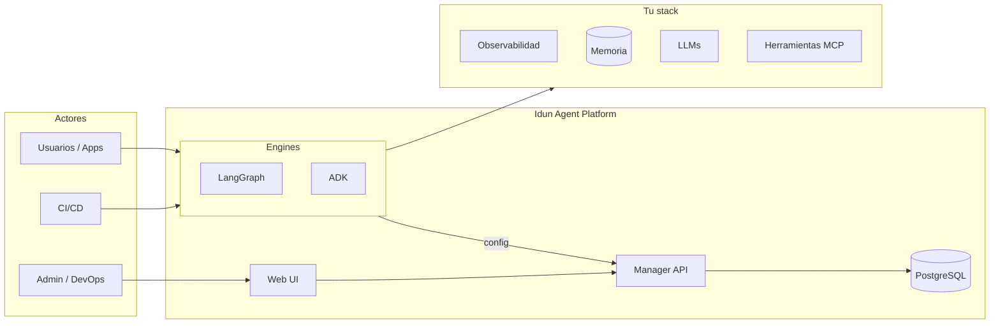

<p align="center">
  <a href="../../README.md">English</a> | <a href="README.fr.md">Français</a> | <strong>Español</strong> | <a href="README.zh.md">中文</a> | <a href="README.ar.md">العربية</a>
</p>

<div align="center">

<picture>
  <source media="(prefers-color-scheme: dark)" srcset="../logo/light.svg">
  <source media="(prefers-color-scheme: light)" srcset="../logo/dark.svg">
  
</picture>

<br/>

### Todo lo que necesitas para desplegar agentes de IA en producción

<br/>

[](https://www.gnu.org/licenses/gpl-3.0.html)
[](https://github.com/Idun-Group/idun-agent-platform/actions/workflows/ci.yml)
[](https://pypi.org/project/idun-agent-engine/)
[](https://discord.gg/KCZ6nW2jQe)
[](https://github.com/Idun-Group/idun-agent-platform)
[](https://github.com/Idun-Group/idun-agent-platform)

<br/>

[Cloud](https://cloud.idunplatform.com) · [Inicio rápido](https://docs.idunplatform.com/quickstart) · [Documentación](https://docs.idunplatform.com) · [Discord](https://discord.gg/KCZ6nW2jQe) · [Reservar una demo](https://calendar.app.google/RSzm7EM5VZY8xVnN9)

⭐ Si te resulta útil, dale una estrella al repo. Ayuda a que otros descubran el proyecto.

</div>

<br/>

<p align="center">Idun Agent Platform es un plano de control open-source y autoalojado para agentes <b>LangGraph</b> y <b>Google ADK</b>. Registra tu agente y obtén un servicio listo para producción con observabilidad, guardrails, persistencia de memoria, gobernanza de herramientas MCP, gestión de prompts y SSO con aislamiento por workspace.</p>

> **¿Por qué Idun?** Los equipos que construyen agentes enfrentan un mal compromiso: construir la plataforma uno mismo (lento, costoso) o adoptar un SaaS (lock-in, sin soberanía). Idun es el tercer camino: conservas tu código de agente, tus datos y tu infraestructura. La plataforma maneja la capa de producción.

<p align="center">
  
</p>

---

## Inicio rápido

> **Requisitos previos**: Docker y Git.

```bash
git clone https://github.com/Idun-Group/idun-agent-platform.git && cd idun-agent-platform
cp .env.example .env
docker compose -f docker-compose.dev.yml up --build
```

Abre [localhost:3000](http://localhost:3000). Crea una cuenta. Despliega tu primer agente en 3 clics.

> [!TIP]
> **¿No necesitas la plataforma completa?** Ejecuta un agente independiente sin Manager y sin base de datos:
> ```bash
> pip install idun-agent-engine && idun init
> ```
> El TUI interactivo configura framework, memoria, observabilidad, guardrails y MCP en un solo paso. Ver la [documentación CLI](https://docs.idunplatform.com/cli/overview).

---

## Contenido

<table>
<tr>
<td width="50%" valign="top">

### Observabilidad

Langfuse · Arize Phoenix · LangSmith · GCP Trace · GCP Logging

Rastrea cada ejecución de agente. Conecta múltiples proveedores al mismo tiempo vía configuración.


</td>
<td width="50%" valign="top">

### Guardrails

Detección PII · Lenguaje tóxico · Listas de exclusión · Restricción de tema · Verificación de sesgo · NSFW · 9 más

Aplica políticas por agente en entrada, salida o ambos. Impulsado por Guardrails AI.


</td>
</tr>
<tr>
<td width="50%" valign="top">

### Gobernanza de herramientas MCP

Registra servidores MCP y controla qué herramientas puede acceder cada agente. Soporta stdio, SSE, HTTP streamable y WebSocket.


</td>
<td width="50%" valign="top">

### Memoria y persistencia

PostgreSQL · SQLite · En memoria · Vertex AI · ADK Database

Las conversaciones persisten entre reinicios. Elige un backend por agente.


</td>
</tr>
<tr>
<td width="50%" valign="top">

### Gestión de prompts

Templates versionados con variables Jinja2. Asigna prompts a agentes desde la UI o la API.


</td>
<td width="50%" valign="top">

### Integraciones de mensajería

WhatsApp · Discord · Slack

Bidireccional: recibe mensajes, invoca agentes, envía respuestas. Verificación de webhook incluida.


</td>
</tr>
</table>

> [!NOTE]
> **SSO y multi-tenant** — OIDC con Google y Okta, o usuario/contraseña. Workspaces con roles (propietario, admin, miembro, lector). Cada recurso está limitado a un workspace.

> [!NOTE]
> **Streaming AG-UI** — Cada agente obtiene una API de streaming basada en estándares, compatible con clientes CopilotKit. Playground de chat integrado para pruebas.

<p align="center">
  
</p>

---

## Arquitectura

| | |
|---|---|
| **Engine** | Envuelve agentes LangGraph/ADK en un servicio FastAPI con streaming AG-UI, checkpointing, guardrails, observabilidad, MCP y SSO. Configuración vía YAML o API Manager. |
| **Manager** | Plano de control. CRUD de agentes, gestión de recursos, workspaces multi-tenant. Sirve configuraciones materializadas a los engines. |
| **Web UI** | Dashboard admin React 19. Asistente de creación de agentes, configuración de recursos, chat integrado, gestión de usuarios. |



---

## Integraciones

<p align="center">
  
  
  
  
  
  
  
  
  
  
  
  
  
</p>

---

## Idun vs alternativas

| | **Idun Platform** | **LangGraph Cloud** | **LangSmith** | **DIY (FastAPI + glue)** |
|---|:---:|:---:|:---:|:---:|
| Autoalojado / on-prem | ✅ | ❌ | ❌ | ✅ |
| Multi-framework (LangGraph + ADK) | ✅ | Solo LangGraph | ❌ (solo observabilidad) | Manual |
| Guardrails (PII, toxicidad, tema) | ✅ 15+ integrados | ❌ | ❌ | Constrúyelo tú mismo |
| Gobernanza de herramientas MCP | ✅ por agente | ❌ | ❌ | Constrúyelo tú mismo |
| Workspaces multi-tenant + RBAC | ✅ | ❌ | ✅ | Constrúyelo tú mismo |
| SSO (OIDC, Okta, Google) | ✅ | ❌ | ✅ | Constrúyelo tú mismo |
| Observabilidad (Langfuse, Phoenix, LangSmith, GCP) | ✅ multi-proveedor | ❌ solo LangSmith | ✅ solo LangSmith | Manual |
| Memoria / checkpointing | ✅ Postgres, SQLite, en memoria | ✅ | ❌ | Constrúyelo tú mismo |
| Gestión de prompts (versionados, Jinja2) | ✅ | ❌ | ✅ Hub | Constrúyelo tú mismo |
| Mensajería (WhatsApp, Discord, Slack) | ✅ | ❌ | ❌ | Constrúyelo tú mismo |
| Streaming AG-UI / CopilotKit | ✅ | ✅ | ❌ | Manual |
| Interfaz admin | ✅ | ✅ | ✅ | ❌ |
| Dependencia de proveedor | **Ninguna** | Alta | Alta | Ninguna |
| Open source | ✅ GPLv3 | ❌ | ❌ | — |
| Carga de mantenimiento | Baja | Baja | Baja | **Alta** |

> [!NOTE]
> Idun no reemplaza a LangSmith (observabilidad) ni a LangGraph Cloud (alojamiento). Es la capa entre tu código de agente y producción que maneja gobernanza, seguridad y operaciones, sin importar qué observabilidad o alojamiento elijas.

---

## Configuración

Cada agente se configura a través de un único archivo YAML. Aquí hay un ejemplo completo con todas las funcionalidades habilitadas:

```yaml
server:
  api:
    port: 8001

agent:
  type: "LANGGRAPH"
  config:
    name: "Support Agent"
    graph_definition: "./agent.py:graph"
    checkpointer:
      type: "sqlite"
      db_url: "sqlite:///checkpoints.db"

observability:
  - provider: "LANGFUSE"
    enabled: true
    config:
      host: "https://cloud.langfuse.com"
      public_key: "${LANGFUSE_PUBLIC_KEY}"
      secret_key: "${LANGFUSE_SECRET_KEY}"

guardrails:
  input:
    - config_id: "DETECT_PII"
      on_fail: "reject"
      reject_message: "La solicitud contiene información personal."
  output:
    - config_id: "TOXIC_LANGUAGE"
      on_fail: "reject"

mcp_servers:
  - name: "time"
    transport: "stdio"
    command: "docker"
    args: ["run", "-i", "--rm", "mcp/time"]

prompts:
  - prompt_id: "system-prompt"
    version: 1
    content: "Eres un agente de soporte para {{ company_name }}."
    tags: ["latest"]

sso:
  enabled: true
  issuer: "https://accounts.google.com"
  client_id: "123456789.apps.googleusercontent.com"
  allowed_domains: ["tuempresa.com"]

integrations:
  - provider: "WHATSAPP"
    enabled: true
    config:
      access_token: "${WHATSAPP_ACCESS_TOKEN}"
      phone_number_id: "${WHATSAPP_PHONE_ID}"
      verify_token: "${WHATSAPP_VERIFY_TOKEN}"
```

> [!TIP]
> Las variables de entorno como `${LANGFUSE_SECRET_KEY}` se resuelven al iniciar. Puedes usar archivos `.env` o inyectarlas a través de Docker/Kubernetes.

Servir desde un archivo:

```bash
pip install idun-agent-engine
idun agent serve --source file --path config.yaml
```

O recuperar la configuración desde el Manager:

```bash
export IDUN_AGENT_API_KEY=tu-clave-api-agente
export IDUN_MANAGER_HOST=https://manager.example.com
idun agent serve --source manager
```

> [!IMPORTANT]
> Referencia de configuración completa: [docs.idunplatform.com/configuration](https://docs.idunplatform.com/configuration)
>
> 9 ejemplos de agentes ejecutables: [idun-agent-template](https://github.com/Idun-Group/idun-agent-template)

---

## Comunidad

| | |
|---|---|
| **Preguntas y ayuda** | [Discord](https://discord.gg/KCZ6nW2jQe) |
| **Solicitudes de funcionalidades** | [GitHub Discussions](https://github.com/Idun-Group/idun-agent-platform/discussions) |
| **Reportes de bugs** | [GitHub Issues](https://github.com/Idun-Group/idun-agent-platform/issues) |
| **Contribuir** | [CONTRIBUTING.md](../../CONTRIBUTING.md) |
| **Hoja de ruta** | [ROADMAP.md](../../ROADMAP.md) |

## Soporte comercial

Mantenido por [Idun Group](https://idunplatform.com). Ayudamos con arquitectura de plataforma, despliegue e integración IdP/cumplimiento. [Reservar una llamada](https://calendar.app.google/RSzm7EM5VZY8xVnN9) · contact@idun-group.com

## Telemetría

Métricas de uso mínimas y anónimas vía PostHog. Sin PII. [Ver código fuente](../../libs/idun_agent_engine/src/idun_agent_engine/telemetry/telemetry.py). Desactivar: `IDUN_TELEMETRY_ENABLED=false`

## Licencia

[GPLv3](../../LICENSE)
