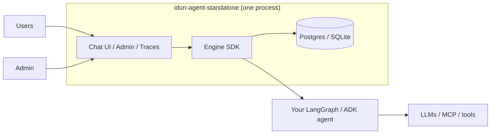

<p align="center">
  <a href="../../README.md">English</a> | <a href="README.fr.md">Français</a> | <strong>Español</strong> | <a href="README.zh.md">中文</a> | <a href="README.ar.md">العربية</a>
</p>

> Actualizado para v0.6 desde la versión en inglés. Reporta problemas de traducción en [GitHub Issues](https://github.com/Idun-Group/idun-agent-platform/issues/new?labels=docs%2Ci18n).

<div align="center">

<picture>
  <source media="(prefers-color-scheme: dark)" srcset="../logo/light.svg">
  <source media="(prefers-color-scheme: light)" srcset="../logo/dark.svg">
  
</picture>

<br/>

### Lleve sus agentes LangGraph & ADK a producción.

Autoalojado. Código abierto. Sin dependencia de proveedores.

<br/>

[](https://www.gnu.org/licenses/gpl-3.0.html)
[](https://github.com/Idun-Group/idun-agent-platform/actions/workflows/ci.yml)
[](https://pypi.org/project/idun-agent-engine/)
[](https://discord.gg/KCZ6nW2jQe)
[](https://github.com/Idun-Group/idun-agent-platform)
[](https://github.com/Idun-Group/idun-agent-platform)

<br/>

[Cloud](https://cloud.idunplatform.com) · [Inicio rápido](https://docs.idunplatform.com/quickstart) · [Documentación](https://docs.idunplatform.com) · [Discord](https://discord.gg/KCZ6nW2jQe) · [Reservar una demo](https://calendar.app.google/RSzm7EM5VZY8xVnN9)

⭐ Si lo encuentras útil, dale una estrella al repositorio. Ayuda a otros a descubrir el proyecto.

</div>

<br/>

<p align="center">Idun es la envoltura de producción de código abierto para agentes <b>LangGraph</b> y <b>Google ADK</b> — interfaz de chat, trazas, guardarraíles, memoria y MCP, en tu propia infraestructura. <code>pip install idun-agent-engine</code> y tu agente se ejecuta como un proceso FastAPI con interfaz de chat integrada, panel de administración, trazas, observabilidad, guardarraíles, persistencia de memoria, gobernanza de herramientas MCP y gestión de prompts.</p>

> **¿Por qué Idun?** Los equipos que construyen agentes se enfrentan a un compromiso: construir tú mismo la envoltura de producción (FastAPI + trazas + guardarraíles + interfaz admin — lento), o adoptar un SaaS como LangGraph Cloud o LangSmith (compromiso de soberanía). Idun es la tercera vía: un `pip install` de un proceso FastAPI autosuficiente que empaqueta tu agente con interfaz de chat, admin, trazas y guardarraíles — todo de código abierto, todo en tu infraestructura.

<p align="center">
  
</p>

---

## Inicio rápido

> **Requisitos previos**: Python 3.12+ y pip.

```bash
pip install idun-agent-engine
idun init my-agent
cd my-agent && idun serve
```

Abre [http://localhost:8000](http://localhost:8000). Chatea con tu agente, luego explora la administración en [/admin](http://localhost:8000/admin) y las trazas en [/admin/traces](http://localhost:8000/admin/traces).

## Qué incluye Idun

<table>
<tr>
<td width="50%" valign="top">

### Observabilidad

Langfuse · Arize Phoenix · LangSmith · GCP Trace · GCP Logging

Traza cada ejecución del agente. Conecta varios proveedores al mismo tiempo mediante configuración.


</td>
<td width="50%" valign="top">

### Guardarraíles

Detección PII · Lenguaje tóxico · Listas de bloqueo · Restricción de temas · Verificación de sesgos · NSFW · 9 más

Aplica políticas por agente en entrada, salida o ambas. Impulsado por Guardrails AI.


</td>
</tr>
<tr>
<td width="50%" valign="top">

### Gobernanza de herramientas MCP

Registra servidores MCP y controla qué herramientas puede usar cada agente. Compatible con stdio, SSE, HTTP streamable y WebSocket.


</td>
<td width="50%" valign="top">

### Memoria y persistencia

PostgreSQL · SQLite · En memoria · Vertex AI · ADK Database

Las conversaciones persisten entre reinicios. Elige un backend por agente.


</td>
</tr>
<tr>
<td colspan="2" valign="top" align="center">

### Gestión de prompts

Plantillas versionadas con variables Jinja2. Asigna prompts a los agentes desde la interfaz o la API.


</td>
</tr>
</table>

> [!NOTE]
> **Streaming AG-UI** — Cada agente obtiene una API de streaming basada en estándares, compatible con clientes CopilotKit. Playground de chat integrado para pruebas.

<p align="center">
  
</p>

---

## Arquitectura

Idun se distribuye como un único proceso: **`idun-agent-standalone`**. Empaqueta el SDK del motor, una interfaz de chat Next.js, un panel de administración y un visor de trazas — tu agente se ejecuta dentro de este proceso, configurado desde un archivo YAML y recargado en vivo desde la API REST de administración.


```mermaid
flowchart LR
  subgraph Idun["idun-agent-standalone (one process)"]
    direction TB
    UI["Chat UI / Admin / Traces"] --> ENG["Engine SDK"]
    ENG --> DB[(Postgres / SQLite)]
  end
  Users --> UI
  Admin --> UI
  ENG --> Agent["Your LangGraph / ADK agent"]
  Agent --> LLM["LLMs / MCP / tools"]
```

---

## Integraciones

<p align="center">
  
  
  
  
  
  
  
  
  
  
  
  
</p>

> [!NOTE]
> **Soporte de frameworks** — LangGraph y Google ADK son de primera clase hoy, con adaptadores completos en el motor. LangChain está soportado a través del adaptador de LangGraph; una compatibilidad nativa más amplia con LangChain está en el [roadmap](https://docs.idunplatform.com/roadmap).

---

## Idun frente a las alternativas

| | **Idun Platform** | **LangGraph Cloud** | **LangSmith** | **DIY (FastAPI + glue)** |
|---|:---:|:---:|:---:|:---:|
| Autoalojado / on-prem | ✅ | ❌ | ❌ | ✅ |
| Multi-framework (LangGraph + ADK) | ✅ | LangGraph only | ❌ obs only | Manual |
| Guardarraíles (15+ integrados) | ✅ | ❌ | ❌ | Build yourself |
| Gobernanza de herramientas MCP | ✅ per-agent | ❌ | ❌ | Build yourself |
| Observabilidad (multi-proveedor) | ✅ Langfuse, Phoenix, LangSmith, GCP | ❌ LangSmith only | ✅ LangSmith only | Manual |
| Memoria / checkpointing | ✅ Postgres, SQLite, in-memory | ✅ | ❌ | Build yourself |
| Streaming AG-UI / CopilotKit | ✅ | ✅ | ❌ | Manual |
| Open source (GPLv3) | ✅ | ❌ | ❌ | — |

> [!NOTE]
> Idun no es un reemplazo de LangSmith (observabilidad) ni de LangGraph Cloud (alojamiento). Es la capa entre tu código de agente y producción que se encarga de la gobernanza, la seguridad y las operaciones, sin importar qué observabilidad o alojamiento elijas.

---

## Configuración

Cada agente se configura mediante un único archivo YAML. Aquí tienes un ejemplo completo con todas las funciones habilitadas:

```yaml
server:
  api:
    port: 8001

agent:
  type: "LANGGRAPH"
  config:
    name: "Support Agent"
    graph_definition: "./agent.py:graph"
    checkpointer:
      type: "sqlite"
      db_url: "sqlite:///checkpoints.db"

observability:
  - provider: "LANGFUSE"
    enabled: true
    config:
      host: "https://cloud.langfuse.com"
      public_key: "${LANGFUSE_PUBLIC_KEY}"
      secret_key: "${LANGFUSE_SECRET_KEY}"

guardrails:
  input:
    - config_id: "DETECT_PII"
      on_fail: "reject"
      reject_message: "Request contains personal information."
  output:
    - config_id: "TOXIC_LANGUAGE"
      on_fail: "reject"

mcp_servers:
  - name: "time"
    transport: "stdio"
    command: "docker"
    args: ["run", "-i", "--rm", "mcp/time"]

prompts:
  - prompt_id: "system-prompt"
    version: 1
    content: "You are a support agent for {{ company_name }}."
    tags: ["latest"]
```

> [!TIP]
> Las variables de entorno como `${LANGFUSE_SECRET_KEY}` se resuelven al arranque. Puedes usar archivos `.env` o inyectarlas a través de Docker/Kubernetes.

Servir desde un archivo:

```bash
pip install idun-agent-engine
idun agent serve --source file --path config.yaml
```

> [!IMPORTANT]
> Referencia completa de configuración: [docs.idunplatform.com/configuration](https://docs.idunplatform.com/configuration)
>
> 9 ejemplos de agentes ejecutables: [idun-agent-template](https://github.com/Idun-Group/idun-agent-template)

---

## Comunidad

| | |
|---|---|
| **Preguntas y ayuda** | [Discord](https://discord.gg/KCZ6nW2jQe) |
| **Solicitudes de funciones** | [GitHub Discussions](https://github.com/Idun-Group/idun-agent-platform/discussions) |
| **Reportes de bugs** | [GitHub Issues](https://github.com/Idun-Group/idun-agent-platform/issues) |
| **Contribuir** | [CONTRIBUTING.md](../../CONTRIBUTING.md) |
| **Roadmap** | [ROADMAP.md](../../ROADMAP.md) |

## Soporte comercial

Mantenido por [Idun Group](https://idunplatform.com). Ayudamos con la arquitectura de la plataforma, el despliegue y la integración con IdP/cumplimiento normativo. [Reservar una llamada](https://calendar.app.google/RSzm7EM5VZY8xVnN9) · contact@idun-group.com

## Telemetría

Métricas de uso mínimas y anónimas a través de PostHog. Sin PII. [Ver código fuente](../../libs/idun_agent_engine/src/idun_agent_engine/telemetry/telemetry.py). Desactivar: `IDUN_TELEMETRY_ENABLED=false`

## Licencia

[GPLv3](../../LICENSE)
