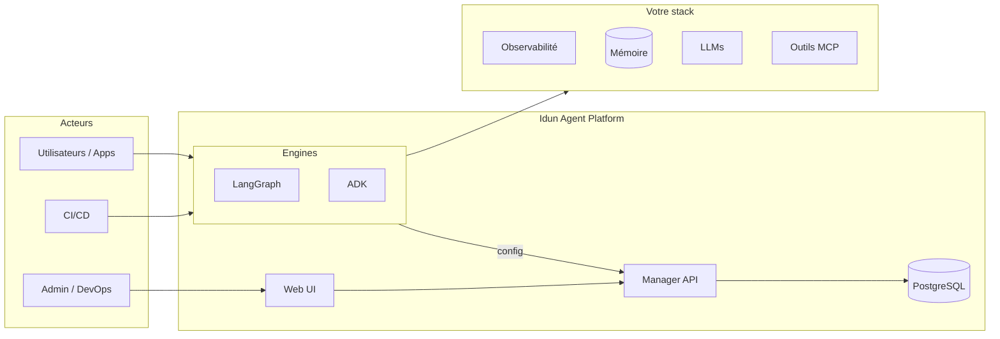

<p align="center">
  <a href="../../README.md">English</a> | <strong>Français</strong> | <a href="README.es.md">Español</a> | <a href="README.zh.md">中文</a> | <a href="README.ar.md">العربية</a>
</p>

<div align="center">

<picture>
  <source media="(prefers-color-scheme: dark)" srcset="../logo/light.svg">
  <source media="(prefers-color-scheme: light)" srcset="../logo/dark.svg">
  
</picture>

<br/>

### Tout ce qu'il faut pour déployer des agents IA en production

<br/>

[](https://www.gnu.org/licenses/gpl-3.0.html)
[](https://github.com/Idun-Group/idun-agent-platform/actions/workflows/ci.yml)
[](https://pypi.org/project/idun-agent-engine/)
[](https://discord.gg/KCZ6nW2jQe)
[](https://github.com/Idun-Group/idun-agent-platform)
[](https://github.com/Idun-Group/idun-agent-platform)

<br/>

[Cloud](https://cloud.idunplatform.com) · [Démarrage rapide](https://docs.idunplatform.com/quickstart) · [Documentation](https://docs.idunplatform.com) · [Discord](https://discord.gg/KCZ6nW2jQe) · [Réserver une démo](https://calendar.app.google/RSzm7EM5VZY8xVnN9)

</div>

<br/>

<p align="center">Idun Agent Platform est un plan de contrôle open-source et auto-hébergé pour les agents <b>LangGraph</b> et <b>Google ADK</b>. Enrôlez votre agent et obtenez un service prêt pour la production avec observabilité, guardrails, persistance mémoire, gouvernance d'outils MCP, gestion de prompts et SSO avec isolation par workspace.</p>

> **Pourquoi Idun ?** Les équipes qui construisent des agents font face à un mauvais compromis : construire la plateforme soi-même (lent, coûteux) ou adopter un SaaS (lock-in, pas de souveraineté). Idun est la troisième voie : vous gardez votre code agent, vos données et votre infrastructure. La plateforme gère la couche de production.

<p align="center">
  
</p>

---

## Démarrage rapide

> **Prérequis** : Docker et Git.

```bash
git clone https://github.com/Idun-Group/idun-agent-platform.git && cd idun-agent-platform
cp .env.example .env
docker compose -f docker-compose.dev.yml up --build
```

Ouvrez [localhost:3000](http://localhost:3000). Créez un compte. Déployez votre premier agent en 3 clics.

> [!TIP]
> **Pas besoin de la plateforme complète ?** Lancez un agent autonome sans Manager et sans base de données :
> ```bash
> pip install idun-agent-engine && idun init
> ```
> Le TUI interactif configure le framework, la mémoire, l'observabilité, les guardrails et MCP en une seule passe. Voir la [documentation CLI](https://docs.idunplatform.com/cli/overview).

---

## Contenu

<table>
<tr>
<td width="50%" valign="top">

### Observabilité

Langfuse · Arize Phoenix · LangSmith · GCP Trace · GCP Logging

Tracez chaque exécution d'agent. Connectez plusieurs fournisseurs en même temps via la configuration.


</td>
<td width="50%" valign="top">

### Guardrails

Détection PII · Langage toxique · Listes d'exclusion · Restriction de sujet · Vérification de biais · NSFW · 9 autres

Appliquez des politiques par agent en entrée, en sortie ou les deux. Propulsé par Guardrails AI.


</td>
</tr>
<tr>
<td width="50%" valign="top">

### Gouvernance d'outils MCP

Enregistrez des serveurs MCP et contrôlez quels outils chaque agent peut utiliser. Supporte stdio, SSE, HTTP streamable et WebSocket.


</td>
<td width="50%" valign="top">

### Mémoire et persistance

PostgreSQL · SQLite · En mémoire · Vertex AI · ADK Database

Les conversations persistent entre les redémarrages. Choisissez un backend par agent.


</td>
</tr>
<tr>
<td width="50%" valign="top">

### Gestion de prompts

Templates versionnés avec variables Jinja2. Assignez des prompts aux agents depuis l'UI ou l'API.


</td>
<td width="50%" valign="top">

### Intégrations messagerie

WhatsApp · Discord · Slack

Bidirectionnel : recevez des messages, invoquez des agents, envoyez des réponses. Vérification de webhook incluse.


</td>
</tr>
</table>

> [!NOTE]
> **SSO et multi-tenant** — OIDC avec Google et Okta, ou nom d'utilisateur/mot de passe. Workspaces avec rôles (propriétaire, admin, membre, lecteur). Chaque ressource est scopée à un workspace.

> [!NOTE]
> **Streaming AG-UI** — Chaque agent obtient une API de streaming basée sur les standards, compatible avec les clients CopilotKit. Playground de chat intégré pour les tests.

<p align="center">
  
</p>

---

## Architecture

| | |
|---|---|
| **Engine** | Encapsule les agents LangGraph/ADK dans un service FastAPI avec streaming AG-UI, checkpointing, guardrails, observabilité, MCP et SSO. Configuration via YAML ou API Manager. |
| **Manager** | Plan de contrôle. CRUD d'agents, gestion des ressources, workspaces multi-tenant. Sert des configurations matérialisées aux engines. |
| **Web UI** | Dashboard admin React 19. Assistant de création d'agents, configuration des ressources, chat intégré, gestion des utilisateurs. |



---

## Intégrations

<p align="center">
  
  
  
  
  
  
  
  
  
  
  
  
  
</p>

---

## Idun vs alternatives

| | **Idun Platform** | **LangGraph Cloud** | **LangSmith** | **DIY (FastAPI + glue)** |
|---|:---:|:---:|:---:|:---:|
| Auto-hébergé / on-prem | ✅ | ❌ | ❌ | ✅ |
| Multi-framework (LangGraph + ADK) | ✅ | LangGraph uniquement | ❌ (observabilité uniquement) | Manuel |
| Guardrails (PII, toxicité, sujet) | ✅ 15+ intégrés | ❌ | ❌ | À construire |
| Gouvernance d'outils MCP | ✅ par agent | ❌ | ❌ | À construire |
| Workspaces multi-tenant + RBAC | ✅ | ❌ | ✅ | À construire |
| SSO (OIDC, Okta, Google) | ✅ | ❌ | ✅ | À construire |
| Observabilité (Langfuse, Phoenix, LangSmith, GCP) | ✅ multi-fournisseur | ❌ LangSmith uniquement | ✅ LangSmith uniquement | Manuel |
| Mémoire / checkpointing | ✅ Postgres, SQLite, en mémoire | ✅ | ❌ | À construire |
| Gestion de prompts (versionnés, Jinja2) | ✅ | ❌ | ✅ Hub | À construire |
| Messagerie (WhatsApp, Discord, Slack) | ✅ | ❌ | ❌ | À construire |
| Streaming AG-UI / CopilotKit | ✅ | ✅ | ❌ | Manuel |
| Interface admin | ✅ | ✅ | ✅ | ❌ |
| Dépendance fournisseur | **Aucune** | Élevée | Élevée | Aucune |
| Open source | ✅ GPLv3 | ❌ | ❌ | — |
| Charge de maintenance | Faible | Faible | Faible | **Élevée** |

> [!NOTE]
> Idun ne remplace pas LangSmith (observabilité) ni LangGraph Cloud (hébergement). C'est la couche entre votre code agent et la production qui gère la gouvernance, la sécurité et les opérations, quel que soit l'observabilité ou l'hébergement que vous choisissez.

---

## Configuration

Chaque agent est configuré via un seul fichier YAML. Voici un exemple complet avec toutes les fonctionnalités activées :

```yaml
server:
  api:
    port: 8001

agent:
  type: "LANGGRAPH"
  config:
    name: "Support Agent"
    graph_definition: "./agent.py:graph"
    checkpointer:
      type: "sqlite"
      db_url: "sqlite:///checkpoints.db"

observability:
  - provider: "LANGFUSE"
    enabled: true
    config:
      host: "https://cloud.langfuse.com"
      public_key: "${LANGFUSE_PUBLIC_KEY}"
      secret_key: "${LANGFUSE_SECRET_KEY}"

guardrails:
  input:
    - config_id: "DETECT_PII"
      on_fail: "reject"
      reject_message: "La requête contient des informations personnelles."
  output:
    - config_id: "TOXIC_LANGUAGE"
      on_fail: "reject"

mcp_servers:
  - name: "time"
    transport: "stdio"
    command: "docker"
    args: ["run", "-i", "--rm", "mcp/time"]

prompts:
  - prompt_id: "system-prompt"
    version: 1
    content: "Vous êtes un agent de support pour {{ company_name }}."
    tags: ["latest"]

sso:
  enabled: true
  issuer: "https://accounts.google.com"
  client_id: "123456789.apps.googleusercontent.com"
  allowed_domains: ["votreentreprise.com"]

integrations:
  - provider: "WHATSAPP"
    enabled: true
    config:
      access_token: "${WHATSAPP_ACCESS_TOKEN}"
      phone_number_id: "${WHATSAPP_PHONE_ID}"
      verify_token: "${WHATSAPP_VERIFY_TOKEN}"
```

> [!TIP]
> Les variables d'environnement comme `${LANGFUSE_SECRET_KEY}` sont résolues au démarrage. Vous pouvez utiliser des fichiers `.env` ou les injecter via Docker/Kubernetes.

Servir depuis un fichier :

```bash
pip install idun-agent-engine
idun agent serve --source file --path config.yaml
```

Ou récupérer la configuration depuis le Manager :

```bash
export IDUN_AGENT_API_KEY=votre-clé-api-agent
export IDUN_MANAGER_HOST=https://manager.example.com
idun agent serve --source manager
```

> [!IMPORTANT]
> Référence de configuration complète : [docs.idunplatform.com/configuration](https://docs.idunplatform.com/configuration)
>
> 9 exemples d'agents exécutables : [idun-agent-template](https://github.com/Idun-Group/idun-agent-template)

---

## Communauté

| | |
|---|---|
| **Questions et aide** | [Discord](https://discord.gg/KCZ6nW2jQe) |
| **Demandes de fonctionnalités** | [GitHub Discussions](https://github.com/Idun-Group/idun-agent-platform/discussions) |
| **Rapports de bugs** | [GitHub Issues](https://github.com/Idun-Group/idun-agent-platform/issues) |
| **Contribuer** | [CONTRIBUTING.md](../../CONTRIBUTING.md) |
| **Feuille de route** | [ROADMAP.md](../../ROADMAP.md) |

## Support commercial

Maintenu par [Idun Group](https://idunplatform.com). Nous aidons avec l'architecture de plateforme, le déploiement et l'intégration IdP/conformité. [Réserver un appel](https://calendar.app.google/RSzm7EM5VZY8xVnN9) · contact@idun-group.com

## Télémétrie

Métriques d'utilisation minimales et anonymes via PostHog. Pas de PII. [Voir le code source](../../libs/idun_agent_engine/src/idun_agent_engine/telemetry/telemetry.py). Désactiver : `IDUN_TELEMETRY_ENABLED=false`

## Licence

[GPLv3](../../LICENSE)
