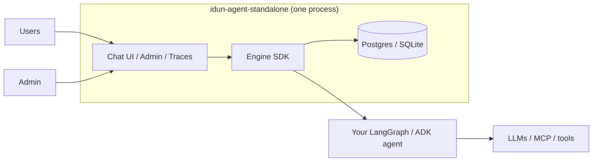

<p align="center">
  <a href="../../README.md">English</a> | <strong>Français</strong> | <a href="README.es.md">Español</a> | <a href="README.zh.md">中文</a> | <a href="README.ar.md">العربية</a>
</p>

> Mis à jour pour v0.6 depuis la version anglaise. Signalez les problèmes de traduction sur [GitHub Issues](https://github.com/Idun-Group/idun-agent-platform/issues/new?labels=docs%2Ci18n).

<div align="center">

<picture>
  <source media="(prefers-color-scheme: dark)" srcset="../logo/light.svg">
  <source media="(prefers-color-scheme: light)" srcset="../logo/dark.svg">
  
</picture>

<br/>

### Productionnez vos agents LangGraph & ADK.

Auto-hébergé. Open source. Aucun verrou propriétaire.

<br/>

[](https://www.gnu.org/licenses/gpl-3.0.html)
[](https://github.com/Idun-Group/idun-agent-platform/actions/workflows/ci.yml)
[](https://pypi.org/project/idun-agent-engine/)
[](https://discord.gg/KCZ6nW2jQe)
[](https://github.com/Idun-Group/idun-agent-platform)
[](https://github.com/Idun-Group/idun-agent-platform)

<br/>

[Cloud](https://cloud.idunplatform.com) · [Démarrage rapide](https://docs.idunplatform.com/quickstart) · [Documentation](https://docs.idunplatform.com) · [Discord](https://discord.gg/KCZ6nW2jQe) · [Réserver une démo](https://calendar.app.google/RSzm7EM5VZY8xVnN9)

⭐ Si ce projet vous est utile, mettez une étoile au dépôt. Cela aide les autres à le découvrir.

</div>

<br/>

<p align="center">Idun est l'enveloppe de production open source pour les agents <b>LangGraph</b> et <b>Google ADK</b> — interface de chat, traces, garde-fous, mémoire et MCP, sur votre propre infrastructure. <code>pip install idun-agent-standalone</code> et votre agent s'exécute comme un processus FastAPI avec interface de chat intégrée, panneau d'administration, traces, observabilité, garde-fous, persistance de mémoire, gouvernance des outils MCP et gestion des prompts.</p>

> **Pourquoi Idun ?** Les équipes qui construisent des agents font face à un compromis : construire soi-même l'enveloppe de production (FastAPI + traces + garde-fous + interface admin — lent), ou adopter un SaaS comme LangGraph Cloud ou LangSmith (compromis sur la souveraineté). Idun est la troisième voie : un `pip install` d'un processus FastAPI autonome qui regroupe votre agent avec interface de chat, admin, traces et garde-fous — tout en open source, tout sur votre infrastructure.

<p align="center">
  
</p>

---

## Démarrage rapide

> **Prérequis** : Python 3.12+ et pip.

```bash
pip install idun-agent-standalone
idun-standalone init my-agent
cd my-agent && idun-standalone serve
```

Ouvrez [http://localhost:8000](http://localhost:8000). Discutez avec votre agent, puis explorez l'admin sur [/admin](http://localhost:8000/admin) et les traces sur [/admin/traces](http://localhost:8000/admin/traces).

## Ce que contient Idun

<table>
<tr>
<td width="50%" valign="top">

### Observabilité

Langfuse · Arize Phoenix · LangSmith · GCP Trace · GCP Logging

Tracez chaque exécution d'agent. Connectez plusieurs fournisseurs simultanément via la configuration.


</td>
<td width="50%" valign="top">

### Garde-fous

Détection PII · Langage toxique · Listes d'interdiction · Restriction de sujet · Vérification de biais · NSFW · 9 autres

Appliquez des politiques par agent en entrée, en sortie, ou les deux. Propulsé par Guardrails AI.


</td>
</tr>
<tr>
<td width="50%" valign="top">

### Gouvernance des outils MCP

Enregistrez des serveurs MCP et contrôlez les outils auxquels chaque agent peut accéder. Prend en charge stdio, SSE, HTTP streamable et WebSocket.


</td>
<td width="50%" valign="top">

### Mémoire et persistance

PostgreSQL · SQLite · En mémoire · Vertex AI · ADK Database

Les conversations persistent entre les redémarrages. Choisissez un backend par agent.


</td>
</tr>
<tr>
<td colspan="2" valign="top" align="center">

### Gestion des prompts

Modèles versionnés avec variables Jinja2. Assignez des prompts aux agents depuis l'interface ou l'API.


</td>
</tr>
</table>

> [!NOTE]
> **Streaming AG-UI** — Chaque agent dispose d'une API de streaming basée sur des standards, compatible avec les clients CopilotKit. Aire de jeu de chat intégrée pour les tests.

<p align="center">
  
</p>

---

## Architecture

Idun est livré sous forme d'un processus unique : **`idun-agent-standalone`**. Il regroupe le SDK du moteur, une interface de chat Next.js, un panneau d'administration et un visualiseur de traces — votre agent s'exécute à l'intérieur de ce processus, configuré depuis un fichier YAML et rechargé en direct depuis l'API REST d'administration.


```mermaid
flowchart LR
  subgraph Idun["idun-agent-standalone (one process)"]
    direction TB
    UI["Chat UI / Admin / Traces"] --> ENG["Engine SDK"]
    ENG --> DB[(Postgres / SQLite)]
  end
  Users --> UI
  Admin --> UI
  ENG --> Agent["Your LangGraph / ADK agent"]
  Agent --> LLM["LLMs / MCP / tools"]
```

---

## Intégrations

<p align="center">
  
  
  
  
  
  
  
  
  
  
  
  
</p>

> [!NOTE]
> **Support des frameworks** — LangGraph et Google ADK sont de premier rang aujourd'hui, avec des adaptateurs complets dans le moteur. LangChain est pris en charge via l'adaptateur LangGraph ; une compatibilité native LangChain plus large est sur la [feuille de route](https://docs.idunplatform.com/roadmap).

---

## Idun face aux alternatives

| | **Idun Platform** | **LangGraph Cloud** | **LangSmith** | **DIY (FastAPI + glue)** |
|---|:---:|:---:|:---:|:---:|
| Auto-hébergé / on-prem | ✅ | ❌ | ❌ | ✅ |
| Multi-framework (LangGraph + ADK) | ✅ | LangGraph only | ❌ obs only | Manual |
| Garde-fous (15+ intégrés) | ✅ | ❌ | ❌ | Build yourself |
| Gouvernance des outils MCP | ✅ per-agent | ❌ | ❌ | Build yourself |
| Observabilité (multi-fournisseurs) | ✅ Langfuse, Phoenix, LangSmith, GCP | ❌ LangSmith only | ✅ LangSmith only | Manual |
| Mémoire / checkpointing | ✅ Postgres, SQLite, in-memory | ✅ | ❌ | Build yourself |
| Streaming AG-UI / CopilotKit | ✅ | ✅ | ❌ | Manual |
| Open source (GPLv3) | ✅ | ❌ | ❌ | — |

> [!NOTE]
> Idun n'est pas un remplaçant de LangSmith (observabilité) ni de LangGraph Cloud (hébergement). C'est la couche entre votre code d'agent et la production qui prend en charge la gouvernance, la sécurité et les opérations, quel que soit l'observabilité ou l'hébergement choisis.

---

## Configuration

Chaque agent est configuré via un seul fichier YAML. Voici un exemple complet avec toutes les fonctionnalités activées :

```yaml
server:
  api:
    port: 8001

agent:
  type: "LANGGRAPH"
  config:
    name: "Support Agent"
    graph_definition: "./agent.py:graph"
    checkpointer:
      type: "sqlite"
      db_url: "sqlite:///checkpoints.db"

observability:
  - provider: "LANGFUSE"
    enabled: true
    config:
      host: "https://cloud.langfuse.com"
      public_key: "${LANGFUSE_PUBLIC_KEY}"
      secret_key: "${LANGFUSE_SECRET_KEY}"

guardrails:
  input:
    - config_id: "DETECT_PII"
      on_fail: "reject"
      reject_message: "Request contains personal information."
  output:
    - config_id: "TOXIC_LANGUAGE"
      on_fail: "reject"

mcp_servers:
  - name: "time"
    transport: "stdio"
    command: "docker"
    args: ["run", "-i", "--rm", "mcp/time"]

prompts:
  - prompt_id: "system-prompt"
    version: 1
    content: "You are a support agent for {{ company_name }}."
    tags: ["latest"]
```

> [!TIP]
> Les variables d'environnement comme `${LANGFUSE_SECRET_KEY}` sont résolues au démarrage. Vous pouvez utiliser des fichiers `.env` ou les injecter via Docker/Kubernetes.

Servir depuis un fichier :

```bash
pip install idun-agent-engine
idun agent serve --source file --path config.yaml
```

> [!IMPORTANT]
> Référence complète de configuration : [docs.idunplatform.com/configuration](https://docs.idunplatform.com/configuration)
>
> 9 exemples d'agents exécutables : [idun-agent-template](https://github.com/Idun-Group/idun-agent-template)

---

## Communauté

| | |
|---|---|
| **Questions et aide** | [Discord](https://discord.gg/KCZ6nW2jQe) |
| **Demandes de fonctionnalités** | [GitHub Discussions](https://github.com/Idun-Group/idun-agent-platform/discussions) |
| **Rapports de bugs** | [GitHub Issues](https://github.com/Idun-Group/idun-agent-platform/issues) |
| **Contribuer** | [CONTRIBUTING.md](../../CONTRIBUTING.md) |
| **Feuille de route** | [ROADMAP.md](../../ROADMAP.md) |

## Support commercial

Maintenu par [Idun Group](https://idunplatform.com). Nous aidons sur l'architecture de la plateforme, le déploiement et l'intégration IdP/conformité. [Réserver un appel](https://calendar.app.google/RSzm7EM5VZY8xVnN9) · contact@idun-group.com

## Télémétrie

Métriques d'utilisation minimales et anonymes via PostHog. Aucune PII. [Voir le code source](../../libs/idun_agent_engine/src/idun_agent_engine/telemetry/telemetry.py). Désactiver : `IDUN_TELEMETRY_ENABLED=false`

## Licence

[GPLv3](../../LICENSE)
