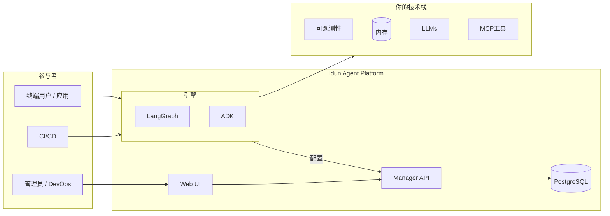

<p align="center">
  <a href="../../README.md">English</a> | <a href="README.fr.md">Français</a> | <a href="README.es.md">Español</a> | <strong>中文</strong> | <a href="README.ar.md">العربية</a>
</p>

<div align="center">

<picture>
  <source media="(prefers-color-scheme: dark)" srcset="../logo/light.svg">
  <source media="(prefers-color-scheme: light)" srcset="../logo/dark.svg">
  
</picture>

<br/>

### 将AI代理部署到生产环境所需的一切

<br/>

[](https://www.gnu.org/licenses/gpl-3.0.html)
[](https://github.com/Idun-Group/idun-agent-platform/actions/workflows/ci.yml)
[](https://pypi.org/project/idun-agent-engine/)
[](https://discord.gg/KCZ6nW2jQe)
[](https://github.com/Idun-Group/idun-agent-platform)
[](https://github.com/Idun-Group/idun-agent-platform)

<br/>

[云服务](https://cloud.idunplatform.com) · [快速开始](https://docs.idunplatform.com/quickstart) · [文档](https://docs.idunplatform.com) · [Discord](https://discord.gg/KCZ6nW2jQe) · [预约演示](https://calendar.app.google/RSzm7EM5VZY8xVnN9)

⭐ 如果觉得有用，请给仓库加星。这有助于更多人发现这个项目。

</div>

<br/>

<p align="center">Idun Agent Platform 是一个开源、自托管的控制平面，适用于 <b>LangGraph</b> 和 <b>Google ADK</b> 代理。注册你的代理，即可获得具备可观测性、安全护栏、内存持久化、MCP工具治理、提示词管理和SSO工作空间隔离的生产级服务。</p>

> **为什么选择 Idun？** 构建代理的团队面临一个两难选择：自建平台（缓慢、昂贵）或采用SaaS（锁定、无主权）。Idun 是第三条路：你保留自己的代理代码、数据和基础设施。平台负责生产层。

<p align="center">
  
</p>

---

## 快速开始

> **前提条件**：Docker 和 Git。

```bash
git clone https://github.com/Idun-Group/idun-agent-platform.git && cd idun-agent-platform
cp .env.example .env
docker compose -f docker-compose.dev.yml up --build
```

打开 [localhost:3000](http://localhost:3000)。创建账户。3次点击部署你的第一个代理。

> [!TIP]
> **不需要完整平台？** 无需Manager和数据库，直接运行独立代理：
> ```bash
> pip install idun-agent-engine && idun init
> ```
> 交互式TUI一次性配置框架、内存、可观测性、安全护栏和MCP。参见 [CLI文档](https://docs.idunplatform.com/cli/overview)。

---

## 功能概览

<table>
<tr>
<td width="50%" valign="top">

### 可观测性

Langfuse · Arize Phoenix · LangSmith · GCP Trace · GCP Logging

追踪每次代理运行。通过配置同时连接多个提供商。


</td>
<td width="50%" valign="top">

### 安全护栏

PII检测 · 有毒语言 · 禁止列表 · 主题限制 · 偏见检查 · NSFW · 另有9种

按代理在输入、输出或两者应用策略。由 Guardrails AI 提供支持。


</td>
</tr>
<tr>
<td width="50%" valign="top">

### MCP工具治理

注册MCP服务器并控制每个代理可以访问哪些工具。支持 stdio、SSE、可流式HTTP 和 WebSocket。


</td>
<td width="50%" valign="top">

### 内存与持久化

PostgreSQL · SQLite · 内存 · Vertex AI · ADK Database

对话在重启之间持久保存。按代理选择后端。


</td>
</tr>
<tr>
<td width="50%" valign="top">

### 提示词管理

带Jinja2变量的版本化模板。从UI或API将提示词分配给代理。


</td>
<td width="50%" valign="top">

### 消息集成

WhatsApp · Discord · Slack

双向：接收消息、调用代理、发送回复。Webhook验证已处理。


</td>
</tr>
</table>

> [!NOTE]
> **SSO与多租户** — 支持Google和Okta的OIDC，或用户名/密码。基于角色的工作空间（所有者、管理员、成员、查看者）。每个资源都限定在工作空间内。

> [!NOTE]
> **AG-UI流式传输** — 每个代理都获得基于标准的流式API，兼容CopilotKit客户端。内置聊天测试区。

<p align="center">
  
</p>

---

## 架构

| | |
|---|---|
| **Engine** | 将LangGraph/ADK代理封装为FastAPI服务，具备AG-UI流式传输、检查点、安全护栏、可观测性、MCP和SSO。通过YAML或Manager API配置。 |
| **Manager** | 控制平面。代理CRUD、资源管理、多租户工作空间。向引擎提供物化配置。 |
| **Web UI** | React 19管理仪表板。代理创建向导、资源配置、内置聊天、用户管理。 |



---

## 集成

<p align="center">
  
  
  
  
  
  
  
  
  
  
  
  
  
</p>

---

## Idun vs 替代方案

| | **Idun Platform** | **LangGraph Cloud** | **LangSmith** | **DIY (FastAPI + glue)** |
|---|:---:|:---:|:---:|:---:|
| 自托管 / 本地部署 | ✅ | ❌ | ❌ | ✅ |
| 多框架 (LangGraph + ADK) | ✅ | 仅LangGraph | ❌ (仅可观测性) | 手动 |
| 安全护栏 (PII, 毒性, 主题) | ✅ 15+内置 | ❌ | ❌ | 自行构建 |
| MCP工具治理 | ✅ 按代理 | ❌ | ❌ | 自行构建 |
| 多租户工作空间 + RBAC | ✅ | ❌ | ✅ | 自行构建 |
| SSO (OIDC, Okta, Google) | ✅ | ❌ | ✅ | 自行构建 |
| 可观测性 (Langfuse, Phoenix, LangSmith, GCP) | ✅ 多提供商 | ❌ 仅LangSmith | ✅ 仅LangSmith | 手动 |
| 内存 / 检查点 | ✅ Postgres, SQLite, 内存 | ✅ | ❌ | 自行构建 |
| 提示词管理 (版本化, Jinja2) | ✅ | ❌ | ✅ Hub | 自行构建 |
| 消息 (WhatsApp, Discord, Slack) | ✅ | ❌ | ❌ | 自行构建 |
| AG-UI / CopilotKit 流式传输 | ✅ | ✅ | ❌ | 手动 |
| 管理界面 | ✅ | ✅ | ✅ | ❌ |
| 供应商锁定 | **无** | 高 | 高 | 无 |
| 开源 | ✅ GPLv3 | ❌ | ❌ | — |
| 维护负担 | 低 | 低 | 低 | **高** |

> [!NOTE]
> Idun 不是 LangSmith（可观测性）或 LangGraph Cloud（托管）的替代品。它是代理代码与生产之间的层，处理治理、安全和运维，不论你选择哪种可观测性或托管方案。

---

## 配置

每个代理通过单个YAML文件配置。以下是启用所有功能的完整示例：

```yaml
server:
  api:
    port: 8001

agent:
  type: "LANGGRAPH"
  config:
    name: "Support Agent"
    graph_definition: "./agent.py:graph"
    checkpointer:
      type: "sqlite"
      db_url: "sqlite:///checkpoints.db"

observability:
  - provider: "LANGFUSE"
    enabled: true
    config:
      host: "https://cloud.langfuse.com"
      public_key: "${LANGFUSE_PUBLIC_KEY}"
      secret_key: "${LANGFUSE_SECRET_KEY}"

guardrails:
  input:
    - config_id: "DETECT_PII"
      on_fail: "reject"
      reject_message: "请求包含个人信息。"
  output:
    - config_id: "TOXIC_LANGUAGE"
      on_fail: "reject"

mcp_servers:
  - name: "time"
    transport: "stdio"
    command: "docker"
    args: ["run", "-i", "--rm", "mcp/time"]

prompts:
  - prompt_id: "system-prompt"
    version: 1
    content: "你是 {{ company_name }} 的支持代理。"
    tags: ["latest"]

sso:
  enabled: true
  issuer: "https://accounts.google.com"
  client_id: "123456789.apps.googleusercontent.com"
  allowed_domains: ["yourcompany.com"]

integrations:
  - provider: "WHATSAPP"
    enabled: true
    config:
      access_token: "${WHATSAPP_ACCESS_TOKEN}"
      phone_number_id: "${WHATSAPP_PHONE_ID}"
      verify_token: "${WHATSAPP_VERIFY_TOKEN}"
```

> [!TIP]
> 环境变量如 `${LANGFUSE_SECRET_KEY}` 在启动时解析。你可以使用 `.env` 文件或通过 Docker/Kubernetes 注入。

从文件启动：

```bash
pip install idun-agent-engine
idun agent serve --source file --path config.yaml
```

或从 Manager 获取配置：

```bash
export IDUN_AGENT_API_KEY=your-agent-api-key
export IDUN_MANAGER_HOST=https://manager.example.com
idun agent serve --source manager
```

> [!IMPORTANT]
> 完整配置参考：[docs.idunplatform.com/configuration](https://docs.idunplatform.com/configuration)
>
> 9个可运行的代理示例：[idun-agent-template](https://github.com/Idun-Group/idun-agent-template)

---

## 社区

| | |
|---|---|
| **问题与帮助** | [Discord](https://discord.gg/KCZ6nW2jQe) |
| **功能请求** | [GitHub Discussions](https://github.com/Idun-Group/idun-agent-platform/discussions) |
| **Bug报告** | [GitHub Issues](https://github.com/Idun-Group/idun-agent-platform/issues) |
| **贡献** | [CONTRIBUTING.md](../../CONTRIBUTING.md) |
| **路线图** | [ROADMAP.md](../../ROADMAP.md) |

## 商业支持

由 [Idun Group](https://idunplatform.com) 维护。我们协助平台架构、部署和IdP/合规集成。[预约通话](https://calendar.app.google/RSzm7EM5VZY8xVnN9) · contact@idun-group.com

## 遥测

通过 PostHog 收集最少的匿名使用指标。无PII。[查看源代码](../../libs/idun_agent_engine/src/idun_agent_engine/telemetry/telemetry.py)。退出：`IDUN_TELEMETRY_ENABLED=false`

## 许可证

[GPLv3](../../LICENSE)
