<p align="center">
  <a href="../../README.md">English</a> | <a href="README.fr.md">Français</a> | <a href="README.es.md">Español</a> | <strong>中文</strong> | <a href="README.ar.md">العربية</a>
</p>

> 已根据 v0.6 英文版更新。请在 [GitHub Issues](https://github.com/Idun-Group/idun-agent-platform/issues/new?labels=docs%2Ci18n) 反馈翻译问题。

<div align="center">

<picture>
  <source media="(prefers-color-scheme: dark)" srcset="../logo/light.svg" />
  <source media="(prefers-color-scheme: light)" srcset="../logo/dark.svg" />
  
</picture>

<br/>

### 将 LangGraph 和 ADK 智能体投入生产。

自托管。开源。无供应商锁定。

<br/>

[](https://www.gnu.org/licenses/gpl-3.0.html)
[](https://github.com/Idun-Group/idun-agent-platform/actions/workflows/ci.yml)
[](https://pypi.org/project/idun-agent-engine/)
[](https://discord.gg/KCZ6nW2jQe)
[](https://github.com/Idun-Group/idun-agent-platform)
[](https://github.com/Idun-Group/idun-agent-platform)

<br/>

[云服务](https://cloud.idunplatform.com) · [快速开始](https://docs.idunplatform.com/quickstart) · [文档](https://docs.idunplatform.com) · [Discord](https://discord.gg/KCZ6nW2jQe) · [预约演示](https://calendar.app.google/RSzm7EM5VZY8xVnN9)

⭐ 如果您觉得这个项目有用，请给仓库点个星。这有助于其他人发现该项目。

</div>

<br/>

<p align="center">Idun 是 <b>LangGraph</b> 和 <b>Google ADK</b> 智能体的开源生产封装层 — 聊天界面、追踪、护栏、记忆和 MCP，全部运行在您自己的基础设施上。<code>pip install idun-agent-engine</code>，您的智能体即作为一个 FastAPI 进程运行，内置聊天界面、管理面板、追踪、可观测性、护栏、记忆持久化、MCP 工具治理与提示词管理。</p>

> **为什么选择 Idun？** 构建智能体的团队面临一个权衡：自己搭建生产封装层（FastAPI + 追踪 + 护栏 + 管理界面 — 缓慢），或者采用 LangGraph Cloud、LangSmith 等 SaaS（牺牲主权）。Idun 是第三条路：通过 `pip install` 获得一个自给自足的 FastAPI 进程，将您的智能体与聊天界面、管理面板、追踪和护栏一同打包 — 全部开源，全部运行在您的基础设施上。

<p align="center">
  
</p>

---

## 快速开始

> **前提条件**：Python 3.12+ 和 pip。

```bash
pip install idun-agent-engine
idun init my-agent
cd my-agent && idun serve
```

打开 [http://localhost:8000](http://localhost:8000)。与您的智能体对话，然后访问管理面板 [/admin](http://localhost:8000/admin) 和追踪页面 [/admin/traces](http://localhost:8000/admin/traces)。

## Idun 包含什么

<table>
<tr>
<td width="50%" valign="top">

### 可观测性

Langfuse · Arize Phoenix · LangSmith · GCP Trace · GCP Logging

追踪每一次智能体运行。通过配置同时连接多个提供商。

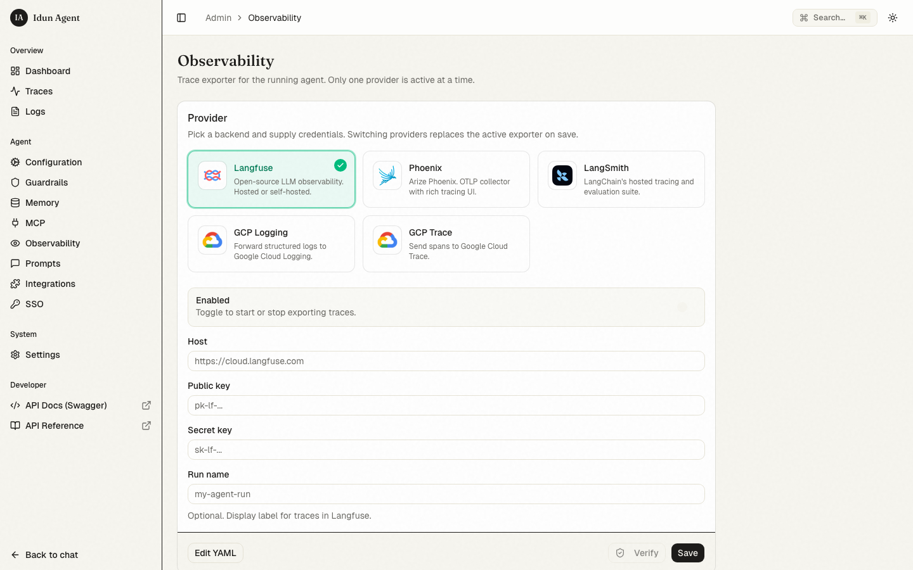

</td>
<td width="50%" valign="top">

### 护栏

PII 检测 · 有害语言 · 禁用列表 · 主题限制 · 偏见检查 · NSFW · 还有 9 项

针对每个智能体在输入、输出或两者上应用策略。由 Guardrails AI 驱动。

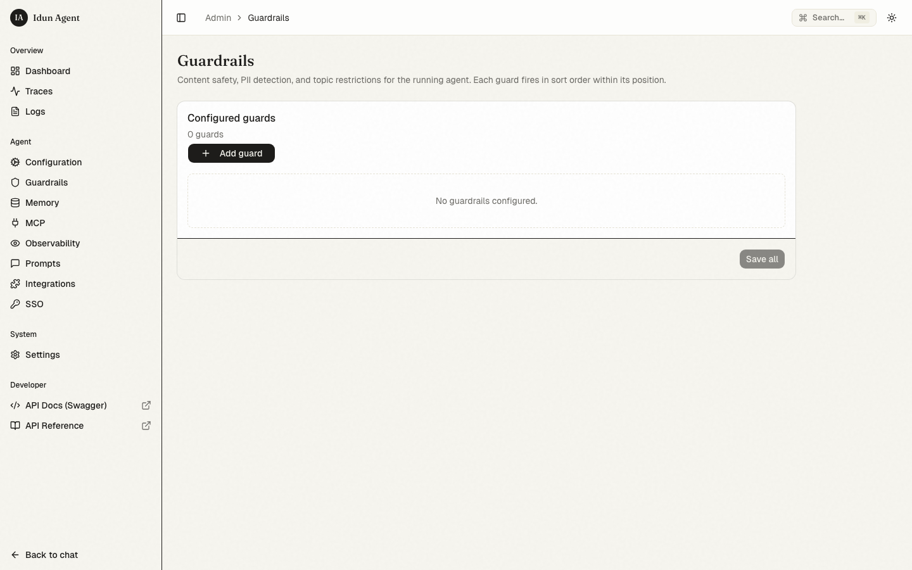

</td>
</tr>
<tr>
<td width="50%" valign="top">

### MCP 工具治理

注册 MCP 服务器并控制每个智能体可访问的工具。支持 stdio、SSE、流式 HTTP 和 WebSocket。

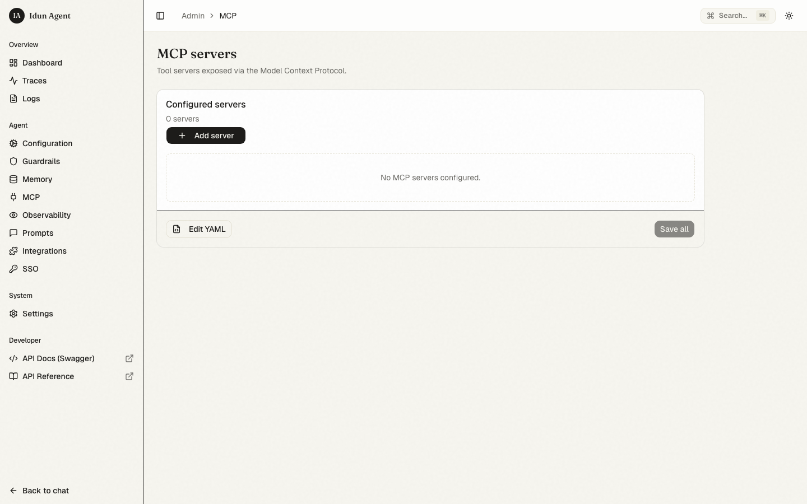

</td>
<td width="50%" valign="top">

### 记忆与持久化

PostgreSQL · SQLite · 内存 · Vertex AI · ADK Database

对话在重启后依然保留。可为每个智能体选择后端。

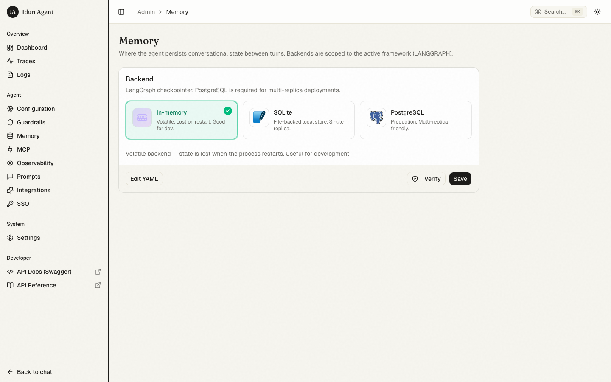

</td>
</tr>
<tr>
<td colspan="2" valign="top" align="center">

### 提示词管理

带 Jinja2 变量的版本化模板。从界面或 API 为智能体分配提示词。

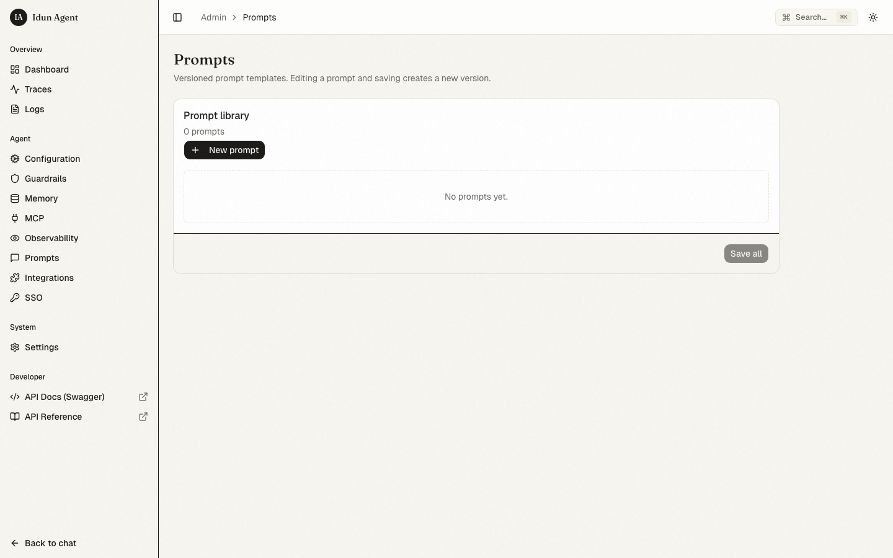

</td>
</tr>
</table>

> [!NOTE]
> **AG-UI 流式传输** — 每个智能体都拥有基于标准的流式 API，与 CopilotKit 客户端兼容。内置聊天测试场用于测试。

<p align="center">
  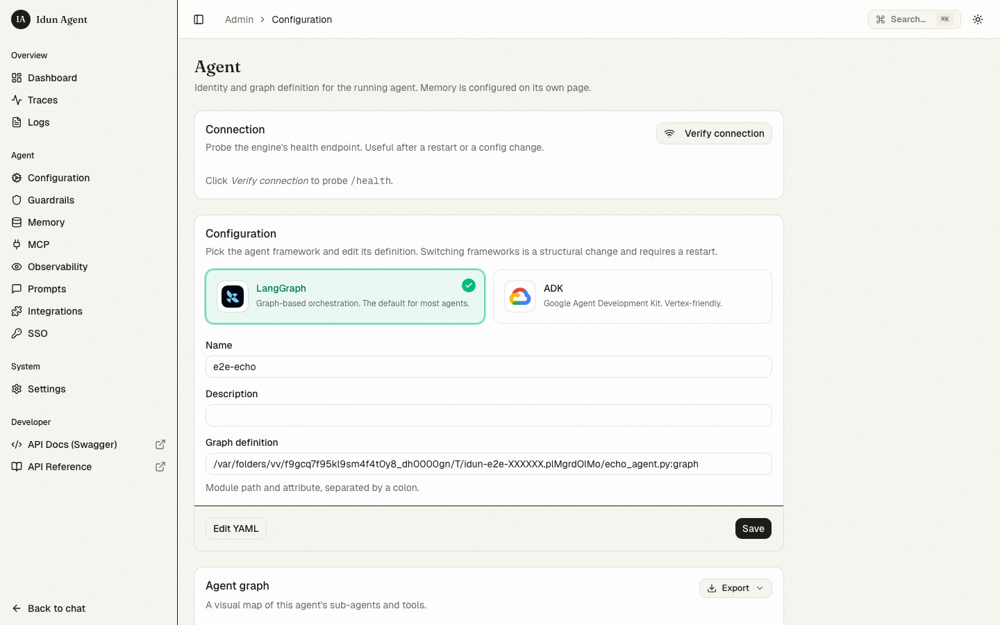
</p>

---

## 架构

Idun 以单一进程的形式发布：**`idun-agent-standalone`**。它打包了引擎 SDK、Next.js 聊天界面、管理面板和追踪查看器 — 您的智能体在该进程内运行，从 YAML 文件读取配置，并可通过管理 REST 接口在线热重载。

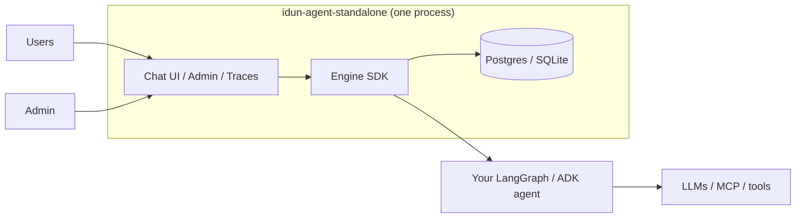
```mermaid
flowchart LR
  subgraph Idun["idun-agent-standalone (one process)"]
    direction TB
    UI["Chat UI / Admin / Traces"] --> ENG["Engine SDK"]
    ENG --> DB[(Postgres / SQLite)]
  end
  Users --> UI
  Admin --> UI
  ENG --> Agent["Your LangGraph / ADK agent"]
  Agent --> LLM["LLMs / MCP / tools"]
```

---

## 集成

<p align="center">
  
  
  
  
  
  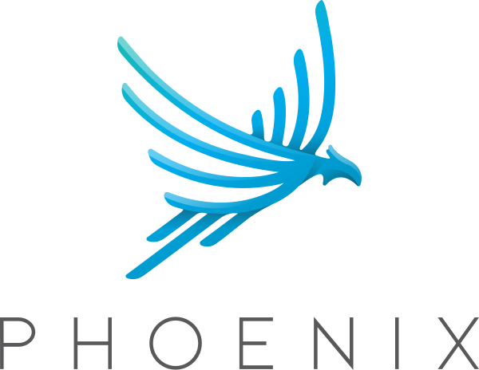
  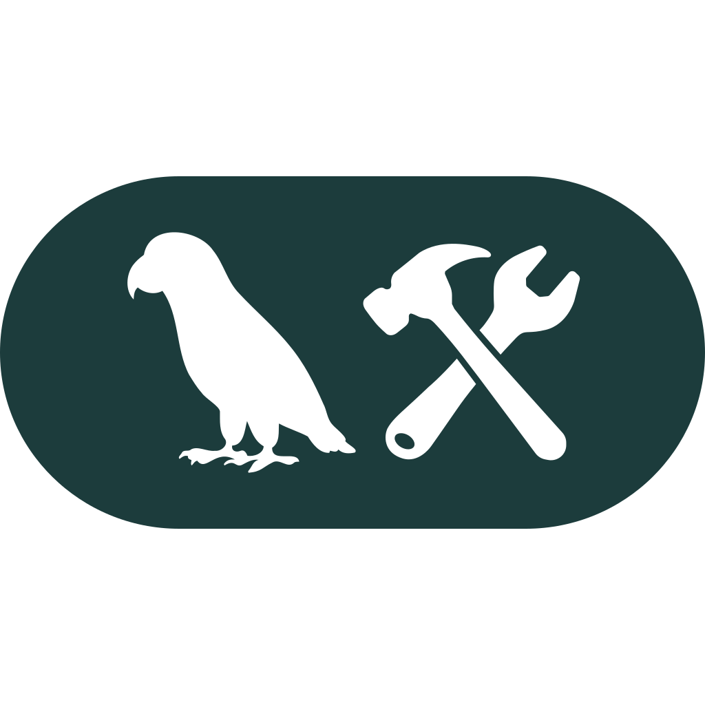
  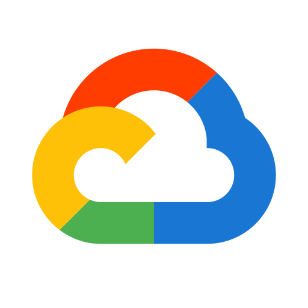
  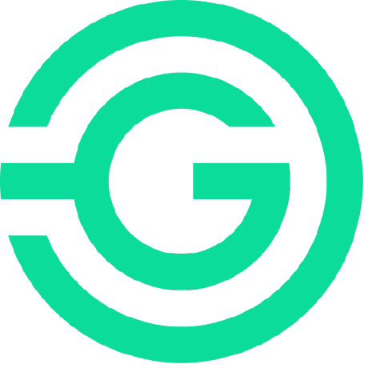
  
  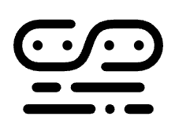
  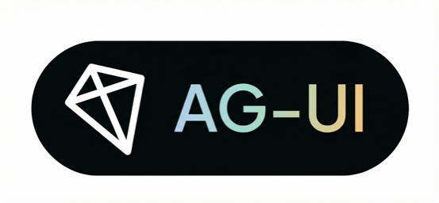
</p>

> [!NOTE]
> **框架支持** — LangGraph 和 Google ADK 目前是一等公民，引擎中提供完整适配器。LangChain 通过 LangGraph 适配器获得支持；更广泛的原生 LangChain 兼容性在[路线图](https://docs.idunplatform.com/roadmap)中。

---

## Idun 与替代方案对比

| | **Idun Platform** | **LangGraph Cloud** | **LangSmith** | **DIY (FastAPI + glue)** |
|---|:---:|:---:|:---:|:---:|
| 自托管 / 本地部署 | ✅ | ❌ | ❌ | ✅ |
| 多框架 (LangGraph + ADK) | ✅ | LangGraph only | ❌ obs only | Manual |
| 护栏 (15+ 内置) | ✅ | ❌ | ❌ | Build yourself |
| MCP 工具治理 | ✅ per-agent | ❌ | ❌ | Build yourself |
| 可观测性 (多提供商) | ✅ Langfuse, Phoenix, LangSmith, GCP | ❌ LangSmith only | ✅ LangSmith only | Manual |
| 记忆 / 检查点 | ✅ Postgres, SQLite, in-memory | ✅ | ❌ | Build yourself |
| AG-UI / CopilotKit 流式 | ✅ | ✅ | ❌ | Manual |
| 开源 (GPLv3) | ✅ | ❌ | ❌ | — |

> [!NOTE]
> Idun 不是 LangSmith（可观测性）或 LangGraph Cloud（托管）的替代品。它是位于您的智能体代码与生产环境之间的层，负责治理、安全与运维 — 无论您选择哪种可观测性或托管方案。

---

## 配置

每个智能体通过一个 YAML 文件进行配置。下面是一个启用所有功能的完整示例：

```yaml
server:
  api:
    port: 8001

agent:
  type: "LANGGRAPH"
  config:
    name: "Support Agent"
    graph_definition: "./agent.py:graph"
    checkpointer:
      type: "sqlite"
      db_url: "sqlite:///checkpoints.db"

observability:
  - provider: "LANGFUSE"
    enabled: true
    config:
      host: "https://cloud.langfuse.com"
      public_key: "${LANGFUSE_PUBLIC_KEY}"
      secret_key: "${LANGFUSE_SECRET_KEY}"

guardrails:
  input:
    - config_id: "DETECT_PII"
      on_fail: "reject"
      reject_message: "Request contains personal information."
  output:
    - config_id: "TOXIC_LANGUAGE"
      on_fail: "reject"

mcp_servers:
  - name: "time"
    transport: "stdio"
    command: "docker"
    args: ["run", "-i", "--rm", "mcp/time"]

prompts:
  - prompt_id: "system-prompt"
    version: 1
    content: "You are a support agent for {{ company_name }}."
    tags: ["latest"]
```

> [!TIP]
> 像 `${LANGFUSE_SECRET_KEY}` 这样的环境变量在启动时被解析。您可以使用 `.env` 文件或通过 Docker/Kubernetes 注入。

从文件启动服务：

```bash
pip install idun-agent-engine
idun agent serve --source file --path config.yaml
```

> [!IMPORTANT]
> 完整配置参考：[docs.idunplatform.com/configuration](https://docs.idunplatform.com/configuration)
>
> 9 个可运行的智能体示例：[idun-agent-template](https://github.com/Idun-Group/idun-agent-template)

---

## 社区

| | |
|---|---|
| **问答与帮助** | [Discord](https://discord.gg/KCZ6nW2jQe) |
| **功能请求** | [GitHub Discussions](https://github.com/Idun-Group/idun-agent-platform/discussions) |
| **缺陷报告** | [GitHub Issues](https://github.com/Idun-Group/idun-agent-platform/issues) |
| **贡献指南** | [CONTRIBUTING.md](../../CONTRIBUTING.md) |
| **路线图** | [ROADMAP.md](../../ROADMAP.md) |

## 商业支持

由 [Idun Group](https://idunplatform.com) 维护。我们提供平台架构、部署以及 IdP/合规集成方面的支持。[预约通话](https://calendar.app.google/RSzm7EM5VZY8xVnN9) · contact@idun-group.com

## 遥测

通过 PostHog 收集最少量、匿名的使用指标 + 已脱敏的会话回放。不收集消息内容，登录后除电子邮件外不收集任何 PII（设置 `IDUN_TELEMETRY_IDENTIFY_USERS=false` 可禁用）。[查看源代码](https://github.com/Idun-Group/idun-agent-platform/blob/develop/libs/idun_agent_engine/src/idun_agent_engine/telemetry/telemetry.py)。关闭：`IDUN_TELEMETRY_ENABLED=false`。仅关闭会话回放：`IDUN_TELEMETRY_SESSION_REPLAY=false`。

## 许可证

[GPLv3](../../LICENSE)
