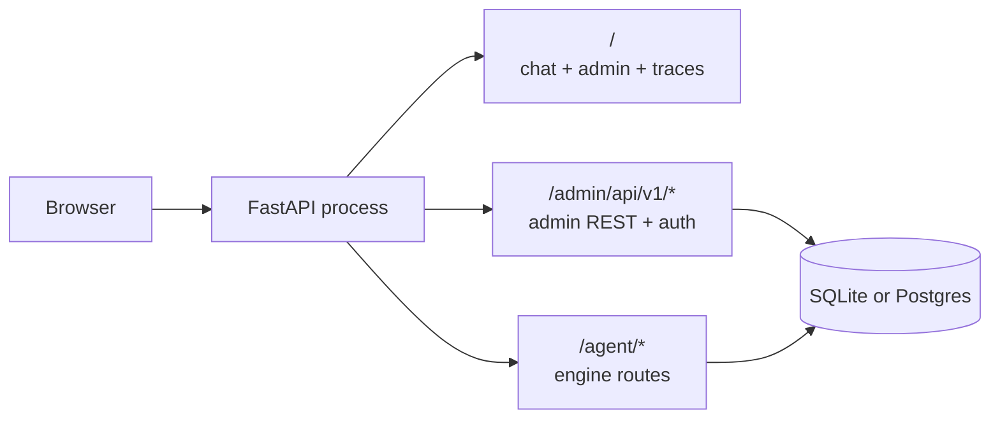

**Idun Agent Standalone** packages one agent into a single FastAPI process — chat UI, admin panel, traces viewer, and a local DB included. Deploy on Google Cloud Run, a VM, or your laptop.

## What you get

- **Chat UI** at `/`, themeable, AG-UI streaming, three layout variants (branded / minimal / inspector).
- **Admin panel** at `/admin/`, edit agent config, guardrails, MCP servers, prompts, observability, integrations, and theme. Hot-reload of the running agent on save.
- **Dashboard** at `/admin/`, live activity stats sourced from the local trace store: request count, p50/p95 latency, error rate, total cost, traffic sparkline, top errors.
- **First-party traces** at `/admin/traces/`, every AG-UI run event captured locally; debug an agent without external observability.
- **Single Docker image**, single Python process. SQLite by default; Postgres for production.

## When to use it

- You ship ONE agent and don't need the governance hub.
- You want to iterate on an agent locally with the full Idun stack — not just the engine SDK.
- You want a branded chat UI without writing a frontend.

## When NOT to use it

- You have your own admin stack and only want the runtime layer. Use [engine-only mode](/cli/overview) with `idun agent serve --source file --path config.yaml` instead.
- You're running multiple agents per host. Standalone is single-agent, single-tenant; run one process per agent.

## Architecture in 60 seconds

The standalone wraps `idun-agent-engine` in a single FastAPI process. The engine still runs the agent and serves `/agent/run`. The standalone adds the chat UI, the admin REST surface, the trace store, password auth, and a hot-reload pipeline that rebuilds the engine on every admin write.

Spans flow into `standalone_trace` + `standalone_span` tables via an OTel exporter the standalone attaches at boot, and the admin UI reads them back through the same REST surface.

## Dashboard

The admin panel opens on a dashboard sourced from the trace store. It refreshes every time you reload and gives you a single-pane view of whether the agent is healthy.

<Frame></Frame>

Default panels:

- **Activity (24h / 7d / 30d toggle)**: total requests, p50/p95 latency, error rate, total cost across the window.
- **Requests / min**: a sparkline of traffic over the window. Spikes here pair with spikes in the latency chart so you can spot saturation.
- **Latency p50 / p95**: two-line chart over the window.
- **Top errors**: a leaderboard of failing span names with a count, last-seen timestamp, and a one-click link into the offending trace.

All of it reads from `standalone_trace` + `standalone_span` directly. No external observability provider needed.

## Next steps

<Card title="Quickstart" icon="rocket" horizontal href="/standalone/quickstart">
  Get the standalone running locally with your first agent.
</Card>

<Card title="CLI reference" icon="terminal" horizontal href="/standalone/cli">
  Every flag of `idun serve` and the supporting commands.
</Card>

<Card title="Cloud Run deployment" icon="cloud" horizontal href="/standalone/cloud-run">
  Deploy the standalone to Google Cloud Run.
</Card>

<Card title="Customizing the UI" icon="layers" horizontal href="/standalone/customizing-ui">
  Theme the chat UI and pick a layout variant.
</Card>
