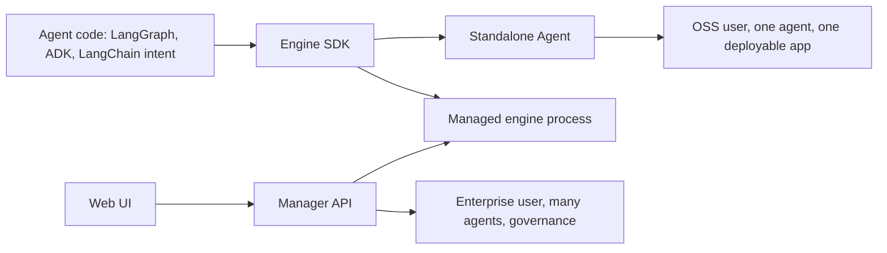

# Standalone, Engine, and Manager Positioning

Date: 2026-04-26

Scope:

- Clarify the product relationship between `idun_agent_engine`, `idun-agent-standalone`, `idun_agent_manager`, and `idun_agent_web`.
- Align the new direction with open-source community needs and enterprise governance needs.
- Propose packaging, naming, docs, and roadmap recommendations.

## Recommended positioning

Idun should be explained as one platform with three layers:

1. **Engine SDK**: the runtime toolkit that turns agent code into a production HTTP service.
2. **Standalone Agent**: the single-agent open-source product that packages one engine, one UI, one admin surface, and local traces.
3. **Manager/Web Governance Hub**: the enterprise control plane for teams governing many agents, users, workspaces, and shared resources.

The shortest narrative:

> Bring your agent code. Idun wraps it into a production service you control, from one local agent to a governed fleet.

This makes Idun complementary to LangGraph, LangChain, and Google ADK. Idun should not try to be "another agent framework." The strongest wedge is the production layer around agents developers already built.

## Product architecture



## Layer definitions

### Engine SDK

Working name: **Idun Engine SDK**

Package: `idun-agent-engine`

Public category: agent runtime SDK.

Primary user:

- Developer who already has agent code.
- Platform engineer who wants FastAPI, AG-UI streaming, config validation, memory, guardrails, MCP, observability, and reload semantics without adopting the full manager.

Primary promise:

- "Turn a LangGraph or ADK agent into a production-shaped HTTP service."

Current strengths:

- FastAPI service wrapper.
- `/agent/run` AG-UI streaming.
- Config schema through `idun_agent_schema`.
- LangGraph and ADK support.
- Memory/checkpoint configuration.
- Observability provider hooks.
- Guardrails.
- MCP server configuration.
- Run-event observers.
- Manager-compatible config source.

Current caution:

- Public language should say LangGraph and ADK are first-class today.
- LangChain should be described as a target ecosystem and foundation, not overclaimed as a fully first-class adapter unless code and tests support that exact claim.

### Standalone Agent

Working name: **Idun Standalone Agent**

Package: `idun-agent-standalone`

Public category: self-hosted single-agent app.

Primary user:

- Open-source evaluator.
- Indie developer.
- Team prototyping one internal agent.
- SaaS builder embedding one support or workflow agent.
- Platform engineer deploying one agent to Cloud Run, a VM, or a small container service.

Primary promise:

- "Run one production-ready agent with chat, admin, traces, and deployment in minutes."

What it includes:

- One FastAPI process.
- One engine.
- One bundled Next.js UI.
- One admin REST surface.
- One traces database.
- SQLite by default, Postgres for production.
- `none` or password admin auth.
- Hot reload where safe.

What it should not promise:

- Multi-agent governance.
- Workspace RBAC.
- Enterprise OIDC in MVP-1.
- Fleet metrics.
- Centralized prompt/resource catalogs across many agents.

Why this should be the default OSS path:

- It has the shortest path from install to value.
- It avoids forcing users to understand manager, web UI, Postgres, workspaces, and separate engines before they trust the platform.
- It demonstrates the full product loop: chat, edit config, reload, inspect trace, deploy.

### Manager/Web Governance Hub

Working name: **Idun Manager** or **Idun Governance Hub**

Packages/services:

- `idun_agent_manager`
- `idun_agent_web`

Public category: enterprise control plane.

Primary user:

- Platform team.
- AI governance team.
- Enterprise engineering team with multiple agents, teams, environments, and compliance requirements.

Primary promise:

- "Govern a fleet of Idun agents with shared resources, workspaces, users, and materialized configs."

What it owns:

- Workspaces and membership.
- Users and roles.
- Many agents per workspace.
- Resource catalogs for guardrails, prompts, MCP, observability, memory, SSO, and integrations.
- Agent-to-resource relationships.
- Materialized `EngineConfig` JSONB snapshots.
- API-key based config fetch for deployed engines.
- Enterprise onboarding and governance workflows.

What it should not be:

- The default first experience for an OSS developer trying Idun.
- A required dependency for every agent deployment.
- A replacement for the standalone product.

## Deployment profiles

### Profile 1: Engine file mode

Command:

```bash
idun agent serve --source file --path config.yaml
```

Positioning:

- Code-first engine runtime.
- No bundled UI.
- Best for developers who want to bring their own frontend, deployment, traces, and admin flow.

Public wording:

- "Engine file mode", not "standalone."

### Profile 2: Standalone Agent

Command:

```bash
idun-standalone init my-agent
cd my-agent
idun-standalone serve
```

Positioning:

- Single-agent open-source product.
- Bundled chat/admin/traces UI.
- Local DB.
- Deployable to Cloud Run or similar.

Public wording:

- "Standalone Agent."

### Profile 3: Managed mode

Command:

```bash
export IDUN_AGENT_API_KEY=...
export IDUN_MANAGER_HOST=https://manager.example.com
idun agent serve --source manager
```

Positioning:

- Engine process fetches its materialized config from Manager.
- Best for teams with many agents and shared governance.

Public wording:

- "Managed mode."

## Recommended website/docs IA

### Top-level product pages

1. `/quickstart`
   - Default tab: Standalone Agent.
   - Secondary: Engine file mode.
   - Tertiary: Manager for teams.
2. `/standalone/overview`
   - Single-agent app.
   - Cloud Run path.
   - No-LLM echo demo.
   - Real LangGraph demo.
3. `/engine/overview`
   - Runtime SDK.
   - Framework adapters.
   - Config and deployment primitives.
4. `/manager/overview`
   - Governance hub.
   - Multi-agent control plane.
   - Workspaces, users, shared resources.
5. `/compare`
   - Honest comparison with LangSmith Deployment, Dify, Google Agent Engine, and DIY.

### Glossary

Add a glossary with these exact concepts:

- **Engine SDK**: Python runtime package that serves an agent over HTTP.
- **Engine file mode**: engine reads config from YAML/file.
- **Standalone Agent**: packaged one-agent app with chat/admin/traces.
- **Manager**: FastAPI control plane for many agents and workspaces.
- **Web UI**: React enterprise admin dashboard for the Manager.
- **Managed mode**: engine reads config from Manager API.
- **Materialized config**: `EngineConfig` JSON computed from relational manager resources.
- **Local traces**: standalone AG-UI event capture stored in its own DB.

## Open-source community needs

The open-source entry point should optimize for trust in the first 10 minutes.

Minimum community checklist:

- A no-LLM demo runs without paid API keys.
- `pip install idun-agent-standalone` works.
- Docker works.
- Cloud Run docs are concrete.
- One chat message visibly returns an assistant response.
- One trace visibly appears.
- One admin edit visibly reloads or clearly says restart required.
- Auth/security defaults are explicit.
- Telemetry opt-out is visible.
- Tests and CI are visible.
- Changelog and release notes are present.
- Contribution guide covers standalone UI, wheel, and E2E workflows.
- Roadmap separates built, beta, and planned features.
- License and commercial support story are clear.

## Competitive context

### LangSmith Deployment / LangGraph Platform

Current external positioning:

- LangSmith Deployment is the production deployment product for agents.
- It offers managed cloud, hybrid, and self-hosted enterprise options.
- It is tightly integrated with LangGraph and LangSmith.

How Idun should differentiate:

- Open-source and self-hosted by default.
- Multi-framework direction: LangGraph and ADK today, LangChain ecosystem intent.
- Governance layer that can sit next to existing observability and hosting choices.
- Standalone one-agent app for users who do not want to start with enterprise infrastructure.

Avoid:

- Saying LangGraph/LangSmith has no self-hosted or hybrid story.
- Saying LangSmith is only observability.
- Claiming "no vendor lock-in" without explaining GPL/commercial licensing and data portability.

### Dify

Current external positioning:

- Open-source LLM app and agentic workflow platform.
- Strong low-code/visual builder story.
- Self-hosted community edition plus managed cloud.
- Broad LLMOps/RAG/app lifecycle framing.

How Idun should differentiate:

- Code-first runtime for agents developers already wrote.
- Production wrapper rather than low-code app builder.
- Stronger fit for LangGraph/ADK users who want to keep code ownership.
- Standalone deployable agent appliance plus enterprise manager upgrade path.

Avoid:

- Competing head-on as a visual app builder unless that product actually exists.

### Google ADK and Vertex AI Agent Engine

Current external positioning:

- ADK is open-source, code-first, and model/deployment agnostic.
- Vertex AI Agent Engine is Google's managed runtime and lifecycle layer.
- Agent Engine emphasizes scaling, sessions, memory, evaluation, observability, and governance in Google Cloud.

How Idun should differentiate:

- Idun is the self-hosted, cloud-portable production layer for ADK and LangGraph agents.
- Standalone can deploy to Cloud Run without adopting Vertex AI Agent Engine.
- Manager can provide governance outside the Google-only control plane.

Avoid:

- Presenting ADK as only a framework without acknowledging Google's managed runtime story.

## Recommended packaging

### Keep packages explicit

- `idun-agent-engine`: engine SDK.
- `idun-agent-standalone`: single-agent app.
- `idun-agent-schema`: shared contracts.

### Rename service labels in docs

- `idun_agent_manager`: Manager API.
- `idun_agent_web`: Manager Web UI.
- `services/idun_agent_standalone_ui`: Standalone UI bundle.

### Avoid future naming conflict

Do not use "Idun Agent UI" generically unless it is clear which UI:

- Standalone UI
- Manager Web UI

There is no `idun_agent_ui` package in the repo today.

## Product recommendations

### Recommendation 1: make standalone the public default

Current public posture still leads with manager/control plane. That is the right enterprise story, but not the right open-source first impression.

Change:

- README hero: mention "from one self-hosted agent to governed fleets."
- Quickstart default: `idun-agent-standalone`.
- Manager docs: "when you outgrow one agent."

### Recommendation 2: define the upgrade path

Users need to know how standalone relates to manager.

Proposed upgrade story:

1. Start with Standalone Agent for one deployable service.
2. Export config from standalone.
3. Import/enroll into Manager.
4. Run engine in managed mode.
5. Attach shared resources and team governance.

Some of this may not be implemented yet. If not, mark as roadmap and avoid implying it is shipped.

### Recommendation 3: separate local traces from observability

Standalone traces are a local debugging and operator tool. They are not a replacement for Langfuse, Phoenix, LangSmith, or GCP Trace.

Suggested wording:

- "Local traces help you debug one standalone agent without external services."
- "For production observability, connect Langfuse, Phoenix, LangSmith, or cloud tracing through the engine config."

### Recommendation 4: make enterprise build health a governance milestone

The manager/web stack has strong architecture, but the web build currently fails. Before presenting it as the enterprise-ready product surface, run a hardening pass.

Recommended gate:

- `uv run pytest services/idun_agent_manager/tests/unit -q`
- Manager integration tests with Postgres.
- `cd services/idun_agent_web && npm run build`
- Targeted Vitest suite.
- One manager-web E2E create/enroll/configure flow.

### Recommendation 5: state GPL/commercial posture plainly

GPLv3 is acceptable if intentional, but enterprise buyers and platform teams will ask about embedding, distribution, and commercial licensing.

Add:

- License FAQ.
- Commercial support note.
- What GPL means for self-hosting and modifications.
- How enterprise/commercial terms work.

## Suggested product copy

### One-line

Idun turns LangGraph and ADK agents into production services you can self-host, from one standalone agent to a governed fleet.

### Short homepage section

Start with one agent. Install `idun-agent-standalone`, scaffold an app, chat with it, edit config, inspect traces, and deploy it to Cloud Run or your own container platform.

When your team needs shared prompts, guardrails, MCP servers, workspaces, users, and fleet governance, connect engines to the Idun Manager and manage them centrally.

### Developer-focused

You keep your agent code. Idun adds the production layer around it: AG-UI streaming, config validation, memory, guardrails, MCP tooling, observability hooks, local traces, and deployment-friendly APIs.

### Enterprise-focused

The Manager gives platform teams one place to govern agents, users, workspaces, prompts, guardrails, tools, observability, and materialized runtime config.

## Roadmap framing

### Built now

- Engine SDK for LangGraph and ADK.
- Standalone single-agent app.
- Chat/admin/traces UI.
- SQLite/Postgres persistence.
- Password auth for standalone.
- Manager API with workspaces and shared resources.
- Manager Web UI, but build health needs hardening.

### Near term

- Trace ordering fix.
- Standalone docs and quickstart realignment.
- Password-mode E2E.
- Real logs or hidden logs page.
- Enterprise web type-hardening.
- Standalone-to-manager migration/import story.

### Later

- OIDC for standalone.
- Stronger LangChain first-class adapter story.
- Fleet-level traces/metrics aggregation.
- Policy packs and governance workflows.
- Managed cloud offering if desired.

## Final recommendation

Use the standalone as the open-source wedge and the manager/web as the enterprise expansion layer. This is a clearer and more credible product than the previous manager-first posture.

The product should not ask OSS users to understand fleet governance before they have seen one agent work. Let them run one agent, trust the runtime, inspect a trace, and deploy it. Then show why teams need the Manager when they have many agents, many people, and shared operational risk.
