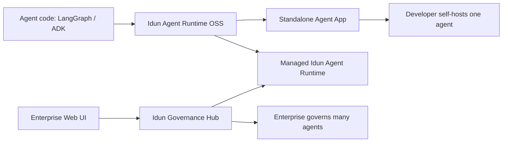

# Idun OSS Runtime and Governance Hub Strategy

Date: 2026-04-27

Scope:

- Consolidate the standalone branch review, UI gap analysis, product positioning, repo organization, and standalone-to-manager enrollment model.
- Clarify the recommended split between the open-source product and the enterprise governance product.
- Propose a repo organization aligned with open-source developer expectations.
- Define how standalone local config/DB should relate to manager-owned config after enrollment.
- No implementation, config, workflow, package, or test files are changed by this document.

## Executive summary

Idun should be positioned as one clear open-source product first:

> Idun Agent Runtime is the open-source runtime for production-ready LangGraph and ADK agents. It packages an agent API, chat UI, admin UI, local traces, config, reload, memory, MCP, guardrails, observability hooks, and deployment primitives.

The existing `idun_agent_manager` and `idun_agent_web` should become the enterprise product:

> Idun Governance Hub is the enterprise control plane for managing many Idun agents across workspaces, users, RBAC, shared resources, SSO, policy, and materialized runtime config.

This gives the project a clean adoption path:

1. A developer starts with one agent and the OSS runtime.
2. The agent runs standalone, with local config and local traces.
3. When the team has many agents or needs governance, the standalone agent can be imported/enrolled into Governance Hub.
4. After enrollment, the manager becomes source of truth for governed config, while the standalone runtime continues to execute the agent.

The most important product rule:

> Do not make OSS users understand fleet governance before they have seen one agent work.

## Recommended product model



## Product boundaries

### OSS: Idun Agent Runtime

Primary audience:

- Developers who already have LangGraph or ADK agent code.
- Open-source evaluators who want a fast proof path.
- Small teams shipping one self-hosted agent.
- SaaS teams embedding one support/workflow agent.
- Platform engineers deploying a single agent to Cloud Run, a VM, or a container service.

Primary promise:

- "Turn one LangGraph or ADK agent into a production-ready service with API, chat, admin, traces, and deployment."

Included in OSS:

- `idun_agent_schema`
- `idun_agent_engine`
- `idun_agent_standalone`
- `idun_agent_standalone_ui`
- no-LLM echo demo
- LangGraph examples
- ADK examples
- Docker and Cloud Run examples
- standalone E2E tests
- wheel install smoke
- docs, contribution guide, security policy, roadmap, and release notes

Not part of the OSS product promise:

- multi-workspace governance
- many-agent fleet management
- RBAC
- organization membership
- enterprise SSO as an MVP-1 standalone feature
- centralized policy and audit across agents

### Enterprise: Idun Governance Hub

Primary audience:

- AI platform teams.
- Enterprise engineering teams.
- Governance/security teams.
- Organizations managing many agents, many users, and shared operational risk.

Primary promise:

- "Govern a fleet of Idun agents with shared resources, users, workspaces, RBAC, SSO, policy, and centralized config."

Included in enterprise:

- `idun_agent_manager`
- `idun_agent_web`
- workspace model
- user/member model
- RBAC
- shared resource catalogs
- agent enrollment
- materialized `EngineConfig`
- central API keys
- enterprise SSO
- fleet dashboards
- governance workflows
- optional upstream traces/heartbeats later

## Naming and terminology

Use these public terms consistently.

| Term | Meaning |
| --- | --- |
| Idun Agent Runtime | The OSS product: engine + standalone app + integrated UI for one agent |
| Engine SDK | Core Python runtime package that serves an agent over HTTP |
| Standalone Agent | One deployed agent app with API, chat, admin, traces, and local DB |
| Engine file mode | `idun agent serve --source file --path config.yaml`; engine-only without bundled UI |
| Managed mode | Runtime fetches config from Governance Hub |
| Governance Hub | Enterprise manager + web UI for many agents |
| Local traces | Standalone AG-UI event capture stored locally |
| Materialized config | `EngineConfig` computed from manager relational resources |

Avoid using "standalone" to mean multiple things. In docs:

- "Engine file mode" means YAML/file-driven engine only.
- "Standalone Agent" means `idun-agent-standalone` with bundled UI and local DB.
- "Managed mode" means an agent runtime enrolled into Governance Hub.

## Recommended repo organization

### Best long-term option: split OSS and enterprise repos

Recommended OSS repo:

```text
idun-agent-runtime/
  packages/
    schema/
    engine/
  apps/
    standalone/
    standalone-ui/
  examples/
    no-llm-echo/
    langgraph/
    adk/
  templates/
  docs/
  docker/
  scripts/
  .github/
  README.md
  CONTRIBUTING.md
  SECURITY.md
  CODE_OF_CONDUCT.md
  ROADMAP.md
  LICENSE
```

Recommended enterprise repo:

```text
idun-governance-hub/
  services/
    manager/
    web/
  packages/
    enterprise-schemas/
  docs/
  deploy/
  .github/
  README.md
```

Why split:

- OSS users see one simple product.
- Enterprise code does not confuse first-time contributors.
- CI can focus on the OSS release path.
- Governance Hub can move on a separate commercial/release cadence.
- The public README does not need to explain every enterprise surface before the user runs one agent.

### Transitional option: keep one repo but separate clearly

If splitting repos is too much now, reorganize inside the monorepo:

```text
oss/
  packages/
    schema/
    engine/
  apps/
    standalone/
    standalone-ui/
  examples/
  docs/
  scripts/

enterprise/
  services/
    manager/
    web/
  docs/

shared/
  tooling/
```

This is less clean than a repo split, but better than the current shape because OSS and enterprise concerns are visible at the top level.

### Current-to-target mapping

| Current path | Target role |
| --- | --- |
| `libs/idun_agent_schema` | OSS `packages/schema` |
| `libs/idun_agent_engine` | OSS `packages/engine` |
| `libs/idun_agent_standalone` | OSS `apps/standalone` |
| `services/idun_agent_standalone_ui` | OSS `apps/standalone-ui` |
| `services/idun_agent_manager` | Enterprise `services/manager` |
| `services/idun_agent_web` | Enterprise `services/web` |
| `docs/standalone/*` | OSS docs |
| `docs/manager/*` | Enterprise docs |
| `docs/superpowers/*` | Internal planning/review docs |

## OSS best-practice checklist

The OSS repo should optimize for trust in the first 10 minutes.

Required:

- one clear README focused on the OSS runtime
- no-LLM quickstart
- `pip install idun-agent-standalone`
- Docker quickstart
- Cloud Run quickstart
- runnable LangGraph example
- runnable ADK example
- test matrix visible in CI
- wheel install smoke visible in CI
- `CONTRIBUTING.md`
- `SECURITY.md`
- `CODE_OF_CONDUCT.md`
- `ROADMAP.md`
- changelog/release notes
- telemetry opt-out documentation
- license/commercial FAQ
- issue templates
- good-first-issue labels

Public README should lead with:

1. What problem it solves.
2. How to run one agent.
3. How to inspect traces.
4. How to edit config/admin settings.
5. How to deploy.
6. When to use Governance Hub.

It should not lead with:

- workspaces
- RBAC
- enterprise users
- full control plane architecture
- many-agent governance

## Runtime architecture after reorganization

The OSS runtime should have three deployable profiles.

### Profile 1: Engine file mode

For developers who want only the runtime API:

```bash
idun agent serve --source file --path config.yaml
```

Characteristics:

- no bundled UI
- config from YAML/file
- user brings deployment/UI/admin
- useful for advanced users and integration tests

### Profile 2: Standalone Agent

For OSS users and single-agent deployments:

```bash
idun-standalone init my-agent
cd my-agent
idun-standalone serve
```

Characteristics:

- one FastAPI process
- one engine
- one bundled UI
- local DB
- local traces
- local admin
- SQLite by default, Postgres for production
- deployable to Cloud Run, VM, Docker, or Kubernetes

### Profile 3: Managed mode

For enterprise governance:

```bash
export IDUN_AGENT_API_KEY=...
export IDUN_MANAGER_HOST=https://manager.example.com
idun agent serve --source manager
```

Characteristics:

- runtime fetches materialized config from Governance Hub
- manager owns governed config
- runtime executes the agent
- local cache and local traces remain possible

## Standalone DB and manager DB responsibilities

Standalone and manager should not share the same database model. They should share contracts.

### Standalone DB owns local operation

Standalone DB is the source of truth before enrollment.

It owns:

- singleton agent config
- prompts
- MCP servers
- guardrails
- memory/checkpointer config
- observability config
- integrations
- theme/runtime UI config
- trace sessions and trace events
- local admin auth/session state
- bootstrap metadata
- cached manager enrollment metadata later

Its job:

- make one agent self-sufficient
- support local admin edits
- support hot reload/restart-required behavior
- support local debugging and traces

### Manager DB owns fleet governance

Manager DB is the source of truth after enrollment into Governance Hub.

It owns:

- workspaces
- users
- roles/RBAC
- many agents
- resource catalogs
- agent-to-resource associations
- materialized `EngineConfig`
- API keys
- enrollment tokens
- governance policies
- enterprise SSO
- audit/fleet records

Its job:

- manage many agents
- share resources across agents
- govern who can change what
- distribute runtime config to enrolled agents

### Shared contract

The shared contract should be:

```text
EngineConfig
Agent identity
Resource definitions
Resource associations
Config revision
Enrollment identity
```

The shared contract should not be:

- SQL tables
- UI component state
- standalone trace schema
- local admin session schema

## Source-of-truth rules

Before enrollment:

```text
Standalone DB -> assemble EngineConfig -> running agent
```

After enrollment:

```text
Manager DB -> materialized EngineConfig -> enrolled runtime -> running agent
```

Standalone remains responsible for:

- execution
- health
- local cache
- local traces
- local runtime status
- emergency local controls if allowed

Manager becomes responsible for:

- governed config
- resource assignment
- config revisioning
- user authorization
- fleet visibility

Do not implement two-way config sync in the first version.

## Enrollment model

Enrollment should happen in phases to avoid fragile bidirectional sync.

### Phase 1: Export and import

Standalone exports a portable bundle.

Bundle contents:

```text
agent.yaml or engine_config.json
prompts.json
mcp_servers.json
guardrails.json
memory.json
observability.json
integrations.json
theme.json optional
metadata.json
```

Manager imports the bundle into a workspace.

Manager creates:

- managed agent row
- prompt records
- resource records
- resource associations
- materialized `EngineConfig`

Not imported:

- trace events
- local admin password
- local sessions
- bootstrap hash
- local UI-only state

This phase can be one-way and offline. It is the safest first bridge between OSS and enterprise.

### Phase 2: Enrollment handshake

Governance Hub creates an enrollment token.

The operator runs a standalone command such as:

```bash
idun-standalone enroll \
  --manager-url https://manager.example.com \
  --token <enrollment-token>
```

The standalone runtime exchanges the token for:

```text
managed_agent_id
agent_api_key
workspace_id
config_revision
manager_url
sync_mode
```

Standalone stores an enrollment record locally:

```text
manager_url
workspace_id
managed_agent_id
agent_api_key
config_revision
mode = local | enrolled | managed
last_synced_at
```

Token rules:

- single use
- short TTL
- scoped to one workspace and one agent
- revocable
- never reused as runtime API key

### Phase 3: Managed config pull

After enrollment, standalone starts in managed mode.

Startup flow:

1. Read local enrollment record.
2. Call manager config endpoint with `agent_api_key`.
3. Fetch materialized `EngineConfig` and revision.
4. Validate with `idun_agent_schema`.
5. Cache config locally.
6. Configure engine.
7. Report health/status to manager if enabled.

If manager is unavailable:

- use last known good config if policy allows
- mark runtime as `degraded`
- keep local traces
- surface banner in local UI: "Running cached managed config"

### Phase 4: Local admin becomes governed

When managed, the standalone admin UI should not allow local edits to manager-owned fields by default.

Recommended UI states:

- local mode: fields editable
- enrolled mode: pending/partial governance
- managed mode: governed fields read-only
- emergency override mode: explicit and auditable

Managed-mode UI copy:

> This agent is managed by Idun Governance Hub. Configuration changes must be made in the Hub and will sync to this runtime.

Local admin can still show:

- active config
- config revision
- health
- traces
- logs
- runtime status
- manager connection state
- emergency restart

### Phase 5: Optional upstream telemetry

Do this later, not in v1 enrollment.

Potential upstream data:

- heartbeat
- runtime version
- active config revision
- health status
- reload status
- trace summaries
- error counts

Keep full local trace event upload optional because it has data/privacy implications.

## Config mapping

### Standalone to manager mapping

| Standalone local data | Manager data |
| --- | --- |
| singleton agent row | managed agent |
| prompt rows | prompt catalog + agent assignment |
| MCP rows | MCP resources + agent association |
| guardrail singleton | guardrail resource + agent association |
| memory row | memory resource + agent association |
| observability row | observability resource + agent association |
| integration rows | integration resources + agent association |
| theme row | optional agent UI/theme profile |
| local trace sessions/events | local only initially |
| admin password/session | not imported |
| bootstrap metadata | not imported |

### Manager to runtime mapping

Manager should serve a single materialized runtime contract:

```text
GET /api/v1/agents/config
Authorization: Bearer <agent_api_key>
```

Response shape:

```text
agent_id
workspace_id
config_revision
engine_config
managed_by
policy
```

`engine_config` remains the canonical runtime object.

Policy can include:

```text
allow_cached_start
allow_local_override
trace_upload_enabled
required_runtime_version
managed_fields
```

## Conflict model

Avoid hidden conflicts by making ownership explicit.

### Local mode

Source of truth:

```text
standalone DB
```

Local admin edits are allowed.

### Enrolled mode

Source of truth:

```text
standalone DB until first successful managed sync
```

UI should show "Enrollment pending" or "Ready to switch to managed config."

### Managed mode

Source of truth:

```text
manager materialized config
```

Local admin edits for governed fields are blocked or require explicit emergency override.

### Emergency override

Use only if needed.

Rules:

- disabled by default
- requires local admin auth
- marks runtime as drifted
- reports drift to manager when connection returns
- offers "discard override and return to manager config"

## Suggested roadmap

### Now: OSS runtime clarity

Goals:

- Make OSS product understandable.
- Ship standalone with high confidence.
- Remove confusing manager-first positioning from OSS entry path.

Work:

1. Rename docs concepts: Engine file mode, Standalone Agent, Managed mode, Governance Hub.
2. Make `idun-agent-standalone` the default quickstart.
3. Add no-LLM demo.
4. Fix trace ordering.
5. Hide or implement real logs.
6. Add password-mode E2E.
7. Document local traces vs external observability.

### Next: repo/product separation

Goals:

- Make the OSS repo feel like one product.
- Reduce contributor confusion.

Work:

1. Move or label enterprise code clearly.
2. Split docs IA into OSS and enterprise sections.
3. Add OSS contribution guide focused on runtime, standalone, UI, examples, and tests.
4. Add license/commercial FAQ.
5. Add release checklist for wheel, Docker, E2E, and Cloud Run smoke.

### Later: enrollment and Governance Hub bridge

Goals:

- Let successful standalone users graduate to enterprise governance.

Work:

1. Add standalone export bundle.
2. Add manager import.
3. Add enrollment token.
4. Add local enrollment record.
5. Add managed config pull in standalone.
6. Make local admin read-only for managed fields.
7. Add runtime heartbeat.
8. Add optional trace summary upload.

## Verification gates for future implementation

### OSS runtime gate

Required commands:

```bash
uv run pytest libs/idun_agent_standalone/tests -q
uv run pytest libs/idun_agent_engine/tests/integration/server libs/idun_agent_engine/tests/unit/agent/test_observers.py -q
uv run ruff check libs/idun_agent_standalone --no-cache
cd services/idun_agent_standalone_ui && pnpm typecheck
cd services/idun_agent_standalone_ui && pnpm test
cd services/idun_agent_standalone_ui && pnpm build
cd services/idun_agent_standalone_ui && pnpm test:e2e
scripts/wheel-install-smoke.sh
```

### Governance Hub gate

Required commands:

```bash
uv run pytest services/idun_agent_manager/tests/unit -q
cd services/idun_agent_web && npm run build
cd services/idun_agent_web && npm exec vitest run
```

Additional future gates:

- manager integration tests with Postgres
- manager-to-runtime config fetch smoke
- enrollment E2E
- managed-mode fallback test with cached config
- local-admin read-only managed-fields test

## Strategic recommendation

The recommended direction is:

1. Treat this repository, or a future split repo, as **one OSS product**: Idun Agent Runtime.
2. Make the OSS runtime excellent for one agent before expanding the story.
3. Move `idun_agent_manager` and `idun_agent_web` into a clearly enterprise context: Idun Governance Hub.
4. Use `EngineConfig` as the shared contract, not shared SQL tables.
5. Implement enrollment as a one-way governance transition first, not two-way sync.
6. Keep standalone local traces local by default; upload only summaries later and only by explicit policy.

This gives Idun a simple open-source wedge and a credible enterprise expansion path:

> Start with one production-ready agent. Grow into governed fleets when your team needs it.
