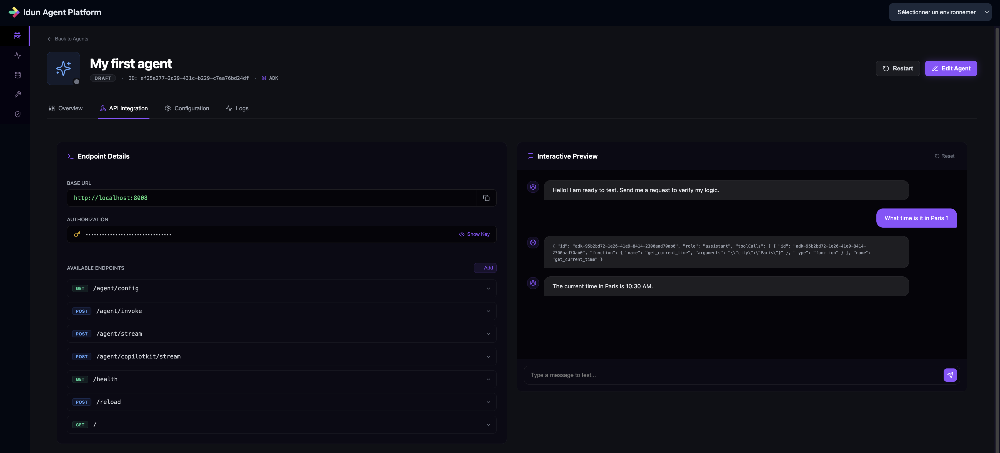

# LangGraph Agents with Idun
{ width="90" }

This guide shows how to connect a **LangGraph** agent to the **Idun Agent Platform** and run it as a managed, observable service.

It continues from the [Quickstart](../getting-started/quickstart.md) and assumes that:

- The platform is running via `docker compose -f docker-compose.dev.yml up --build`.
- You can access the Manager UI at `http://localhost:3000`.
- You are familiar with the basic LangGraph Python quickstart ([LangGraph Quickstart](https://docs.langchain.com/oss/python/langgraph/quickstart)).

## 1. Create an Agent configuration in Idun

1. Open your browser at `http://localhost:3000` and press **Login** (no credentials needed for local dev).
2. Click **"Create an agent"**.

   <!-- Replace with a LangGraph-specific screenshot later -->
   

3. Fill in the **basic info**:
   - **Name**: `My first LangGraph agent`
   - **Base URL**: `http://localhost:8008` (where your LangGraph agent will be reachable)
   - **Server Port**: `8008` (local development port)
   - **Agent framework**: select **`LangGraph`**
4. Click **Next**.
5. Fill in the **framework-specific settings**:
   - **Name**: `My first LangGraph agent`
   - **Graph Definition** (or equivalent field): `my_langgraph_agent/agent.py:app`
     This should point to the Python module and attribute that exposes your LangGraph app (for example, the `agent`, `graph` or `app` object from the LangGraph quickstart). For an existing project, reuse your current module and object name.
   - For **checkpointing/memory** and **observability**, keep the default values for now.
     You can later switch to SQLite/PostgreSQL checkpointing and plug in observability providers.
6. Click **Next**.
7. For now, skip **MCP Server** and **Guardrails**; these are covered in their own guides.
8. Click **Create Agent**.

   <!-- Replace with a LangGraph-specific screenshot later -->
   

!!! success "Congratulations"
    Your LangGraph agent configuration is created in the Idun Agent Manager.

## 2. Get the Agent API Key

1. In the Agent Dashboard, click on your newly created LangGraph agent.
2. Go to the **API Integration** tab.
3. Click **Show Key** and copy the **Agent API Key**.

   <!-- Replace with a LangGraph-specific screenshot later -->
   

You will use this key to let your LangGraph agent fetch its configuration from the Idun Agent Manager.

## 3. Connect your LangGraph agent project

Now that the Idun Agent Platform is ready, you can connect either an **existing** LangGraph project or create a **new** one.

- **If you already have a LangGraph agent project**:
  Keep your current project structure. Make sure the **Graph Definition** you configured in Idun points to the module and object that already expose your compiled LangGraph app (for example `my_project/agent.py:agent`). Then follow **Step 3** (configure Idun access) and **Step 4** (run the agent) below from within your existing project.
- **If you don’t have a LangGraph agent yet**:
  Follow **Step 1** and **Step 2** below to create a new LangGraph project, then continue with **Step 3** and **Step 4** to connect it to Idun.

### Step 1: Create the project directory (for new projects)

```bash
mkdir demo-langgraph-idun-agent
cd demo-langgraph-idun-agent
```

### Step 2: Initialize the LangGraph agent (for new projects)

1. In your editor, create and activate a **Python 3.12** virtual environment.
2. Follow the official LangGraph Python quickstart to build a simple agent:

   [LangGraph Quickstart](https://docs.langchain.com/oss/python/langgraph/quickstart){:target="_blank"}

At the end, you should have a Python module (for example `agent.py`) that exposes your LangGraph app object, e.g.:

```python
from langgraph.graph import StateGraph, START, END

# ... define your state, nodes, and edges ...

app = StateGraph(...).compile()
```

Make sure the object name you expose here (e.g. `app`) matches what you configured in the **Graph Definition** field in the Manager (for example `my_langgraph_agent/agent.py:app`).

### Step 3: Configure Idun platform access (for existing or new projects)

Install the Idun Agent Engine and LangGraph packages in your project:

```bash
pip install idun-agent-engine langgraph aiosqlite
```

Create an `.env` file for your LangGraph agent and add the following variables (adjust host if your Manager is not on localhost):

```bash
IDUN_MANAGER_HOST=http://localhost:8000
IDUN_AGENT_API_KEY=<PASTE_THE_AGENT_KEY_FROM_STEP_2>
```

Make sure you create this `.env` file **inside your LangGraph project folder** and that any helper scripts you use load it from the correct path.

### Step 4: Run your LangGraph agent with Idun (for existing or new projects)

Export the environment variables from your `.env` file in your terminal:

```bash
set -o allexport
source ./my_langgraph_agent/.env
set +o allexport
```

Then start the Idun Agent Engine in **managed mode** so it pulls configuration from the Manager and loads your LangGraph graph:

```bash
idun agent serve --source manager
```

!!! success "Congratulations"
    Your LangGraph agent is now running behind the Idun Agent Engine and managed by the Idun Agent Platform.

## 4. Test your agent

1. In the Manager UI, go to your LangGraph agent’s **API Integration** tab.
2. Use the built-in chat or your own client to send a request.

Try a simple question or task that your graph can handle, for example:

```bash
Add 3 and 4.
```

   <!-- Replace with a LangGraph-specific screenshot later -->
   

!!! success "Congratulations"
    You’ve successfully connected a LangGraph agent to Idun.

## Next Steps

From here you can enrich your LangGraph agent with more platform capabilities:

- [Observability](../observability/overview.md) – Monitor your agent’s performance and traces.
- [Memory](../memory/overview.md) – Add conversation and state persistence.
- [MCP](../mcp/overview.md) – Attach MCP tools to your agent.
- [Guardrails](../guardrails/overview.md) – Protect your agents with safety and policy checks.
- [A2A](../a2a/overview.md) – Enable agent-to-agent collaboration.
