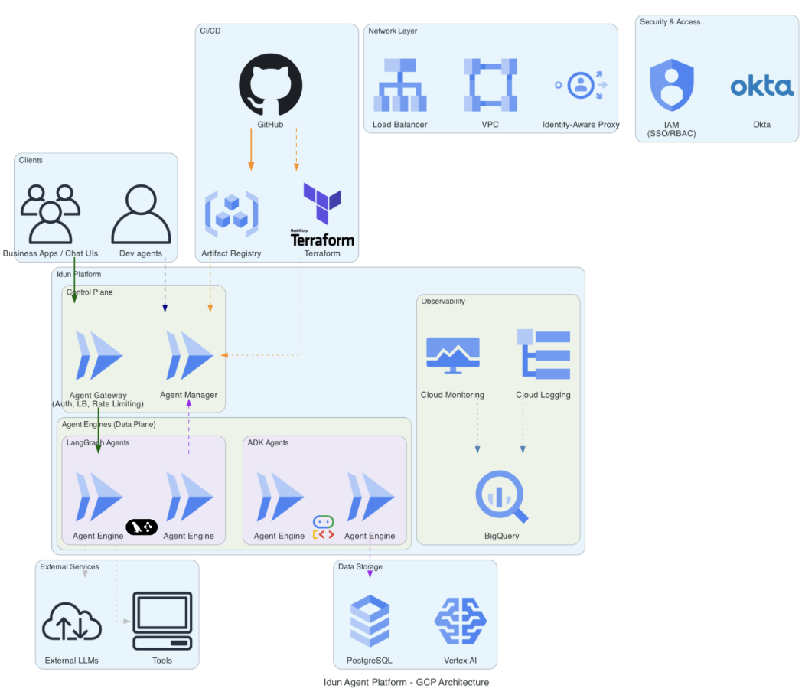

# GCP Self-Hosted Deployment

This guide explains how to deploy the Idun Agent Platform on Google Cloud Platform (GCP) using serverless options.

## Architecture

The platform is deployed using a serverless architecture on GCP:

- **Idun Manager (Control Plane)**: Deployed as a **Cloud Run** service. This handles API requests, authentication, and agent orchestration.
- **Idun UI**: Deployed as a **Cloud Run** service (serving the frontend static assets).
- **Persistence**: A **Cloud SQL for PostgreSQL** instance is used to store platform state, agent configurations, and history.
- **Agent Engines**: Deployed as separate **Cloud Run** services or via your existing CI/CD pipelines.

## Deployment Process

1. **Database Setup**: Provision a Cloud SQL PostgreSQL instance.
2. **Manager Deployment**: Deploy the Manager container image to Cloud Run, configured with the database connection string.
3. **UI Deployment**: Deploy the UI container image to Cloud Run.
4. **Networking**: (Optional) Configure a Load Balancer or connect via Cloud Run URLs.

## Agent Deployment

Agents continue to be deployed using your standard CI/CD pipelines (e.g., GitHub Actions, Cloud Build). The Idun Manager interacts with the deployed agent services (Agent Engines) to manage their lifecycle.

## Terraform Modules

We offer **Terraform modules** to automate this entire deployment process, ensuring a production-ready setup with best practices (IAM, networking, security).

!!! info "Get Terraform Code"
    The Terraform code is available upon request. If you are interested in automating your GCP deployment, please reach out via [GitHub issues](https://github.com/Idun-Group/idun-agent-platform/issues) or join our [Discord Server](https://discord.gg/KCZ6nW2jQe).
