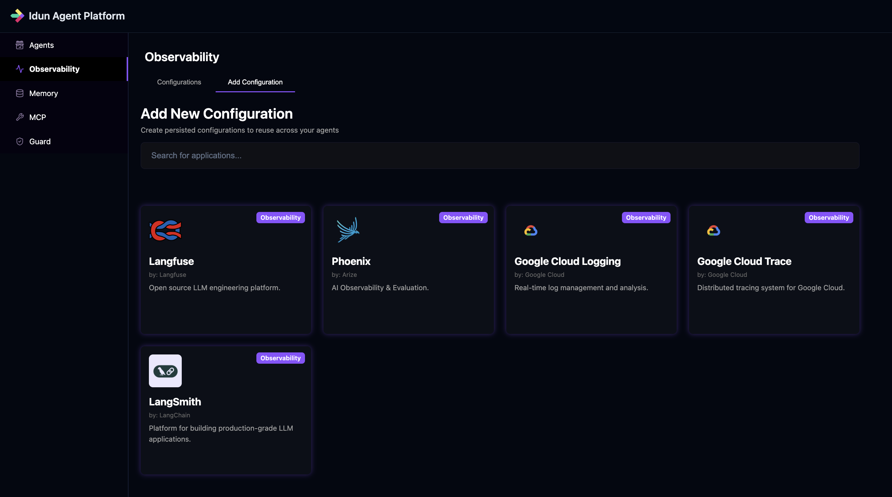

  {: width="120" }

# Observability with Google Cloud Logging

This guide shows you how to set up Google Cloud Logging to add structured logging to your agents. With observability enabled, you can centralized logs for agent execution, errors, and custom events in Google Cloud Logging.

Before starting this guide make sure to follow the [Quickstart Guide](../getting-started/quickstart.md) to have your First Agent running on Idun Agent Platform.

## Setting Up Observability

### Step 1: Prepare Google Cloud Project

1. Ensure you have a Google Cloud Project created.
2. Enable the **Cloud Logging API** in your project.
3. Ensure the environment where your agent is running has credentials with permissions to write logs (e.g., `Logs Writer` role).

### Step 2: Navigate to Observability Configuration

1. On **Idun Agent Platform** main page, navigate to **Observability**
2. Go to **Add configuration**
3. Select **GCP Logging**
4. Enter a **Configuration Name** (e.g., "GCP Logging Prod")
5. Fill in the required details:
    - **Project ID**: Your Google Cloud Project ID
    - **Log Name**: Identifier for the log stream (e.g., `idun-agent-logs`)
    - **Resource Type**: (Optional) e.g., `global` or `gce_instance`
    - **Severity**: Minimum level to record (e.g., `INFO`, `WARNING`, `ERROR`)
    - **Transport**: Delivery method (default `BackgroundThread`)
6. Finnaly, click **Create configuration**

### Step 3: Add GCP Logging to your agent

1. Navigate to your agent
2. Click **Edit Agent**
3. Click **Next** to go to the observability config
4. Select **GCP Logging** in observability
5. Click on the configuration you just created.
6. Click **Next**
7. Finnalize with **Save changes**

Finnaly, on your agent page, click **🔄Restart** to reload the agent configuration.

## Viewing Observability Data

Once your agent is running with observability enabled:

1. Interact with your agent
2. Go to the [Google Cloud Console](https://console.cloud.google.com/)
3. Navigate to **Logging** -> **Logs Explorer**

You can filter by the **Log Name** you configured to see your agent's logs.

 

---

 

## Best Practices

- **Use structured logging**: The agent platform sends structured logs which are easier to query in GCP.
- **Set appropriate severity**: Filter out debug noise in production by setting severity to INFO or WARNING.

## Troubleshooting

### Logs not showing up?

1. **Check Permissions**: Ensure the `Logs Writer` role is assigned.
2. **Check Log Name**: Ensure you are filtering by the correct log name in Logs Explorer.
